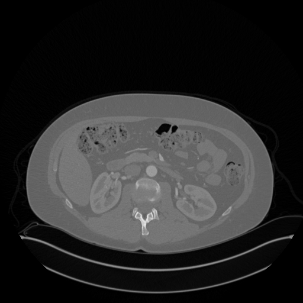
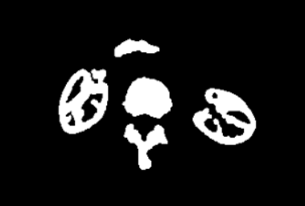
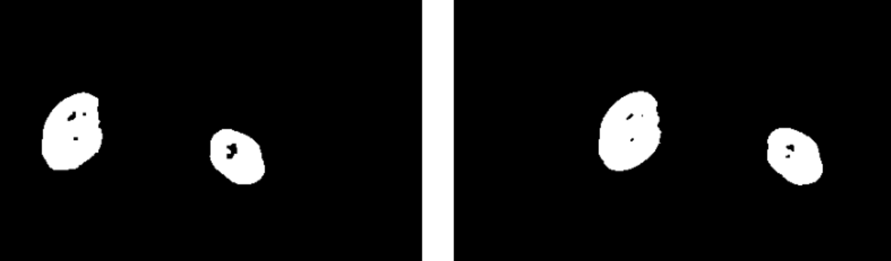
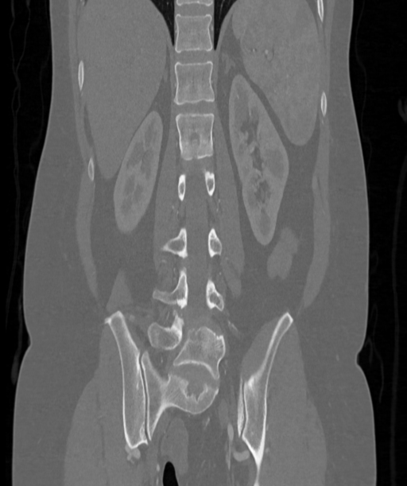

# 肾脏分割

## 1 算法实现和分析

最终提交的具体代码可能会有不同，因为负责算法设计和最终封装代码的是不同的成员，但是基本思路是这样的

---

### 1.1 除分割算法外的程序分析

我们将整个程序分为图像读取、预处理、图像分割、指标评价、保存文件几个部分。这是显然的一个图像处理的过程，图像读取和保存文件过程不赘述。


#### 1.1.1 预处理

第一步是转换数据类型，这个很重要

由于这些数据集的噪声并不是很明显，我们选择**形态学**运算进行去噪，这**保证**了图像**边界**的**清晰**度，代码如下

```python
# 图像预处理
def preprocess_image(image):
    # 类型转换：确保图像数据类型为 uint8
    if image.dtype != np.uint8:
        image = image.astype(np.uint8)
    
    # 形态学开运算
    kernel = np.ones((3, 3), np.uint8)
    opened_image = cv2.morphologyEx(image, cv2.MORPH_OPEN, kernel)
    
    # 形态学闭运算
    closed_image = cv2.morphologyEx(opened_image, cv2.MORPH_CLOSE, kernel)
    
    preprocessed_image = closed_image
    
    return preprocessed_image
```

都是很基本的运算，不赘述


#### 1.1.2 指标评价

由于`ground_truth`数据集存在两种标签，导致灰度有差异，需要先二值化，保险起见，分割后的图像也进行二值化，虽然本来就是二值化的

根据作业要求给出的评价指标，通过调用已有的函数实现，具体代码如下

```python
from sklearn.metrics import confusion_matrix

# 计算评价指标
def evaluate_segmentation(ground_truth, segmented_image):
    # 将图像转换为二值图像
    ground_truth = np.where(ground_truth > 0, 1, 0)
    segmented_image = np.where(segmented_image > 0, 1, 0)
    
    # 计算混淆矩阵
    tn, fp, fn, tp = confusion_matrix(ground_truth.flatten(), segmented_image.flatten()).ravel()
    
    # 计算评价指标
    dice_score = (2 * tp) / (2 * tp + fp + fn)
    sensitivity = tp / (tp + fn)
    specificity = tn / (tn + fp)
    precision = tp / (tp + fp)
    accuracy = (tp + tn) / (tp + tn + fp + fn)
    
    return {
        'Dice Score': dice_score,
        'Sensitivity': sensitivity,
        'Specificity': specificity,
        'Precision': precision,
        'Accuracy': accuracy
    }
```


### 1.2 图像分割算法

我们将3D的数据集分为了3个视图，对于每个视图，肾脏的影像都存在各自的特征。我们认为根据每个视图的特征进行分割是可以接受的


####  1.2.1 水平切视图

即`a`视图，在选用的数据集中用`ax.png`和`axl.png`表示，其中后者是`ground_truth`数据

观察下面的图像

<center></center>

可以发现，肾脏大致分布在中心对称的两侧，并且**肾皮质有比较高的灰度，肾髓质的灰度较低，肾窦的灰度很低**

观察`ground_truth`图像，发现肾窦是不算在肾脏这个器官内的，我感到很奇怪，但还是照做了

因此，基本思路就是**用两个阈值**，分割出**肾皮质**和**肾窦**，肾髓质就是剩下的部分，故不需要特别处理，代码如下

```python
# 标记灰度低于低阈值的像素
_, Hole = cv2.threshold(image, low_threshold, 255, cv2.THRESH_BINARY) 
# 提取灰度高于高阈值的像素
_, binary_image = cv2.threshold(image, high_threshold, 255, cv2.THRESH_BINARY)
```


为了保证后续处理的正确性，需要提取边界并叠加到阈值处理的图像上，得到一个**封闭的肾脏**图像，这里使用`canny`算子，代码如下

```python
# 边界提取
edges = cv2.Canny(binary_image, 100, 200)
# 第一步：将边界添加到预处理得到的图中
segmented_image = cv2.add(binary_image, edges)
```


很显然上面处理后肾脏将会是**连通**的，并且面积不会很小，通过**连通分量的提取**和**面积阈值**的判断进一步舍去无关元素，代码如下

```python
# 第二步：连通分量分析
num_labels, labels, stats, centroids = cv2.connectedComponentsWithStats(segmented_image, connectivity=8)
    
# 设置面积阈值，删除小于这个面积的连通分量
min_area_threshold = 500  # 这已经远小于可以分辨的肾脏面积阈值了
for i in range(1, num_labels):
    if stats[i, cv2.CC_STAT_AREA] < min_area_threshold:
        segmented_image[labels == i] = 0
```

这时我们可以得到下面的图像

<center></center>

可以发现还有一些不想要的元素，这时候，肾脏的位置分布特征就显示出来了：一个比较正常的人的**肾脏不会位于**身体**中心**。图中无关的元素无一例外都是人体中心的器官/组织，通过对靠近中央的连通分量的标记，我们删除了这些无关元素，代码如下

```python
# 第三步：将靠近图像中间的列的元素做标记，若连通集里面存在这个元素，则抛弃这个连通集
middle_column = image.shape[1] // 2
for i in range(1, num_labels):
    if np.any(labels[:, middle_column] == i):
        segmented_image[labels == i] = 0
```


这样就得到只剩下两个**肾皮质**的图像，然后对肾皮质进行闭运算，**闭合肾髓质和肾窦**，这里不需要担心肾窦的去除问题，我们在第一步就已经标记了肾窦，通过两张图的**与运算**就能**去除肾窦**，代码如下

```python
# 第四步：闭运算填充空隙
kernel = np.ones((20, 20), np.uint8)
segmented_image = cv2.morphologyEx(segmented_image, cv2.MORPH_CLOSE, kernel)

# 第五步：将结果与低于低阈值的像素按像素与运算
segmented_image = cv2.bitwise_and(segmented_image, Hole)
```


到此整个分割已经结束，得到的图像（左）和`ground_truth`（右）的比较如下图

<center></center>

>Evaluation Results: 
>
>Dice Score: 0.9635；	Sensitivity: 0.9332
>
>Specificity: 0.9999；	 Precision: 0.9958；	 Accuracy: 0.9984


#### 1.2.2 余下的两个视图

有了1.2.1的经验，对于剩下的两个视图是基本一致的过程，这里对一样的过程不再赘述。

从高低阈值，边界提取，到连通分量的提取和舍弃为止，都和1.2.1一致

下一步，我们选择将图像取反，得到肾髓质的孔洞，而不是形态学闭运算填充；将孔洞填充后再次取反得到完全填充的肾脏，代码如下

```python
def fill_blocks(image):
    image = ~image
    num_labels, labels, stats, centroids = cv2.connectedComponentsWithStats(image, connectivity=8)
    mean_area_threshold = np.mean(stats[1:, cv2.CC_STAT_AREA])
    for i in range(1, num_labels):
        if stats[i, cv2.CC_STAT_AREA] < mean_area_threshold:
            image[labels == i] = 1
    return ~image
```

<font color=red>为什么这里不接着用闭运算？</font>

考虑到髓质的面积会随切面变化，使用自适应的算法，这里选择填充的阈值为所有孔洞的均值


由于这两个视图还会存在一些不在中央且面积较大的无关元素，如下如图的盆骨

<center></center>

需要选择其他的算法进行连通分量的选取

我们发现，肾脏在这两个视图的纵向上是靠近中央的，利用这个特征，我们选取靠近中央的连通分量并保留，代码如下

```python
def select_mid_area(image):
    num_labels, labels, stats, centroids = cv2.connectedComponentsWithStats(image, connectivity=8)
    middle_row = image.shape[0] // 2  # 修改为获取图像的中间行
    for i in range(1, num_labels):
        for row in range(middle_row-100, middle_row):  # 修改为遍历中间行的像素
            if np.any(labels[row, :] == i):  # 检查中间行是否有标签 i
                image[labels == i] = 1
                break
            else:
                image[labels == i] = 0
    return image
```


最后再进行与低阈值筛选出的肾窦的与运算，得到了最终的结果

<font color=red>来张图</font>