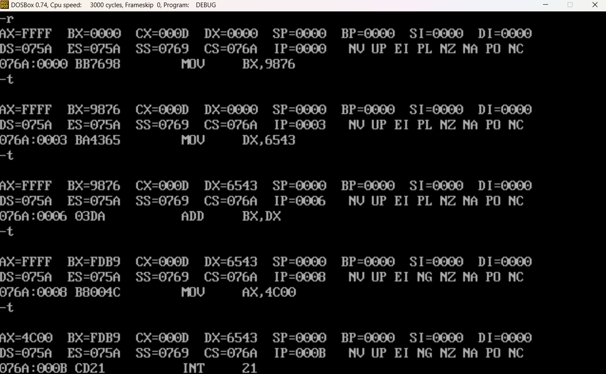

# 微机原理 Homework 3

### 1 从编写汇编语言源程序到生成可执行文件需要经过的步骤

汇编语言程序——>编辑程序——>生成.ASM——>MASM.exe编译——>生成.OBJ——>LINK.exe连接——>生成.EXE


### 2 完整的汇编语言程序设计框架

```assembly
assume cs:code		;段分配，定义code为cs段的段名
code segment		;cs段开始定义，以下内容存放于cs段中

dw 1234H			;装载数据

start:				;指令从这里开始，防止将数据视为指令
		;具体的程序

mov ax, 4c00h		;表示程序成功运行
int 21h				;中断程序

code ends			;cs段结束
end start			;程序结束；指明程序入口
```

首尾两段是伪指令


### 3 设计程序计算

```assembly
assume cs:code
code segment

mov bx, 9876h
mov dx, 6543h
add bx, dx

mov ax, 4c00h
int 21h

code ends
end
```

结果

<center></center>