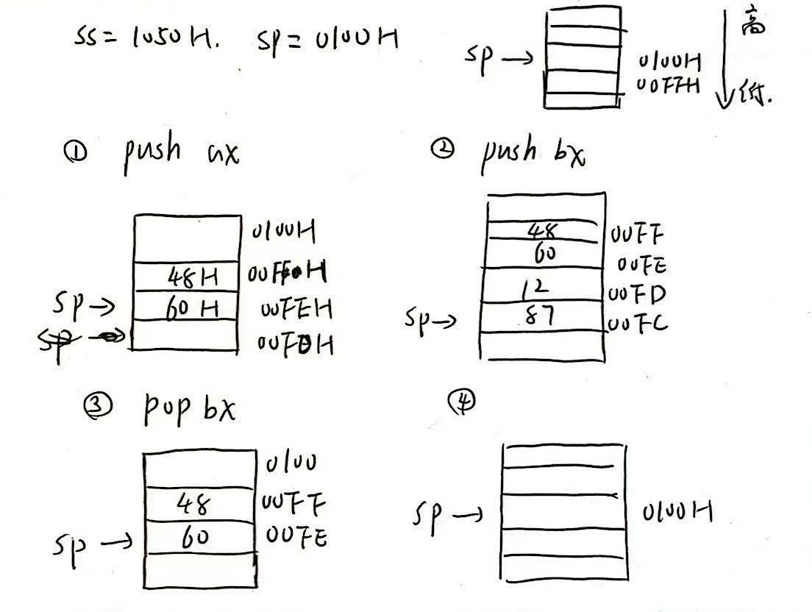

# 微机原理 Homework 4

### P120, 2

已知`ds=1000H,bx=0200H,si=0002H,10200H-10205H:10H,2AH,3CH,46H,59H,6BH`

执行

```assembly
mov ax, 0200H				;ax=0200H
mov ax, [200H]				;ax=2A10H
mov ax, bx					;ax=0200H
mov ax, 3[bx]				;ax=5946H
mov ax, [bx+si]				;ax=463CH
mov ax, 2[bx+si]			;ax=6B59H
```


### P120, 3

已知`ds=1000H,es=2000H,ss=3500H,si=00A0H,di=0024H,bx=0100H,bp=0200H`

VAL在`ds:[0030]`

```assembly
mov ax, [100H]				;直接寻址，1000:0100H - 1000:0101H
mov ax, val					;直接寻址，1000:0030H - 1000:0031H
mov ax, [bx]				;间接寻址，1000:0100H - 1000:0101H
mov ax, es:[bx]				;间接寻址，2000:0100H - 2000:0101H
mov ax, [si]				;间接寻址，1000:00A0H - 1000:00A1H
mov ax, [bx+10H]			;相对寻址，1000:0110H - 1000:0111H
mov ax, [bp]				;间接寻址，3500:0200H - 3500:0201H
mov ax, val[bp][si]			;相对基址变址寻址，3500:(02A0+val)H - 3500:(02A1+val)H
mov ax, val[bx][di]			;相对基址变址寻址，1000:(0124+val)H - 1000:(0125+val)H
mov ax, [bp][di]			;基址变址寻址，3500:0224H - 3500:0225H
```


### P121, 6

1. ax是2B，dl是1B
2. 8650H是一个idata，[xxxx]才对
3. ds不能直接赋值
4. [bx]是一个内存地址，内存地址不能直接加，没有加法器在内存里，改成bx
5. 改ip得用jmp
6. ip不能作为源操作数
7. 只能用一个基地址
8. al只有8bit
9. 只能用一个变址
10. offset用于获取变量的偏移地址
11. al只有8b，需要16bit才行
12. XCHG不能用于idata
13. in只能操作al/ax
14. out的端口号范围是(0,0FFH)


### P121, 8

已知`ss=1050H,sp=0100H,ax=4860H,bx=1287H`

```assembly
push ax
push bx
pop bx
pop ax
```

<center></center>


### 补充

设`EAX=0000 1000H, EBX=0000 2000H,ds=0010H`

```assembly
mov ECX, [EAX+EBX]			;默认是字型，访问了3000H - 3001H
mov [EAX+2*EBX], cl			;是字节型，访问了5000H
mov DH, [EBX+4*EAX+1000H]	;是字节型，访问了7000H
```

32bit寄存器不需要段地址:偏移地址