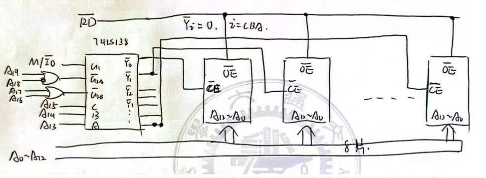
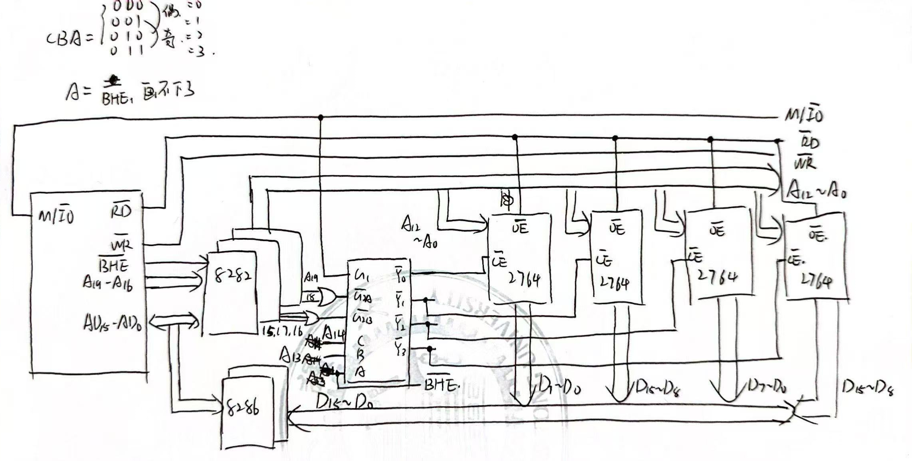

# Homework 7

### 7 `1Kx1`的RAM组成`16Kx8`的存储器

$16/1=16,8/1=8$，需要$8\times 16=128$个

$2^{10}=1$K，$2^4=16$，故`A0-A9`用于片内寻址，`A10-A13`用于片选

### 8 `512x4`的RAM组成`4KB`的存储器

`4KB`=`4Kx8b`，$4/0.5=8, 8/4=2$，需要$2\times 8=16$个

每块芯片的寻址线是$\log_2512 = 9$根，$2^3=8$，所以需要12根

### 9 `1Kx8`的RAM组成`4Kx8`的存储器

需要4个芯片，使用4位高地址进行选址，片内选址需要10位低地址

所以`A0-A9`用于片内选址，`A12-A15`用于片选，将`A12`连到第一块芯片，依次类推，这样，`A16-A19`的信息变成了Dont care term，造成了地址浪费和重叠

下表显示了各个芯片的表示范围

| 芯片 | A15-A12 |  A9-A0  |  地址范围   |
| :--: | :-----: | :-----: | :---------: |
|  1   |  0001   | 全0-全1 | 1000-1FFF H |
|  2   |  0010   | 全0-全1 | 2000-2FFF H |
|  3   |  0100   | 全0-全1 | 4000-4FFF H |
|  4   |  1000   | 全0-全1 | 8000-8FFF H |

可见地址不连续

### 12 设计一个`64Kx8`的存储器

74LS138是`3-8`译码器，EPROM2764是`8Kx8`芯片，那么`A0-A12`是片内选址，还剩7个地址信号和1个`M/IO`信号，1个`RD`信号

$64/8=8$，需要3个地址进行片选，那么剩下的信号作为门信号

要求地址从`40000H - 4FFFFH`，即`0100 0000 0000 0000 0000B - 0100 1111 1111 1111 1111B`，那么`A19A18A17A16=0100`和`M/IO`一起作为门信号，`A15A14A13`从`000`到`111`，作为片选信号

如下图所示

### 13 `8Kx8`的EPROM和74LS138组成8086最小工作模式的存储器

使用两个相同的组成一个字，奇偶地址分离，使用两组相同的组成`16KW`，但实际有`32KB`

$2^{13}=8$K，`A12-A0`作为片内选址，用`A14A13 BHE`作为片选信号，`A14=0/1`，`A19-A15`恒为0。当`A14=0`时，表示为指令；当`A14=1`时，表示为数据

用`M/IO`作为`G1`的信号，剩下`A19A18A17A16A15=00000`作为`G2A,G2B`的信号

2764作为指令存储器，6264作为数据存储器

图中画出了2764的结构，6264画不下了，但是和2764是类似的，区别在于多了一个$\overline{\mathsf{WR}}$信号接入每一个芯片的$\overline{\mathsf{WE}}$，且和数据总线的交互是双向的，片选信号是`Y4-Y7`

地址分配见下表，其中偶数芯片是低地址数据，奇数芯片是高地址数据

|  芯片  | A14A13 | A12-A0  |    地址范围     |
| :----: | :----: | :-----: | :-------------: |
| 2764-0 |   00   | 全0-全1 | 00000 - 01FFF H |
| 2764-1 |   00   | 全0-全1 | 00000 - 01FFF H |
| 2764-2 |   01   | 全0-全1 | 02000 - 03FFF H |
| 2764-3 |   01   | 全0-全1 | 02000 - 03FFF H |
| 6264-0 |   10   | 全0-全1 | 04000 - 05FFF H |
| 6264-1 |   10   | 全0-全1 | 04000 - 05FFF H |
| 6264-2 |   11   | 全0-全1 | 06000 - 07FFF H |
| 6264-3 |   11   | 全0-全1 | 06000 - 07FFF H |

