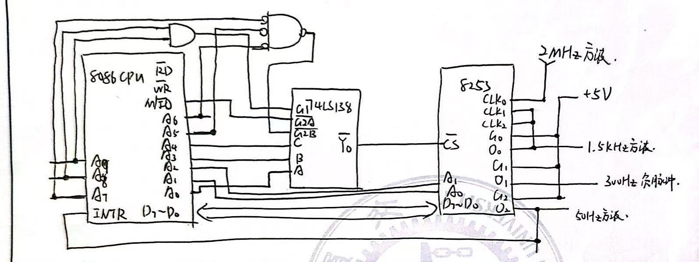

# Homework 9

### 4 一堆要求

`16bit`CPU，基地址为`300H = 0011 0000 0000 B`，CPU的`A2A1`作为片内选址，`A4A3A0=000`作为74LS138的`CBA=0`，$\overline{\mathsf{Y}}_0$导通，连接到8253的$\mathsf{\overline{CS}}$，CPU的$\mathsf{M/\overline{IO}}$作为74LS138的$\mathsf{\overline{G2A}}$，将`A9A8=11`用一个and接入`G1`，`A7A6A5=000`各自先取非在and再取非接入$\mathsf{\overline{G2B}}$

通道0使用方式3，输出方波，`GATE=1`；通道1输出负脉冲序列，使用方式2，`GATE=1`；通道2输出50Hz方波，方式3，连接到CPU的`INTR`，`GATE=1`，每秒50次，CLK2使用O0

对于通道0，`n=134D=0134H`，控制字为`00 11 011 1`

对于通道1，`n=5D=05H`，控制字为`01 01 010 1`

对于通道2，`n=30D=30H`，控制字为`10 01 011 1`

硬件连接如下

<center></center>

初始化程序如下

```assembly
;初始化0
mov al, 0011011B
out 306H, al
mov al, 34H
out 300H, al
mov al, 01H
out 300H, al

;初始化0
mov al, 01010101B
out 306H, al
mov al, 05H
out 302H, al

;初始化1
mov al, 10010111B
out 306H, al
mov al, 30H
out 304H, al
```


### 6 一堆要求

#### 6.1 读取计数值

```assembly
;读0
mov al, 11010010B
out F6H, al
in F0H, al
in F0H, ah
mov dS:[0000], ax

;读1
mov al, 11010100B
out F6H, al
in F2H, al
in F2H, ah
mov dS:[0002], ax

;读2
mov al, 11011000B
out F6H, al
in F4H, al
in F4H, ah
mov dS:[0004], ax
```


#### 6.2 读状态值

```assembly
;读2
mov al, 11101000B
out F6H, al
in F4H, al
in F4H, ah
mov dS:[0006], ax
```

