# 微机原理实验

## 1 查看CPU和内存，用机器指令和汇编指令编程

### 1.1 使用Debug写东西观察寄存器

由于是在debug里写，就不放代码了，观测和预期一致

<table>
    <tr>
    	<td>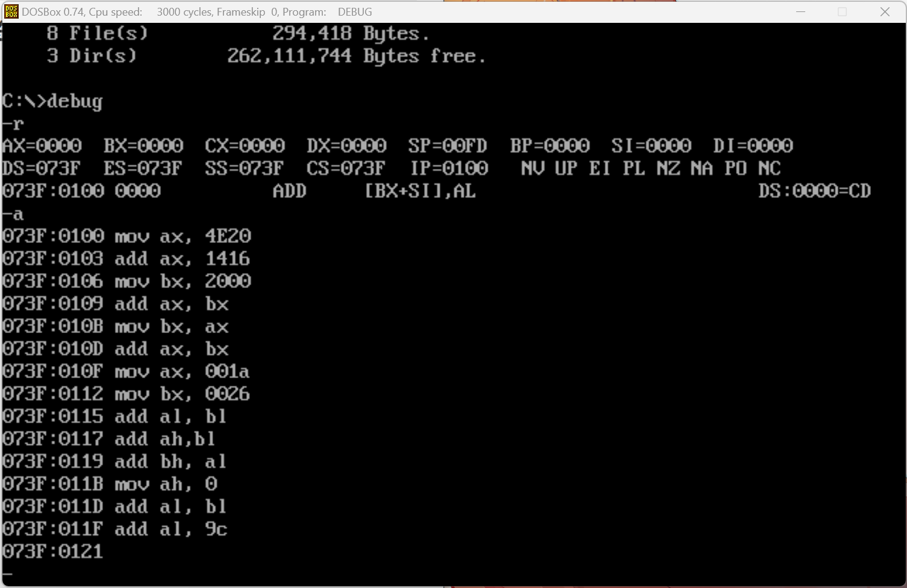</td>
    	<td>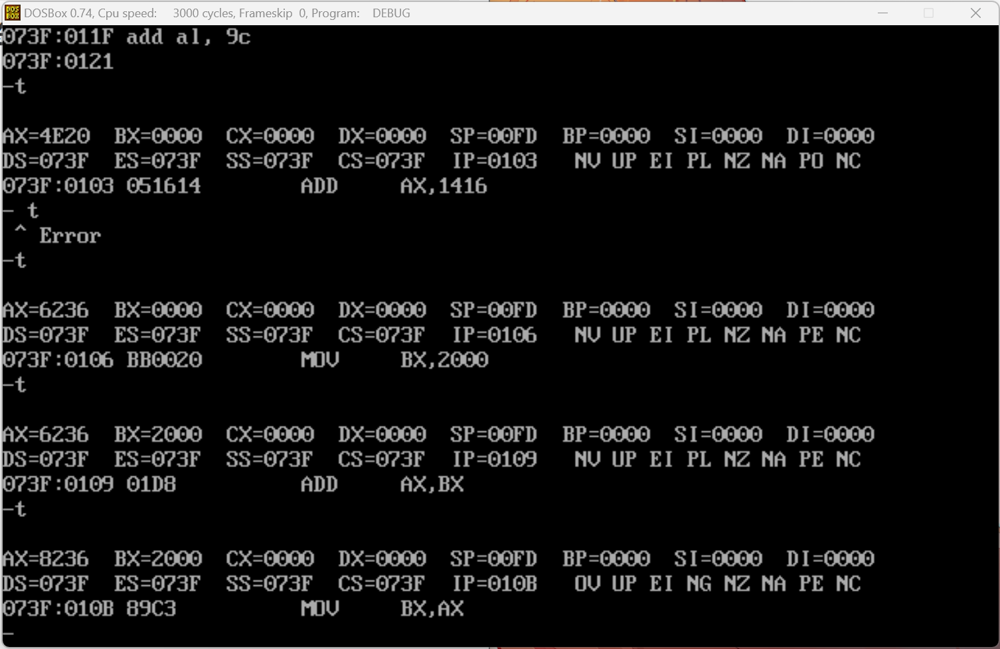</td>
    </tr>
</table>

<table>
    <tr>
    	<td>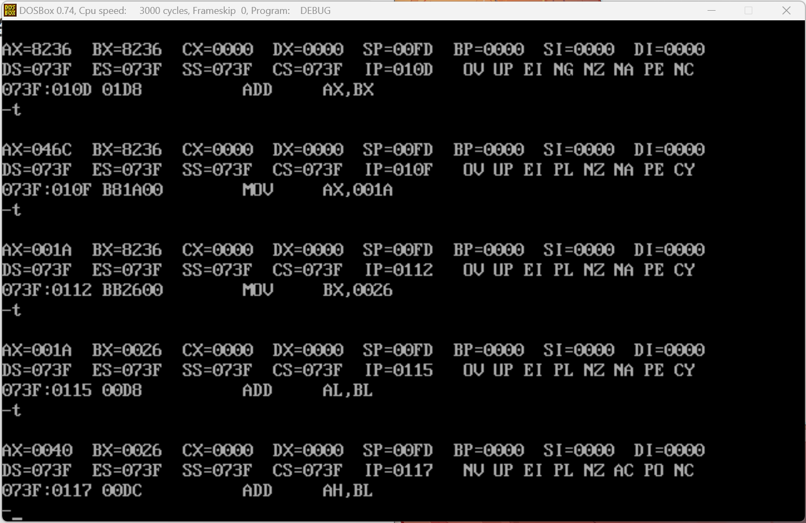</td>
    	<td>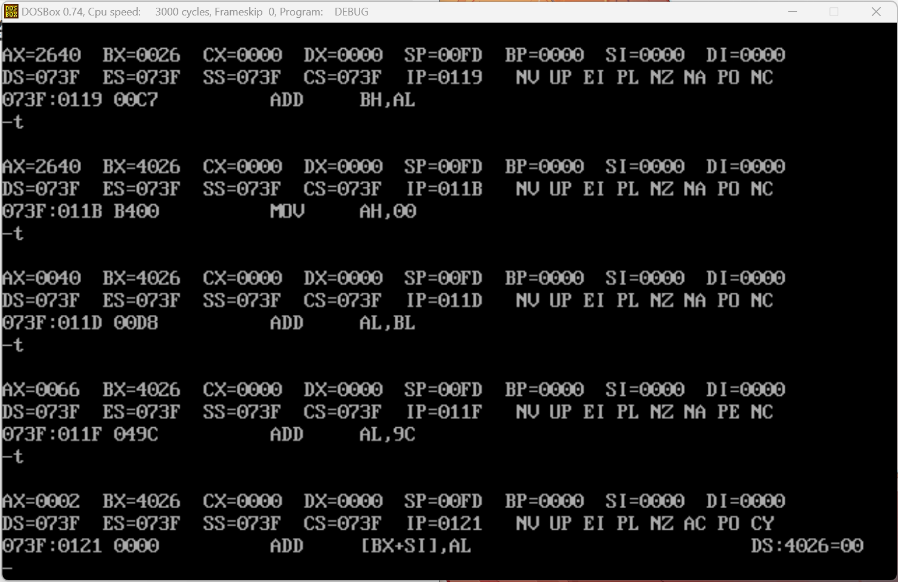</td>
    </tr>
</table>


### 1.2 计算2^8

$2^8=256=100H$，观察到100H就行

<center>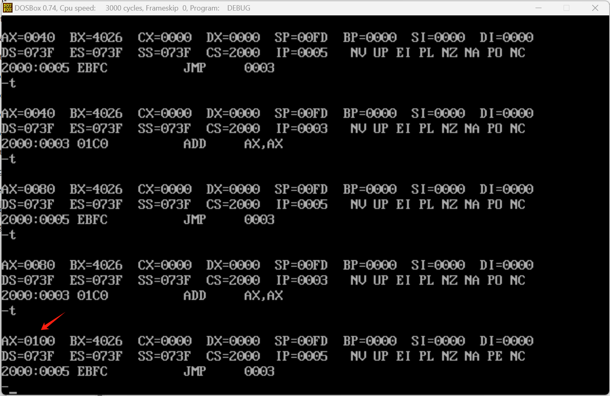</center>


### 1.3 查看生产日期并修改

能查看，位于`FFF0:00F5` -- `FFF0:00FC`的地址内，但是不能修改，原因是这些内存地址是**只读**的

<table>
    <tr>
    	<td>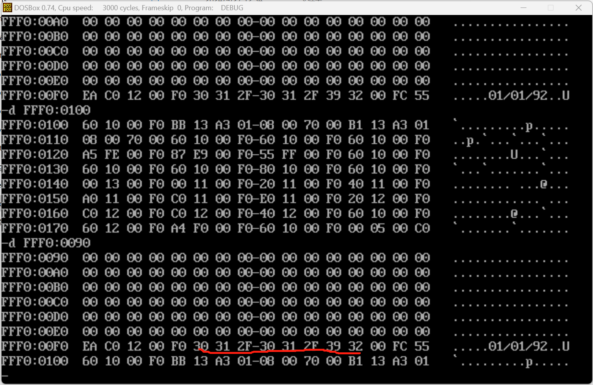</td>
    	<td>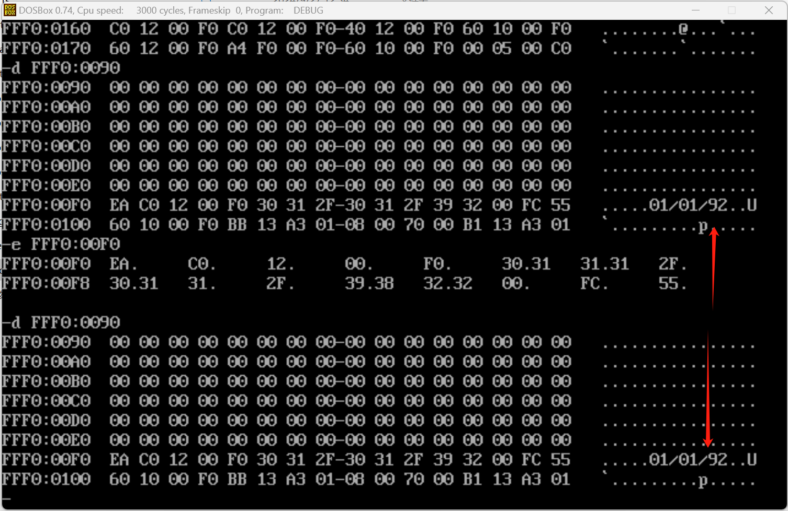</td>
    </tr>
</table>


### 1.4 从B8100H开始填写数据

得到的结果直接打印在了显示器上，使用ASCII编码

内存地址`B8000H`到`BFFFFH`是用于文本模式的显存区域，向这个区域写入数据时，数据会直接显示在屏幕上。

这个地址的内容分为两类：

- 字符代码：存储在偶数地址，使用ASCII编码。（value)
- 字符属性：存储在奇数地址，用于定义字符的颜色、背景色等属性。（font）


<center>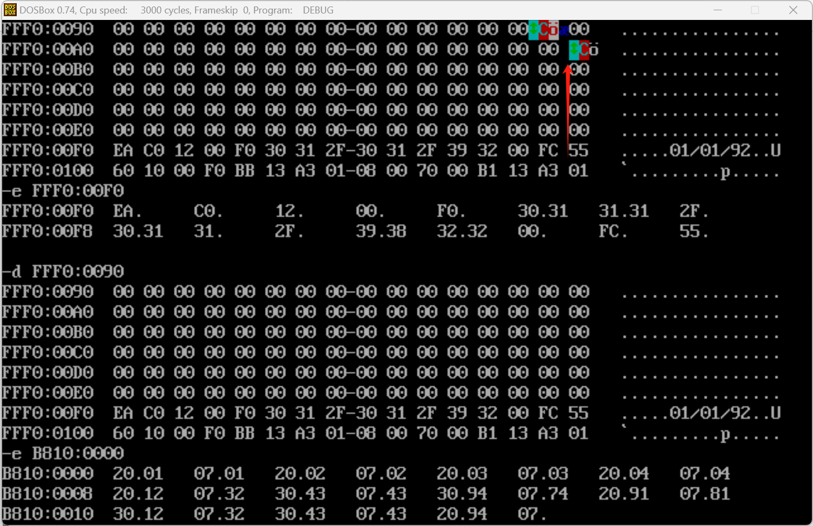</center>


## 2 用机器指令和汇编指令编程

### 2.1 使用Debug写东西填空

```assembly
mov ax, ffff
mov ds, ax

mov ax, 2200
mov ss, ax			;上面都是分配空间

mov sp, 0100

mov ax, [0]			;ax=C0EA
add ax, [2]			;ax=C0FC
mov bx, [4]			;bx=30F0
add bx, [6]			;bx=6021
					;内容都是低地址-高地址
push ax				;sp=00FE;修改的内存单元地址是2200:00FF,2200:00FE,内容为FC-C0
push bx				;sp=00FC;修改的内存单元地址是2200:00FD,2200:00FC,内容为21-60
pop ax				;sp=00FE;ax=6021
pop bx				;sp=0100;bx=C0FC

push [4]			;sp=00FE;修改的内存单元地址是2200:00FF,2200:00FE,内容为F0-30
push [6]			;sp=00FC;修改的内存单元地址是2200:00FD,2200:00FC,内容为31-2F
```

都是**字型**变量，所以都是按一个字赋值的，满足低位存储在低地址，高位存储在高地址

<table>
    <tr>
    	<td>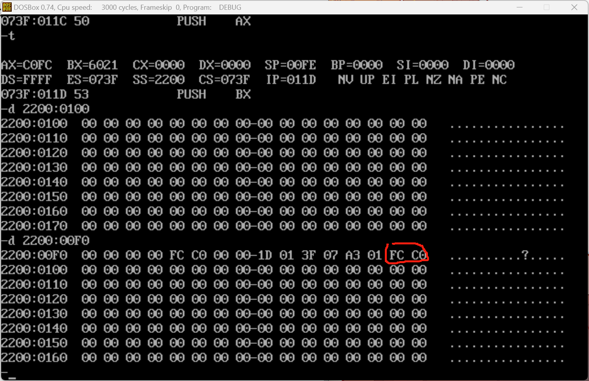</td>
    	<td>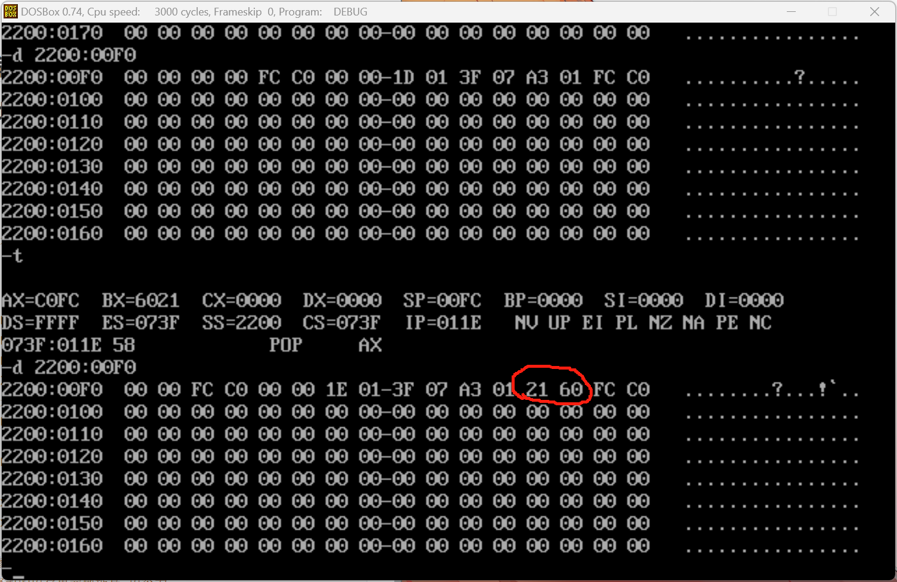</td>
    </tr>
</table>

<center>第一二次入栈</center>

<table>
    <tr>
    	<td>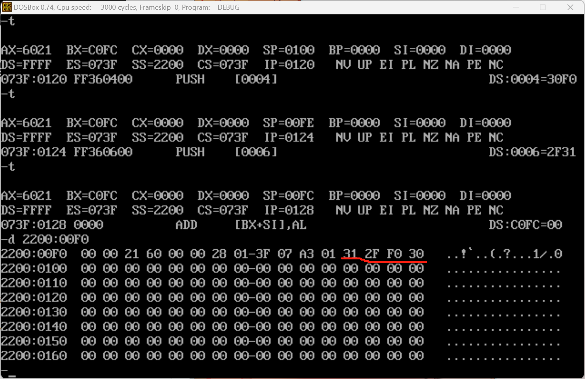</td>
    	<td></td>
    </tr>
</table>

<center>第一二次出栈和第三四次入栈，以及数据段的东西，计算一下前面结果符合预期</center>


### 2.2 为什么呢

在执行-t操作时，有中断操作，一些数据被压栈暂存


## 3 编程、编译、连接、跟踪

### 3.1 保存文件，生成.exe

```assembly
assume cs:codesg

codesg segment

	mov ax, 2000H
	mov ss, ax
	mov sp, 0
	add sp, 10
	pop ax
	pop bx
	push ax
	push bx
	pop ax
	pop bx
	
	mov ax, 4c00H
	int 21H

codesg ends

end
```

<center>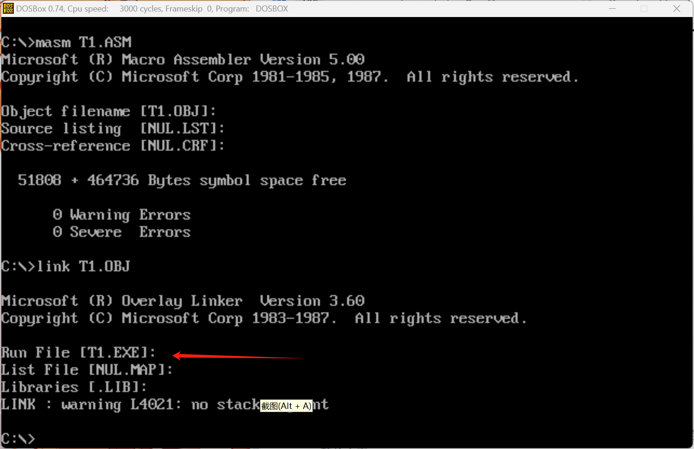</center>


### 3.2 运行、跟踪

```assembly
assume cs:codesg

codesg segment

	mov ax, 2000H			;ax=2000H
	mov ss, ax				;ss=2000H
	mov sp, 0				;sp=0000H
	add sp, 10				;sp=0010H
	pop ax					;ax=0000H
	pop bx					;bx=0000H
	push ax					;ax=0000H
	push bx					;bx=0000H
	pop ax					;ax=0000H
	pop bx					;bx=0000H
	
	mov ax, 4c00H
	int 21H

codesg ends

end
```

每一步的栈顶内容都是0000H

<table>
    <tr>
    	<td>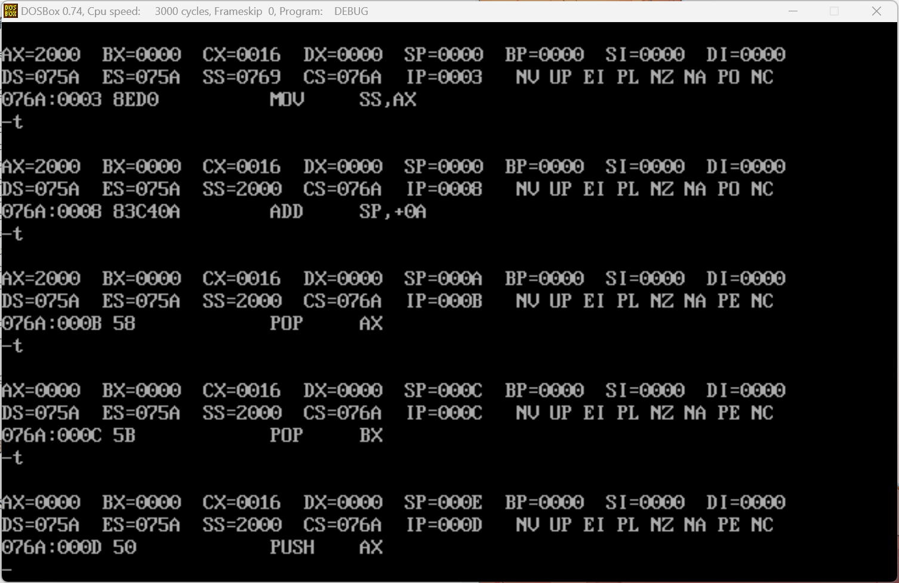</td>
    	<td>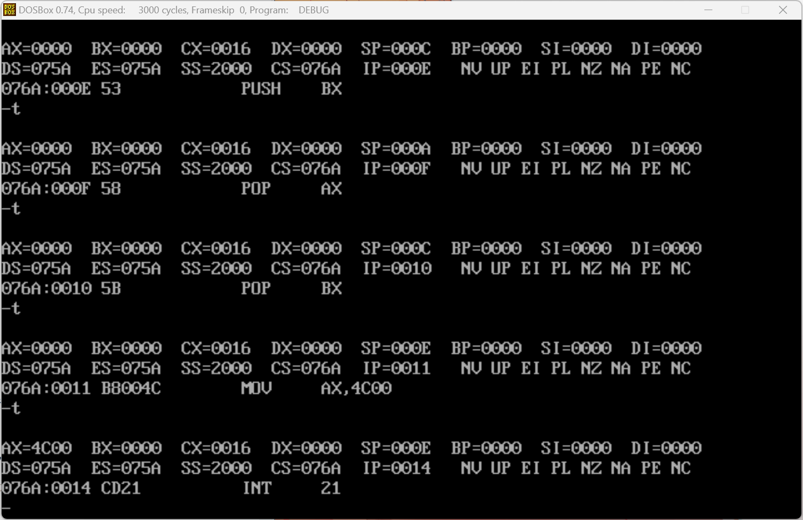</td>
    </tr>
</table>

​	

### 3.3 查看PSP

<center>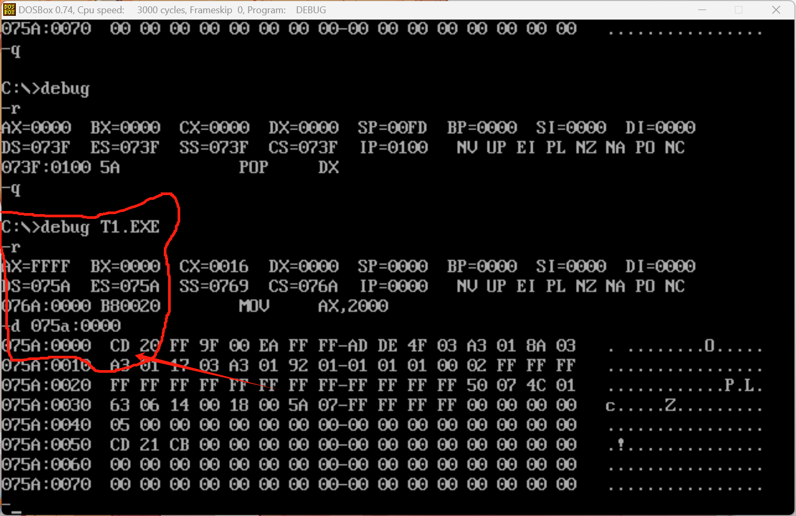</center>


## 4 `[bx]`和`loop`的使用

### 4.1, 4.2 传送数据

代码如下

```assembly
assume cs:codesg

codesg segment

	mov cx, 64
	mov bx, 0
	mov ds, bx
	s:	mov [200H+bx], bx
		inc bx
	loop s

	mov ax, 4c00H
	int 21H

codesg ends

end
```

只用了8条

程序运行结果如下

<center>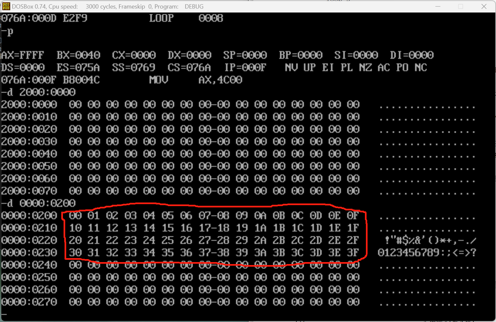</center>


### 4.3 补全代码

```assembly
assume cs:code
code segment
	
	mov ax, code			;补全了code
	mov ds, ax
	mov ax, 0020H
	mov es, ax
	mov bx, 0H
	mov cx, 18H				;补全了18H
	
s:	mov al, [bx]
	mov es:[bx], al
	inc bx
	loop s
	
	mov ax, 4c00H
	int 21H
	
code ends
end
```

复制的是代码，也是数据，可用8b寄存器一B一B地复制，从`cs:0000H`复制到`0000:0200H`

复制的程序段的长度可以通过debug查看，查看过程如下

<center>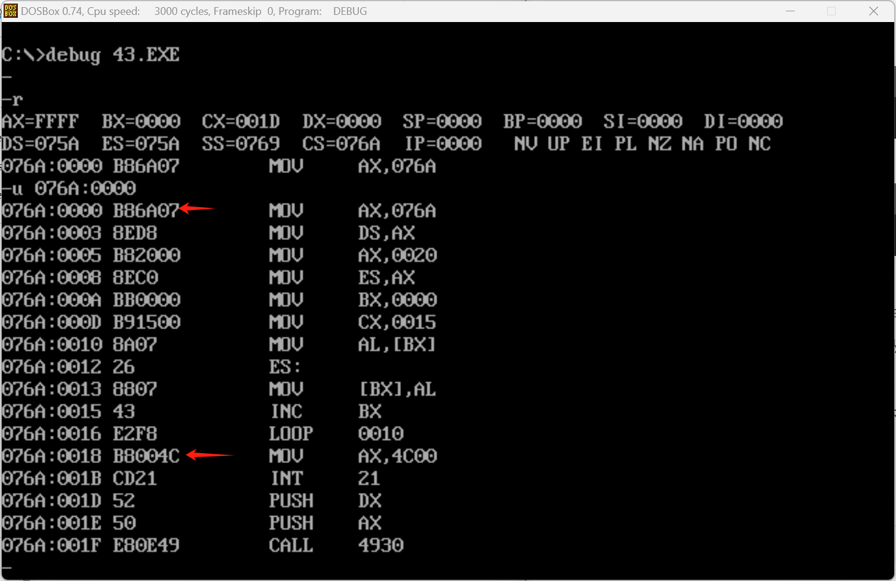</center>

最终结果如下

<center>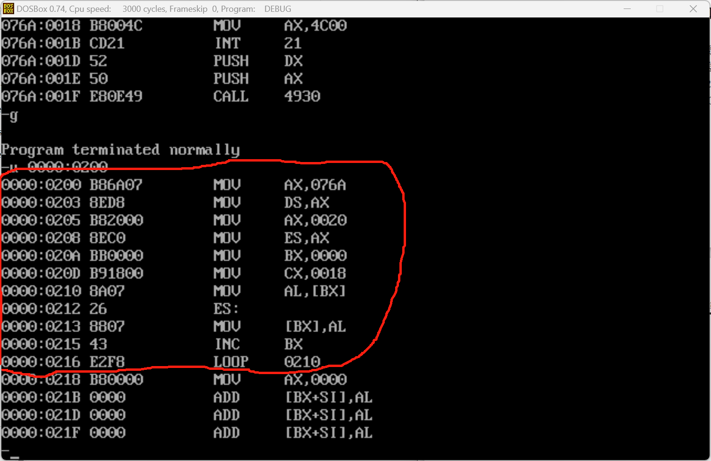</center>


## 5 编写、调试具有多个段的程序

### 5.1 跟踪程序

**data段数据**

从`075A:0100`到`075A:010F`依次为`23,01,56,04,89,07,BC,0A,EF,0D,ED,0F,BA,0C,87,09`

<center>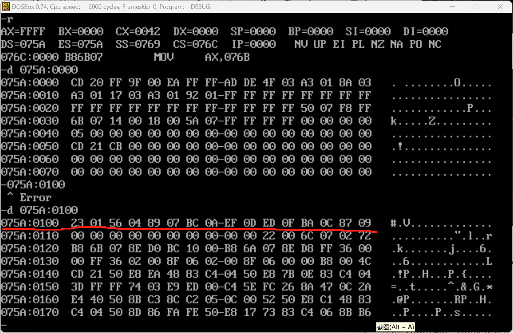</center>


**`CS, SS, DS`的值**

见下图，`CS=076C, SS=076B, DS=076A`


**程序加载后**

`CS=x`，则`SS = CS-2*8Byte / 16 = CS - 1H = X - 1H`，`DS = SS-2*8Byte / 16 = CS - 2H = X - 2H`

<center>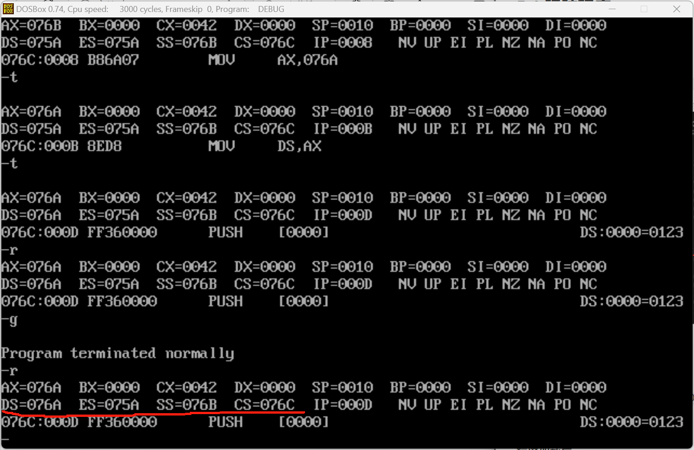</center>


### 5.2 跟踪程序

**data段数据**

从`075A:0100`到`075A:0103`依次为`23,01,56,04`

<center>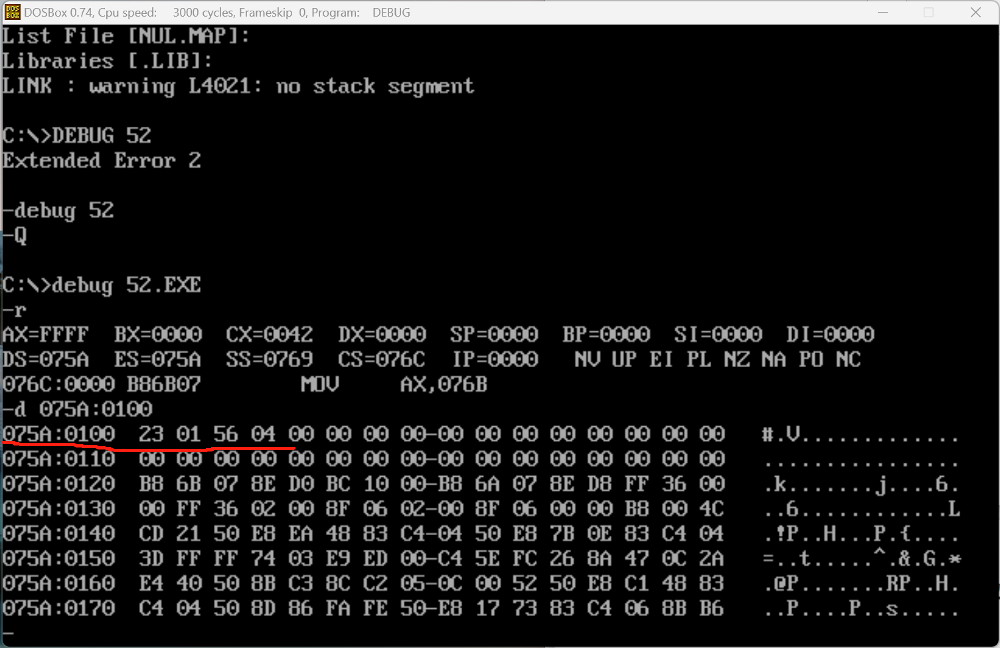</center>


**`CS, SS, DS`的值**

见下图，`CS=076C, SS=076B, DS=076A`


**程序加载后**

`CS=x`，则`SS = X - 1H`，`DS = X - 2H`

<center>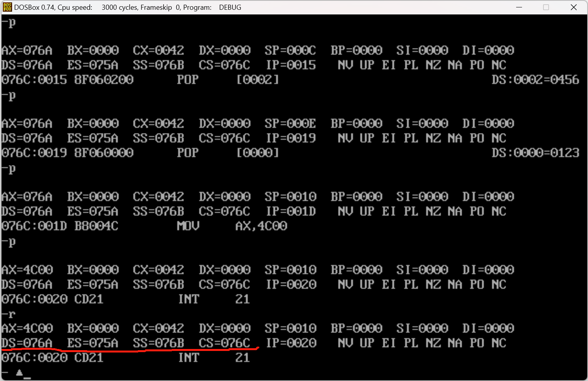</center>


**N个字节的段加载后实际占有的空间**
$$
\mathsf{space} = \lceil N/16 \rceil \times 16 \mathsf{Byte}
$$
其中$\lceil\,\,\,\,\rceil$是取天花板函数


### 5.3 跟踪程序

**data段数据**

从`075D:0100`到`075D:0103`依次为`23,01,56,04`

<center>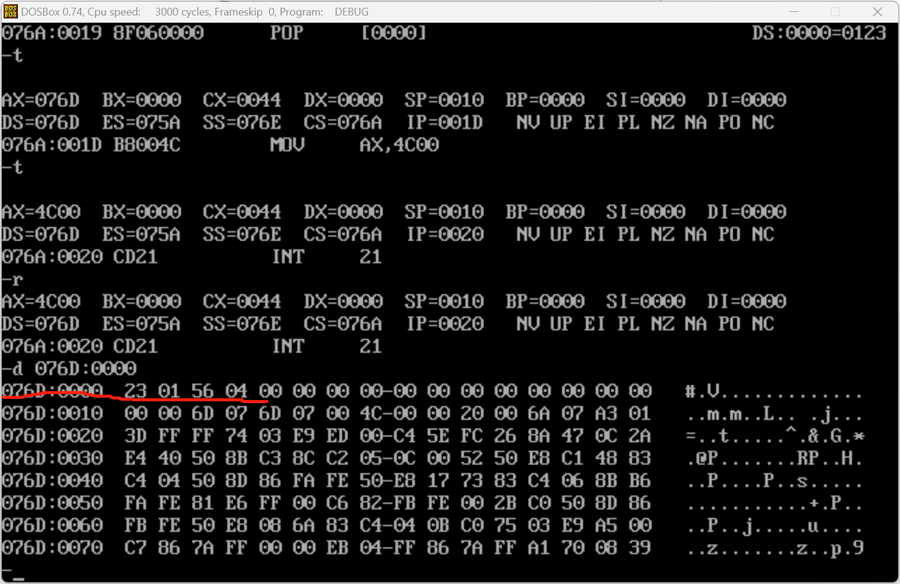</center>


**`CS, SS, DS`的值**

见上图，`CS=076A, SS=076E, DS=076D`


**程序加载后**

`CS=x`，则`SS = X + 4H`，`DS = X + 3H`


### 5.4 谁能运行

只有第三个可以，当不指明程序入口时，CPU顺序执行所有代码，这样会将一些数据也当作指令执行，而第三个就是从指令开始编写的


### 5.5 完善程序

代码如下

```assembly
assume cs:code

a segment
	db 1, 2, 3, 4, 5, 6, 7, 8
a ends

b segment
	db 1, 2, 3, 4, 5, 6, 7, 8
b ends

c segment
	db 0, 0, 0, 0, 0, 0, 0, 0
c ends

code segment
start:	
	mov ax, a
	mov ds, ax

	mov cx, 8H
	mov bx, 0H

s:	mov al, 0
	add al, ds:[bx]
	add al, ds:[bx+10H]
	mov ds:[bx+20H], al
	inc bx
	loop s
	
	mov ax, 4c00H
	int 21H

code ends
end start
```

code段是我加的

结果如下

<table>
    <tr>
    	<td>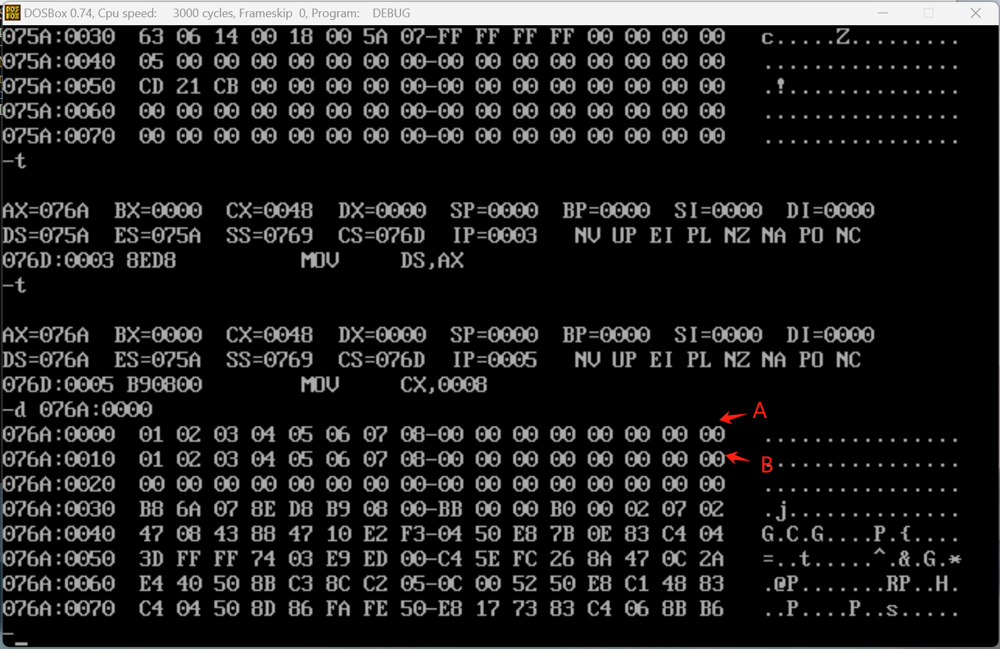</td>
    	<td>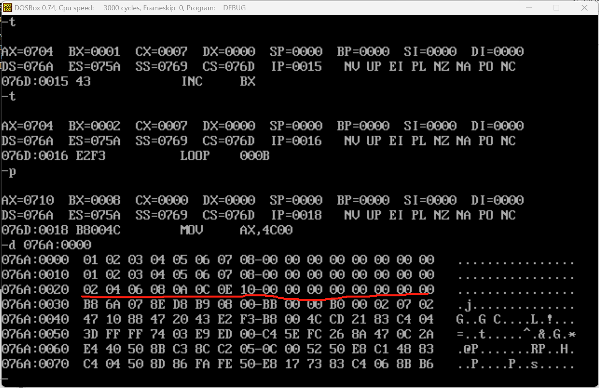</td>
    </tr>
</table>

分别是ABC段的内容和最终结果


### 5.6 完善程序

```assembly
assume cs:code

a segment
	dw 1, 2, 3, 4, 5, 6, 7, 8, 9, 0aH, 0bH, 0cH, 0dH, 0eH, 0fH, 0ffH
a ends

b segment
	dw 0, 0, 0, 0, 0, 0, 0, 0
b ends


code segment
start:	mov ax, a
	mov ds, ax
	mov bx, 0H
	add ax, 3			;将b段之后的一个段定义为ss
	mov ss, ax
	mov cx, 8

s1:	push [bx]
	add bx, 2
	loop s1

	mov bx, 20H
	mov cx, 8

s2:	pop [bx]
	add bx, 2
	loop s2

	mov ax, 4c00H
	int 21H

code ends

end start
```

code段是我加的

结果如下

<table>
    <tr>
    	<td>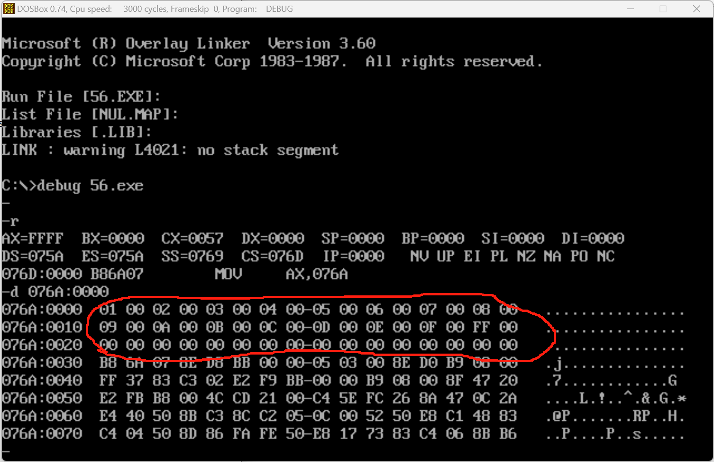</td>
    	<td>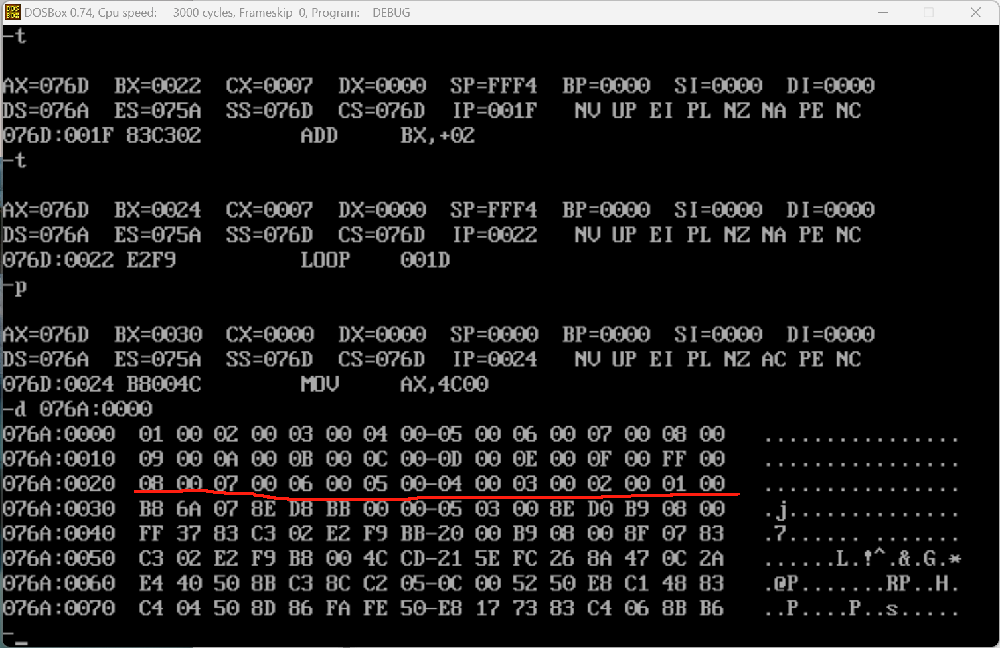</td>
    </tr>
</table>

分别是AB段的内容和最终结果


## 6 内存寻址方式

### 6.1 完善7.9的程序

代码如下

```assembly
assume cs:codesg, ss:stacksg, ds:datasg

stacksg segment
	dw 0, 0, 0, 0, 0, 0, 0, 0
stacksg ends

datasg segment
	db '1. display      '
	db '2. brows        '
	db '3. replace      '
	db '4. modify       '
datasg ends

codesg segment
start:	mov ax, datasg
        mov ds, ax
        mov bx, 0H
        mov ax, stacksg
        mov ss, ax
        mov sp, 0H
        mov cx, 4
s1:		push cx
        mov cx, 4
        mov si, 0
s2:		mov al,  [bx+3+si]
        and al, 11011111B
        mov [bx+3+si], al
        inc si
        loop s2
        pop cx
        add bx, 10H
        loop s1

        mov ax, 4c00H
        int 21H
codesg ends

end start

```

定义结果如下

<center>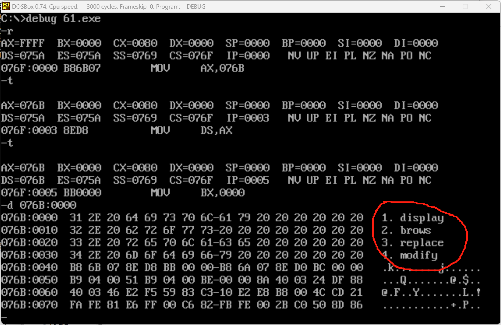</center>

最终结果如下

<center>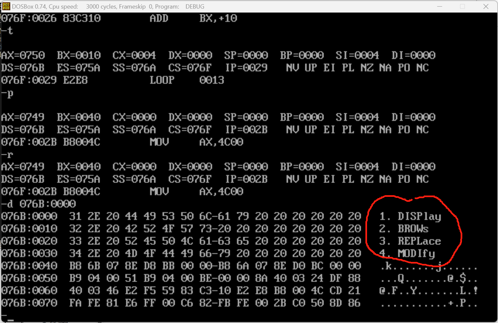</center>


## 7 寻址方式在结构化数据访问中的应用

代码如下

```assembly
assume cs:codesg, ss:stacksg

data segment

	db '1975','1976','1977','1978','1979','1980','1981','1982','1983'
	db '1984','1985','1986','1987','1988','1989','1990','1991','1992'
	db '1993','1994','1995'

	dd 16,22,382,1356,2390,8000,16000,24486,50065,97479,140417,197514
	dd 345980,590827,803530,1183000,1843000,2759000,3753000,4649000,5937000

	dw 3,7,9,13,28,38,130,220,476,778,1001,1442,2258,2793,4037,5635,8226
	dw 11542,14430,15257,17800

data ends

table segment
	
	db 21 dup ('year summ ne ?? ')

table ends


stacksg segment				;附加栈段
	
	dw 21 dup(0)

stacksg ends


codesg segment

start:	
	mov ax, data
	mov ds, ax
	mov ax, table
	mov es, ax
	mov ax, stacksg
	mov ss, ax
	mov sp, 0H
	mov bx, 0H
	mov bp, 0H
	mov si, 84
	mov di, 168
	mov cx, 21

s1:	
	mov ax, ds:[bx]			;转移年份
	mov es:[bp], ax
	mov ax, ds:[bx+2]
	mov es:[bp+2], ax
	
	mov ax, ds:[si]			;转移收入
	mov dx, ds:[si+2]
	mov es:[bp+5], ax
	mov es:[bp+7], dx

	push bx					;计算人均收入并转移
	mov bx, ds:[di]
	div bx
	pop bx
	mov es:[bp+13], ax

	mov ax, ds:[di]			;转移雇员数
	mov es:[bp+10], ax
	
	mov al, 20H				;转移空格
	mov es:[bp+4], al
	mov es:[bp+9], al
	mov es:[bp+12], al
	mov es:[bp+15], al
	
	add bx, 4H
	add si, 4H
	add di, 2H
	add bp, 10H
	loop s1

	mov ax, 4c00H
	int 21H

codesg ends

end start
```

结果如下

初始化结果

<center>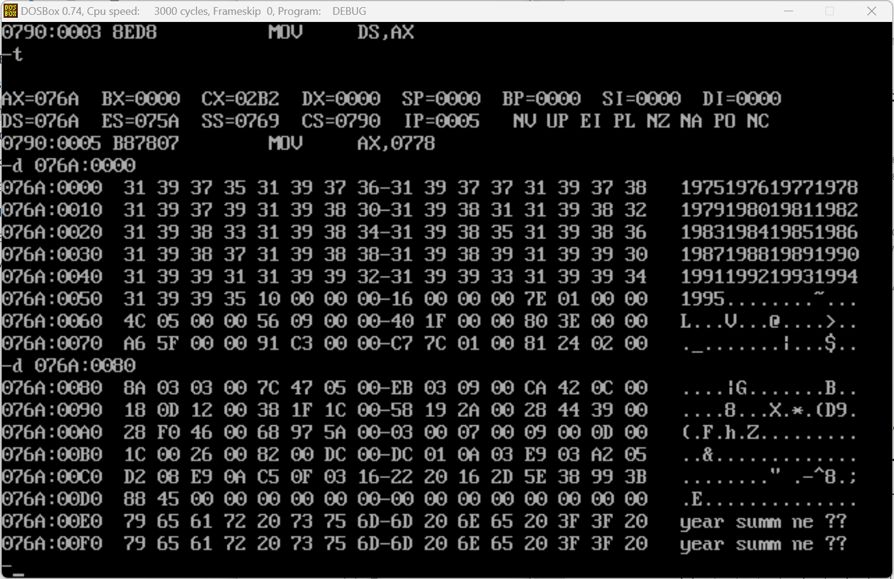</center>

最终结果

<table>
    <tr>
    	<td>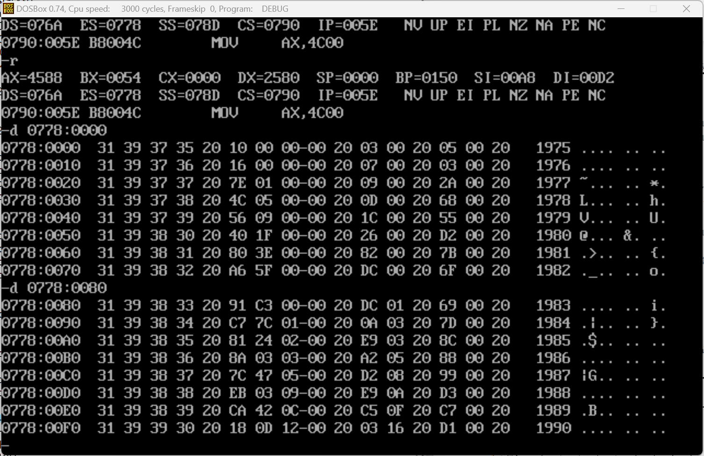</td>
    	<td>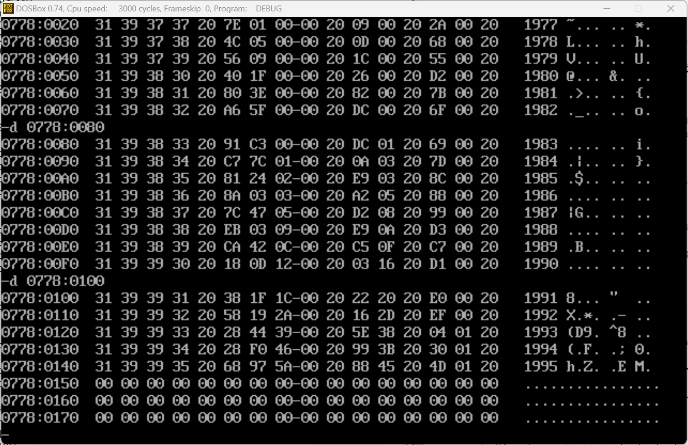</td>
    </tr>
</table>


## 8 分析奇怪的程序

一开始我认为不能正常返回，但是运行的结果确实正常返回了

结果如下

<center>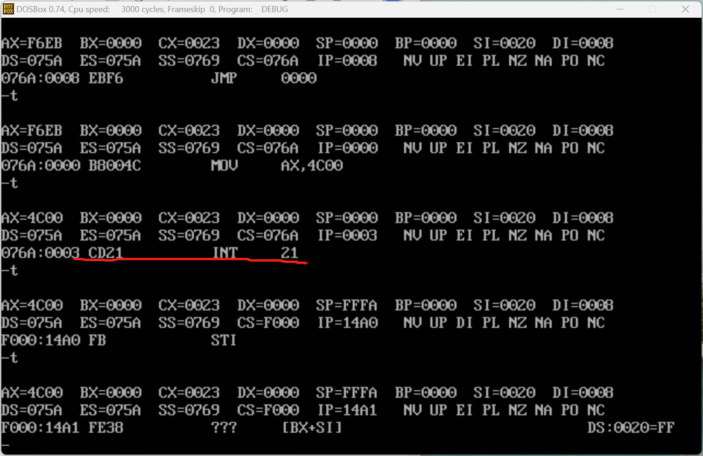</center>


`jmp short s1`的机器码记录的是偏移，在这里就是`-10 = F6`，而`s`向上移动10个字节就是`mov ax, 4c00H`，此时的`s:jmp short s1`占2Byte，`mov ax, 0`和`mov ax, 4c00H`占3Byte，`int 21H`占2Byte，加起来正好10Byte


## 9 在屏幕中间显示不同颜色的字符串

代码如下

```assembly
assume cs:code, ds:data

data segment
	db 'welcom to masm!'
data ends

code segment
	
start:
	mov bx, 0000H
	mov ax, data
	mov ds, ax
	mov bp, 0000H
	mov ax, 0B800H
	mov es, ax
	
	mov ah, 00000010B				;第一行
	mov cx, 15D
	mov bp, 11*80*2+(39-7)*2
s1:	mov al, ds:[bx]
	mov es:[bp], ax
	inc bp
	inc bp
	inc bx
	loop s1

	mov bx, 0						;第二行
	mov ah, 00100100B
	mov cx, 15D
	mov bp, 12*80*2+(39-7)*2
s2:	mov al, ds:[bx]
	mov es:[bp], ax
	inc bp
	inc bp
	inc bx
	loop s2

	mov bx, 0						;第三行
	mov ah, 01110001B
	mov cx, 15D
	mov bp, 13*80*2+(39-7)*2
s3:	mov al, ds:[bx]
	mov es:[bp], ax
	inc bp
	inc bp
	inc bx
	loop s3

	mov ax, 4c00H
	int 21H

code ends
end start
```

结果如下

<center>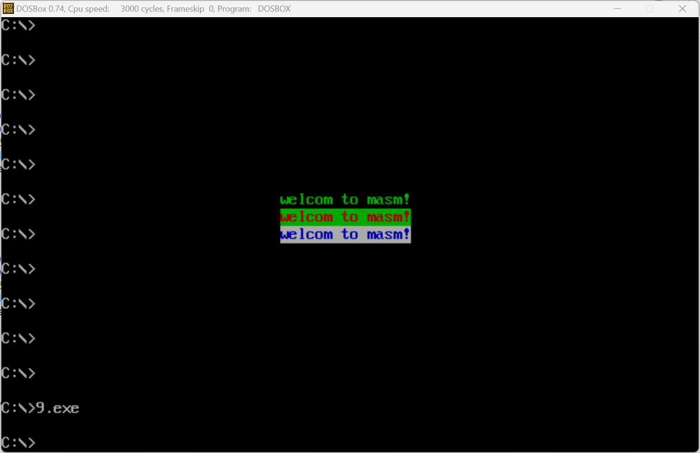</center>


## 10 编写子程序

### 10.1 显示字符串

代码如下

```assembly
assume cs:code

data segment
	db 'Welcome to masm!', 0
data ends

code segment

start:
	mov dh, 8
	mov dl, 3
	mov cl, 2
	mov ax, data
	mov ds, ax
	mov si, 0
	call show_str
	
	mov ax, 4c00H
	int 21H

show_str:
	push ax
	push bx
	push es
	push di
	push cx
	push si

	mov bl, 160D		;找显示位置
	mov ax, 0B800H
	mov es, ax
	mov al, dh
	mul bl

	mov bl, dl
	add bl, bl
	mov di, ax
	
	mov ah, cl			;设置字符属性
s:	mov ch, 0			
	mov cl, ds:[si]		;传递字符
	jcxz over
	mov al, ds:[si]
	mov es:[bx+di], ax
	inc si
	inc bx
	inc bx
	jmp short s
over:	
	pop si
	pop cx
	pop di
	pop es
	pop bx
	pop ax
	
	ret

code ends
end start
```

结果如下

<center>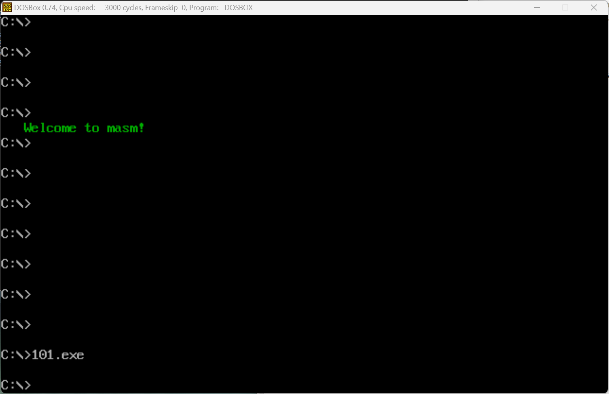</center>

在运行完后又出来了一行，所以字符串显示在第7行，但是其实是显示在第八行的，第三列也对的上


### 10.2 解决除法溢出问题

代码如下

```assembly
assume cs:code

code segment

	mov ax, 4240H
	mov dx, 000FH
	mov cx, 0AH
	call divdw
	
	mov ax, 4c00H
	int 21H

divdw:	
	push bx
	push si
	push di

	mov si, ax			;存数据给临时变量
	mov di, dx
	mov bx, cx
	
	mov ax, di			;计算高位的商
	mov dx, 0
	div bx
	mov di, ax			;高位的商在di，高位的余数在dx
	
	mov ax, si			;计算低位的商和余数
	div bx				;低位的商在ax，低位的余数在dx

	mov cx, dx
	mov dx, di

	pop di
	pop si
	pop bx
	ret

code ends

end
```

结果如下

<center>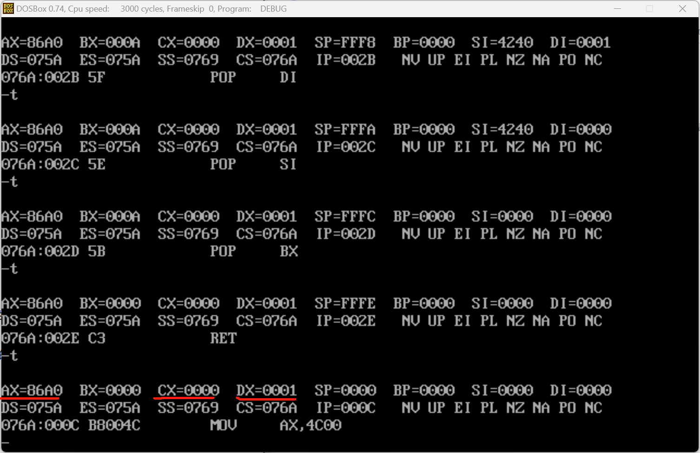</center>


### 10.3 数值显示

代码如下

```assembly
assume ds:data, cs:code, es:extra

data segment
	dw 123, 12666, 1, 8, 3, 38
data ends


extra segment		;保存字符串
	db 10 dup (0)
extra ends


code segment
	
start:
	mov ax, data
	mov ds, ax
	mov si, 2

	mov ax, extra
	mov es, ax
	mov di, 0

	mov cx, 1
	mov bx, 5		;从第5开始打印，打印6行，这里只打印一个12666

s:	mov ax, ds:[si]
	call dtoc
	
	push dx
	push cx
	
	mov dh, bl
	mov dl, 3
	mov cl, 2
	call show_str

	pop cx
	pop dx
	
	inc bl
	add si, 2
	add di, 4

	loop s

	mov ax, 4c00H
	int 21H

dtoc:
	push bp
	push bx
	push dx
	push cx
	push ax

	mov bp, 0
	mov bx, 10
dtoc1:
	mov dx, 0
	div bx
	add dx, 30H			;余数变ASCII
	mov cx, ax				;看除完了没				
	mov byte ptr es:[di+bp], dl		;写结果
	jcxz inverse1
	inc bp
	jmp short dtoc1

inverse1:					;因为是倒着存的，还要倒回去
	mov byte ptr es:[di+bp+1], 0		;最后写0
	mov bp, 0
	push bp						;作为弹栈完成标志
inverse15:	
	mov ch, 0
	mov cl, es:[di+bp]
	jcxz inverse2
	push cx
	inc bp
	jmp short inverse15

inverse2:
	mov bp, 0
inverse25:
	pop cx
	mov es:[di+bp], cl
	inc bp
	jcxz overdtoc
	jmp short inverse25

overdtoc:
	pop ax
	pop cx
	pop dx
	pop bx
	pop bp
	ret

show_str:
	push ax
	push bx
	push ds
	push di
	push cx
	push si

	mov bl, 160D
	mov ax, 0B800H
	mov ds, ax
	mov al, dh
	mul bl

	mov bl, dl
	add bl, bl
	mov si, ax
	
	
	mov ah, cl
str:	mov ch, 0
	mov cl, es:[di]
	jcxz overstr
	mov al, es:[di]
	mov ds:[bx+si], ax
	inc di
	inc bx
	inc bx
	jmp short str
overstr:	
	pop si
	pop cx
	pop di
	pop es
	pop bx
	pop ax
	
	ret

code ends

end start


code ends

end start
```

结果如下

<center>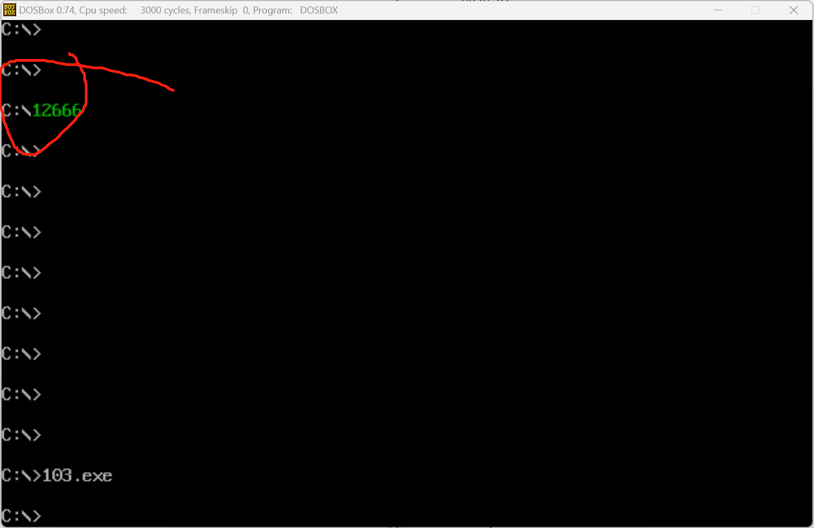</center>


## 11 编写子程序

代码如下

```assembly
assume cs:code, ds:data

data segment
	db "Beginner's All-purpose Symbolic Instruction Code.", 0
data ends

code segment

pushreg macro
	push ax
	push bx
	push cx
	push dx
	push si
	push di
	push bp
	endm

popreg macro
	pop bp
	pop di
	pop si
	pop dx
	pop cx
	pop bx
	pop ax
	endm

begin:
	mov ax, data
	mov ds, ax
	mov si, 0
	
	pushreg
	call letterc
	popreg

	mov ax, 4c00H
	int 21H

letterc:
	mov al, ds:[si]
	
	cmp al, 0
	je lettercEnd
	
	cmp al, 'a'		;在不在范围内的判断
	jb nextLetter
	cmp al, 'z'
	ja nextLetter
	
	and al, 11011111B
	mov ds:[si], al

nextLetter:
	inc si
	jmp short letterc	

lettercEnd:
	ret

code ends

end begin
```

一开始内存的内容如下

<center>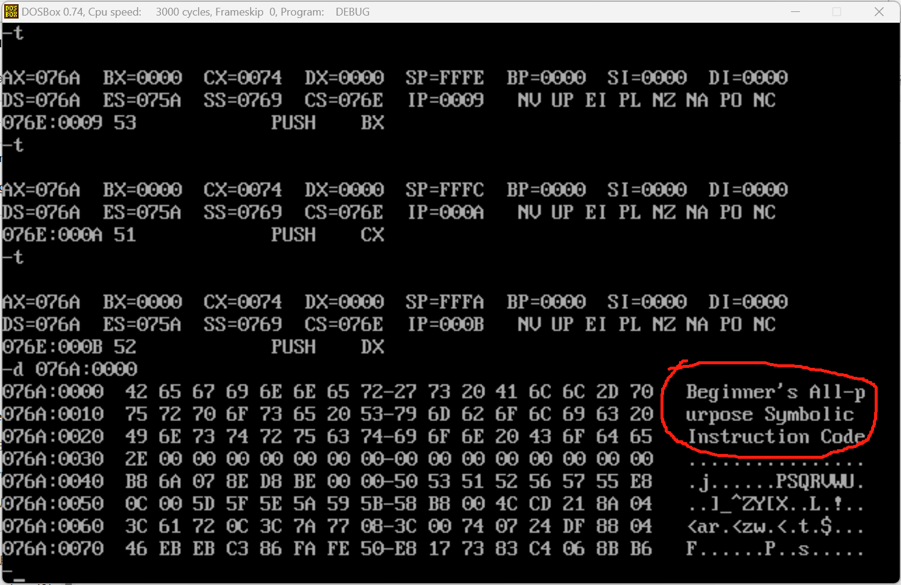</center>


程序返回后内存内容如下

<center>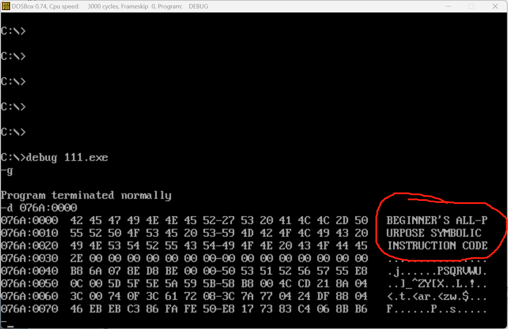</center>


## 12 编写0号中断程序

代码如下

```assembly
assume cs:code

code segment
start:
	mov ax, 0
	mov es, ax
	mov di, 204h	;在0000:0204h处安装程序
	
	mov ax, cs
	mov ds, ax
	mov si, offset do0
	mov ax, offset do0end
	sub ax, si
	mov cx, ax		;将程序的长度给cx
	
	cld			;复制程序
	rep movsb
	
	mov word ptr es:[0], 204h	;重定向中断例程
	mov word ptr es:[2], 0
	
	mov ax, 4c00H
	int 21H

do0:
	jmp short do0start
	db 'divide error!', 0

do0start:
	push ax
	push bx
	push es
	push cx
	push bp
	push ds
	
	mov ax, 0
	mov ds, ax
	mov ax, 0B800H			;设置显示位置
	mov es, ax
	mov bp, 12*80*2+(39-6)*2
	mov bx, 206h				;设置显示源
	mov ah, 00100100B		;设置字符属性

	mov ch, 0
s:	mov al, [bx]			;显示字符
	mov cl, al
	jcxz over
	mov es:[bp], ax
	inc bp
	inc bp
	inc bx
	jmp short s

over:
	pop ds
	pop bp
	pop cx
	pop es
	pop bx
	pop ax
	
	mov ax, 4c00H
	int 21H
do0end:
	nop

code ends

end start
```

这个程序设置了新的中断例程，在安装完后并不会直接报错，因为我没有在程序里出发0号中断，安装完结果如下

<center>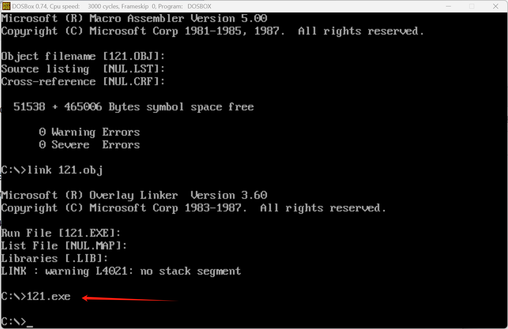</center>


可以看到并没有报错，但是程序是成功安装的

在我手动触发之后，会执行中断例程

<center>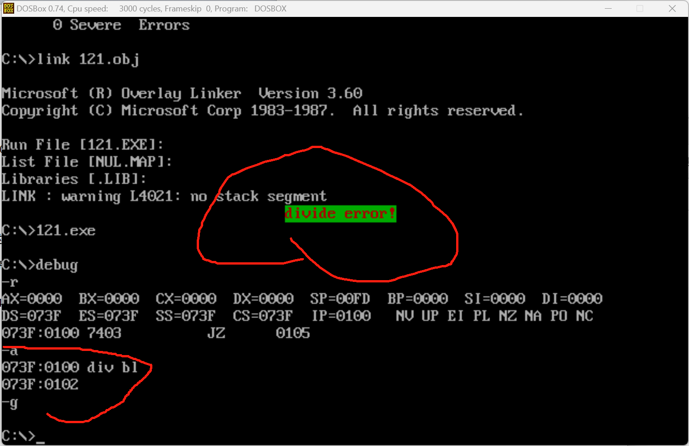</center>

这个程序没有`iret`，因为在发生溢出错误后后面的代码不可能执行正确，也就不需要返回到后面的指令位置

这里不能用`-t`指令执行除法，这样后面不能中断了


## 13 编写、应用中断例程

### 13.1 编写并安装`int 7Ch`中断例程

编写安装程序`1311.exe`如下

```assembly
assume cs:code

code segment
start:
	mov ax, code						;复制指令
	mov ds, ax
	mov si, offset do7C
	mov di, 200h
	mov ax, 0
	mov es, ax
	mov cx, offset do7Cend - offset do7C
	cld
	rep movsb

	mov word ptr es:[7Ch*4], 200h			;更改中断向量表
	mov word ptr es:[7Ch*4+2], 0

	mov ax, 4C00h
	int 21h

do7C:
	push bx
	push ax
	push es
	push cx
	push si
	push di

	mov bl, 160D		;找显示位置
	mov ax, 0B800H
	mov es, ax
	mov al, dh
	mul bl

	mov bl, dl
	add bl, bl			;存列号
	mov di, ax			;存行号

	mov si, 0			;源
	mov ah, cl			;字符属性
	mov ch, 0
s:	mov al, ds:[si]		;转移到显存
	mov cl, al
	jcxz over
	mov es:[di+bx], ax
	add bl, 2
	inc si
	jmp short s

over:
	pop di
	pop si
	pop cx
	pop es
	pop ax
	pop bx
	iret
do7Cend:
	nop
	
code ends

end start
```

触发程序`131.exe`如下

```assembly
assume cs:code, ds:data

data segment
	db "welcome to masm! ", 0
data ends

code segment
start:
	mov dh, 10
	mov dl, 10
	mov cl, 2
	mov ax, data
	mov ds, ax
	mov si, 0
	int 7Ch
	mov ax, 4c00h
	int 21h
code ends
end start
```

结果如下

<center>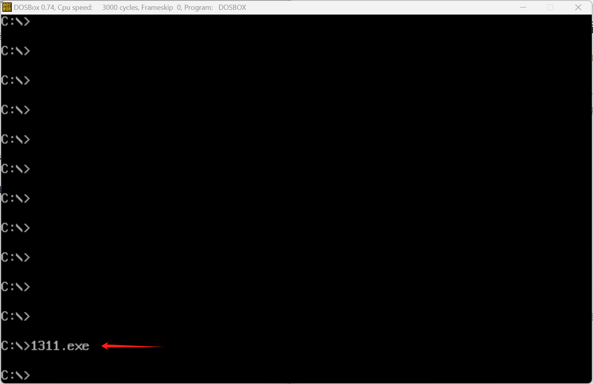</center>

运行安装程序后无事发生，因为没有触发

<center>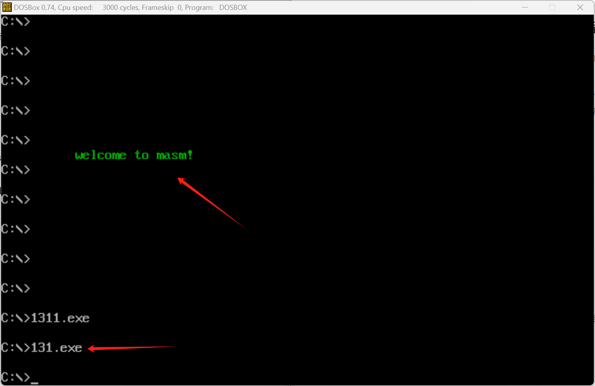</center>

运行触发程序后产生了结果

在`131.exe`程序运行完`int 7Ch`指令后，`CS=7Ch*4+2, IP=7Ch*4`，原先的`flags, CS,IP`依次入栈，在运行完`iret`后，依次出栈，反着出


### 13.2 编写循环指令

编写安装程序`132.exe`如下

```assembly
assume cs:code

code segment
start:
	mov ax, code					;复制指令
	mov ds, ax
	mov si, offset do7C
	mov di, 200h
	mov ax, 0
	mov es, ax
	mov cx, offset do7Cend - offset do7C
	cld
	rep movsb

	mov word ptr es:[7Ch*4], 200h	;更改中断向量表
	mov word ptr es:[7Ch*4+2], 0

	mov ax, 4C00h
	int 21h

do7C:
	pop ax							;ax存原来的下一个ip，即offst se
	pop dx							;dx存原来的cs						

	add ax, bx						;此时ax为offset s
	sub cx, 1
	jcxz notDo						;进入中断前有一次循环，故判断==0在-1之后
	
	push dx							;cs不变
	push ax							;ip重新指向s
	iret

notDo:
	sub ax, bx
	push dx
	push ax
	iret

do7Cend:
	nop
	
code ends

end start
```

触发程序`1322.exe`如下

```assembly
assume cs:code
code segment
start:
	mov ax, 0b800h
	mov es, ax
	mov di, 160*12
	mov bx, offset s - offset se
	mov cx, 80
s:	mov byte ptr es:[di], '!'
	add di, 2
	int 7Ch
se:	nop
	mov ax, 4c00H
	int 21H
code ends
end start
```

结果如下

<center>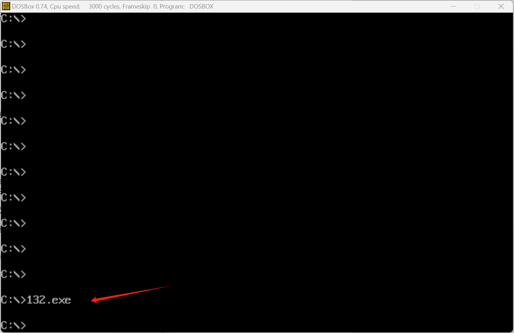</center>

运行了安装程序，没有触发，再运行触发程序

<center>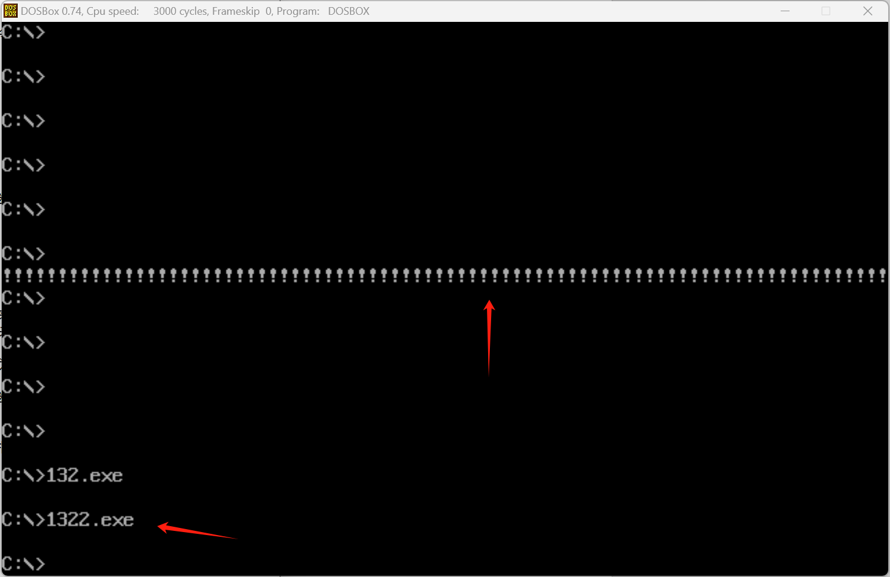</center>

产生了结果


### 13.3 补全代码，调用BIOS中断例程

代码如下

```assembly
assume cs:code

code segment
	s1:	db 'Good, better, best,', '$'
	s2:	db 'Never Let it rest,', '$'
	s3:	db 'Till good is better,', '$'
	s4:	db 'And better, best.', '$'
	s:	dw offset s1, offset s2, offset s3, offset s4
	row:	db 2, 4, 6, 8

start:
	mov ax, cs
	mov ds, ax
	mov bx, offset s
	mov si, offset row
	mov cx, 4

ok:	mov bh, 0
	mov dh, ds:[si]				;dh中存放的是显示的行号
	mov dl, 0
	mov ah, 2
	int 10H						;10h中断的2号例程是设置光标

	mov dx, ds:[bx]				;要显示的字符串
	mov ah, 9
	int 21H						;21h中断的9号例程是在光标处显示以'$'结尾的字符串

	inc si						;si指向下一个行号
	add bx, 2					;bx指向下一个字符串
	loop ok

	mov ax, 4c00H
	int 21H

code ends

end start
```

结果如下

<center>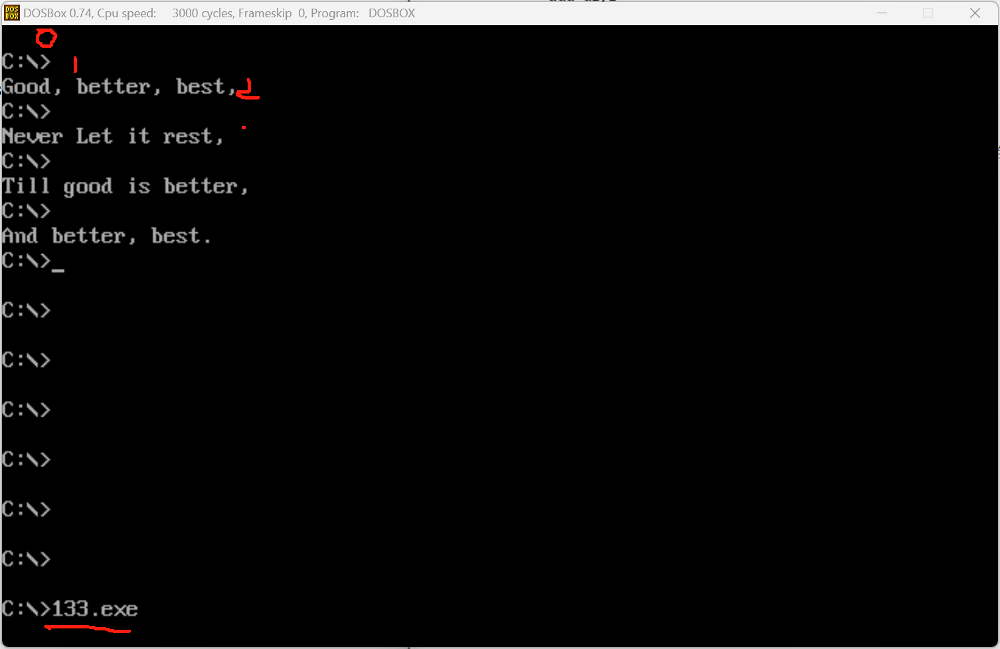</center>


## 14 访问CMOS RAM

代码如下

```assembly
assume cs:code

code segment
	s: db 9, 8, 7, 4, 2, 0
	time: dw '00', ' /', '00', ' /', '00', '  ', '00', ' :', '00', ' :', '00'	;存放读到的时间
start:
	mov ax, cs
	mov ds, ax
	mov si, offset s			;定位到数据段
	mov di, offset time		;存储用
	mov cx, 6				;循环6次

read:	
	mov al, ds:[si]			;写入要读的端口
	out 70h, al				
	in al, 71h				;写到al，还需要变换
	
	mov ah, al				;将高位和低位变为ASCII码
	push cx
	mov cl, 4
	shr ah, cl
	pop cx
	and al, 00001111b
	add ah, 30h
	add al, 30h

	mov byte ptr ds:[di], ah	;写入内存
	mov byte ptr ds:[di+1], al
	
	inc si
	add di, 4
	
	loop read

print:						;显示时间
	mov ax, 0B800h
	mov es, ax
	mov bx, 12*160+(39-11)*2
	
	mov si, offset time
	mov cx, 22
printloop:
	mov dl, ds:[si]
	mov es:[bx], dl
	add bx, 2
	inc si
	loop printloop

	mov ax, 4c00h
	int 21h

code ends

end start
```

结果如下

<center>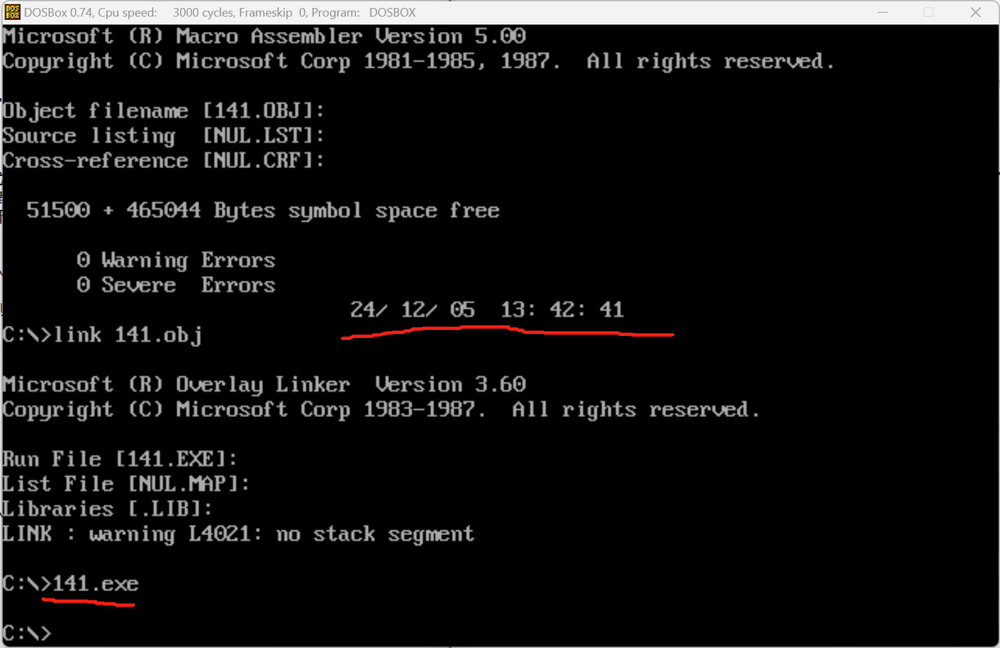</center>


## 15 新的`int 9 `中断

代码如下

```assembly
assume cs:code

code segment
start: 
        ;保存原始int9的地址
        mov ax, 0
        mov es, ax
        mov ax, es:[9*4]
        mov es:[200h], ax
        mov ax, es:[9*4+2]
        mov es:[202h], ax
        
        ;复制指令
        mov ax, code                                     
        mov ds, ax
        mov si, offset do9
        mov di, 204h
        mov cx, offset do9end - offset do9
        cld
        rep movsb

        ;更改中断向量表
        cli                                 ;关中断
        mov word ptr es:[9h*4], 204h       
        mov word ptr es:[9h*4+2], 0
        sti                                 ;开中断

        mov ax,4c00h
        int 21h

do9:
        push ax
        push bx
        push cx
        push es
        push ds

        in al, 60h                          ;读取扫描码
        
        pushf                               ;保存标志寄存器
        call dword ptr cs:[200h]            ;调用原中断处理程序
        
        cmp al, 1Eh                         ;比较是否为A键的通码
        jne do9ret                          ;不是A键就直接返回
        
        ;是A键，等待松开
wait_release:
        in al, 60h
        cmp al, 9Eh                         ;比较是否为A键的断码
        jne wait_release                    ;不是断码就继续等待
        
        ;显示满屏A
        mov ax, 0B800h
        mov es, ax
        mov bx, 0
        mov cx, 2000
        mov al, 'A'
s:      
        mov es:[bx], al
        add bx, 2
        loop s

do9ret:
        pop ds
        pop es
        pop cx
        pop bx
        pop ax
        iret
        
do9end:
        nop

code ends
end start
```

结果如下，安装过程没有问题

<center>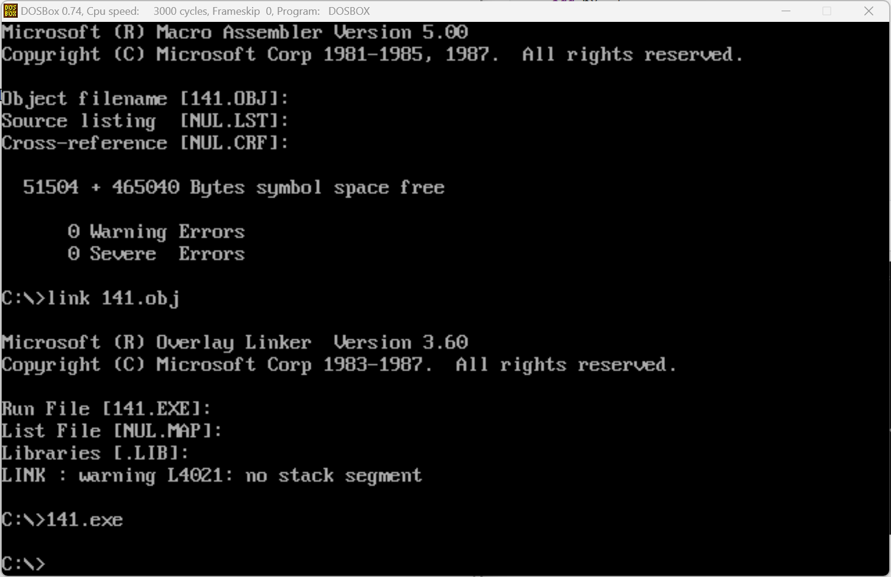</center>

安装完后按别的按键正常

<center>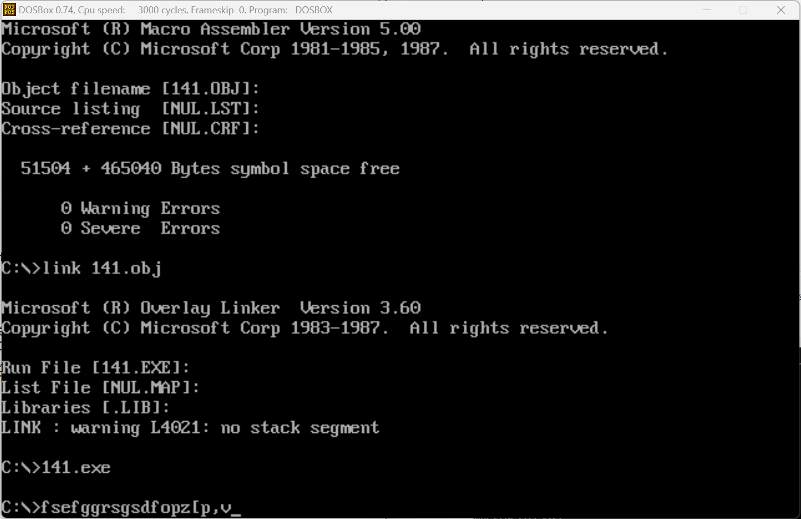</center>

按A会触发

<center>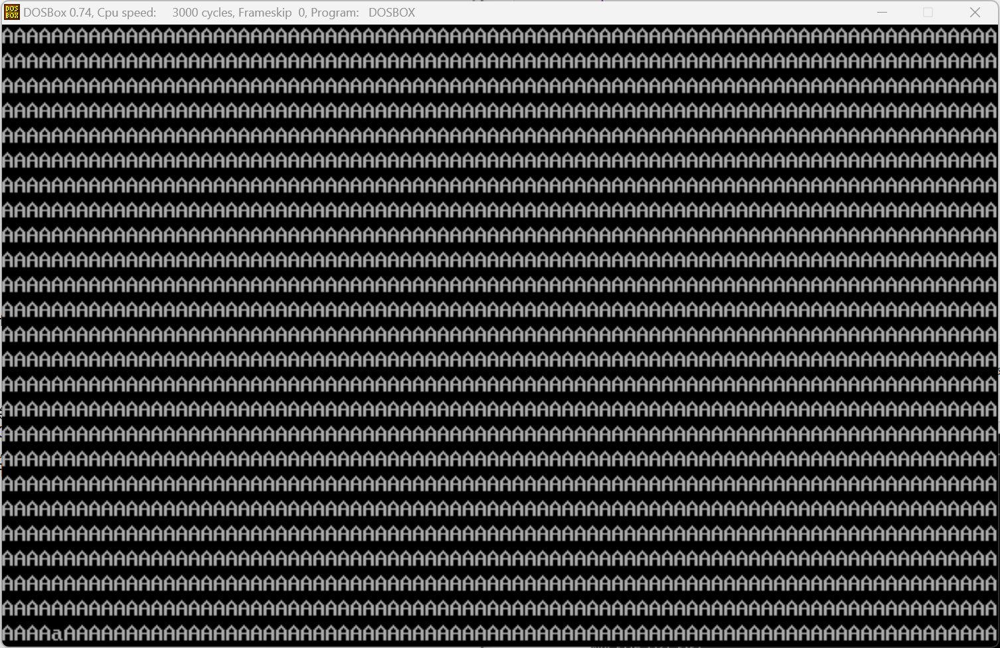</center>

触发完还能按别的按键

<center>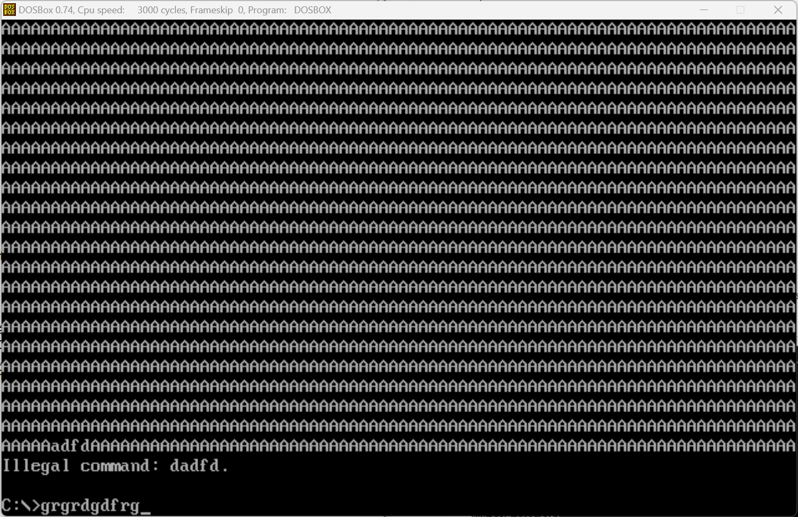</center>


## 16 编写包含多个功能子程序的中断例程

由于是动态的变化，图片的演示效果不太好

代码如下：

```assembly
assume cs:code, ds:data

data segment							;在code段内定义会有bug，不知道怎么回事就单独定义一个data段
	dw offset sub1 - offset do7C + 200h
	dw offset sub2 - offset do7C + 200h
	dw offset sub3 - offset do7C + 200h
	dw offset sub4 - offset do7C + 200h
data ends

code segment

start:									;安装程序
	mov ax, 0
	mov es, ax
	mov ax, code
	mov ds, ax
	mov di, 200h
	mov si, offset do7C
	mov cx, offset do7CEnd - offset do7C
	cld
	rep movsb

	mov word ptr es:[7Ch*4],  200h			;重定向
	mov word ptr es:[7Ch*4+2], 0

	mov di, 200h + offset do7CEnd - offset do7C		;记录data段的数据，紧跟这do7C的指令
	mov si, 0
	mov ax, data
	mov ds, ax
	mov cx, 4
	cld
	rep movsw

	mov ax, 4C00h
	int 21h

do7C:
	jmp near ptr set

set:
	push es
	push bx
	push ds
	push ax
	
	cmp ah, 3
	ja sret
	mov bl, ah
	mov bh, 0
	add bx, bx
	mov ax, 0
	mov es, ax
	mov si, 200h + offset do7CEnd - offset do7C 	;指向几个数据
	mov bx, es:[bx+si]
	pop ax						;ax必须在这里pop，不然就是0
	call bx
sret:
	pop ax
	pop bx
	pop es

	iret

sub1:
	push bx
	push es
	push cx
	push dx
	mov bx, 0B800h
	mov es, bx
	mov cx, 2000
	mov bx, 0
	mov dl, ' '
sub1s:
	mov es:[bx], dl
	inc bx
	inc bx
	loop sub1s
	pop dx
	pop cx
	pop es
	pop bx
	ret


sub2:
	push bx
	push es
	push cx
	mov bx, 0B800h
	mov es, bx
	mov cx, 2000
	mov bx, 1
sub2s:
	and byte ptr es:[bx], 11111000b
	or es:[bx], al
	inc bx
	inc bx
	loop sub2s
	pop cx
	pop es
	pop bx
	ret


sub3:
	push bx
	push es
	push cx
	mov bx, 0B800h
	mov es, bx
	mov cl, 4
	shl al, cl
	mov cx, 2000
	mov bx, 1
sub3s:
	and byte ptr es:[bx], 10001111b
	or es:[bx], al
	inc bx
	inc bx
	loop sub3s
	pop cx
	pop es
	pop bx
	ret


sub4:
	push bx
	push es
	push si
	push di
	push cx
	mov bx, 0B800h
	mov es, bx
	mov di, 0
	mov si, 160
	mov ds, bx
	cld
 	mov cx, 24
sub4s:
	push cx
	mov cx, 160
	rep movsb
	pop cx
	loop sub4s

	mov cx, 80
	mov di, 0
sub4s1:
	mov byte ptr es:[di+160*24], ' '
	inc si
	inc si
	loop sub4s1
	pop cx
	pop di
	pop si
	pop es
	pop bx
	ret

do7CEnd:
	nop

code ends

end start
```

触发代码如下

```assembly
assume cs:code

code segment

	mov ah, 2			;可以换成别的
	mov al, 3			;可以换成别的

	int 7Ch
	
	mov ax, 4C00h
	int 21h
code ends

end
```

图片就不放了，但是这真的是能够正常执行并且返回DOS系统的