# 自控实验报告

* 小组成员：

## 1 建模

### 1.1 公式推导

如图的电机

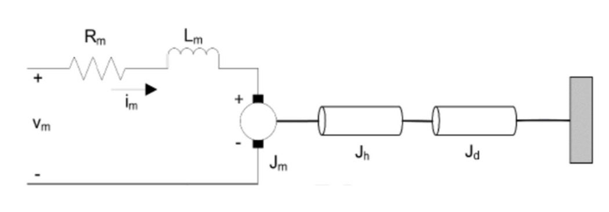

如果认为电感远小于电阻，得到
$$
V_m(t) - R_mi_m(t) -e_b(t)  =0
$$
其中$e_b(t) = K_ew_m(t)$是电机的电压，右边是反电动势常数和电机转速，带入对上式进行$Laplace$变换，得到
$$
I_m(s) = \frac{V_m(s) - K_eW_m(s)}{R_m} \tag{1-1}
$$
又知电机的转速与负载质量和输出扭矩的关系是
$$
J_{eq}\dot{w}_m(t) = K_ti_m(t)\Rightarrow J_{eq}sW_m(s) = K_tI_m(s)\\\tag{1-2}
J_{eq} = J_m + J_h + J_d,\,\,\,\,\,J = \frac{1}{2}mr^2
$$
联立式(1-1)和(1-2)得到转速关于电压的传递函数
$$
\frac{W_m(s)}{V_m(s)} = \frac{\frac{1}{K_e}}{\frac{J_{eq}R_m}{K_eK_t}s+1} \tag{1-3}
$$
若输入电压为阶跃信号，即$V(t) = Au(t)$，得到转速的阶跃响应
$$
W_m(s)= \frac{A}{K_e}\cdot \frac{1}{s} - \frac{A}{K_e}\cdot\frac{1}{s+\frac{K_eK_t}{J_{eq}R_m}}\tag{1-4}
$$

$$
w_m(t) = \frac{A}{K_e} u(t) - \frac{A}{K_e} e^{-\frac{K_eK_t}{J_{eq}R_m}t}u(t)\tag{1-5}
$$

### 1.2 实验结果

2.1 阶跃响应测试
1. 确保QNET DC Motor Modeling .vi 打开。 确保选择了正确的设备 Device。
2. 运行 VI. 直流电机应开始旋转，VI上的曲线应类似于图1.2所示。
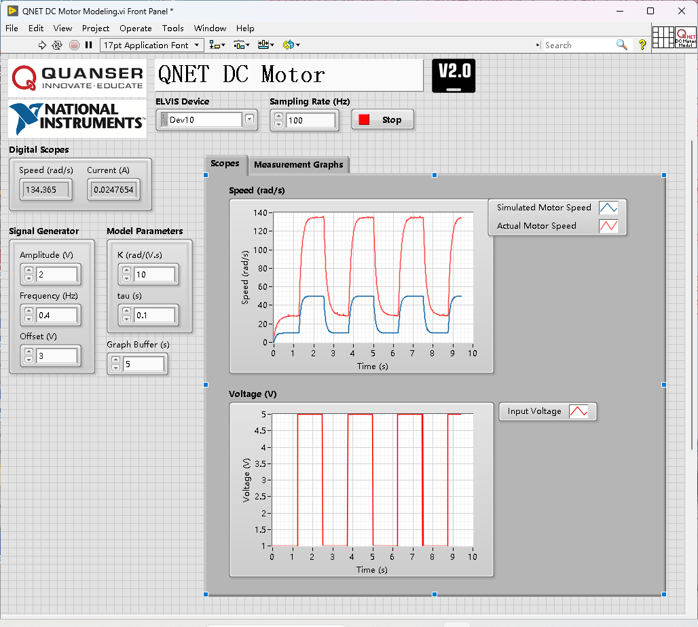
3. 对信号发生器 Signal Generator 部分的设置 
- 振幅Amplitude (V) = 2.0 
- 频率Frequency (Hz) = 0.40 
- 偏移量Offset (V) = 3.0 
4. 当获取得到一个完整阶跃响应曲线时，点击停止Stop按钮来停止VI运行。
5. 粘贴速度 Speed (rad/s)和电压 Voltage (V) 图中的响应
6. 选择实测图形 Measurement Graphs选项以查看实际响应，如图 1.3所示。
稳态增益和时间常数的测量如图：
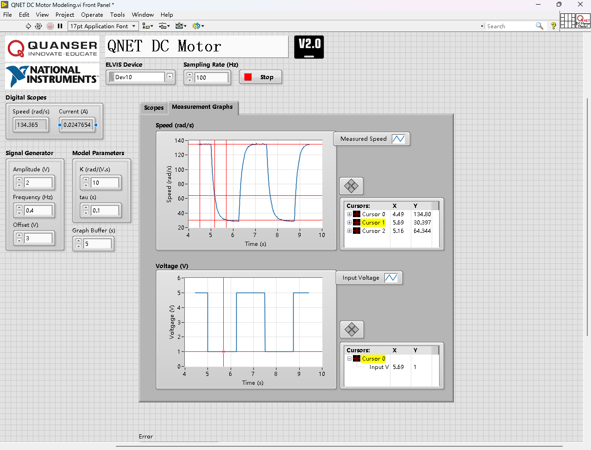
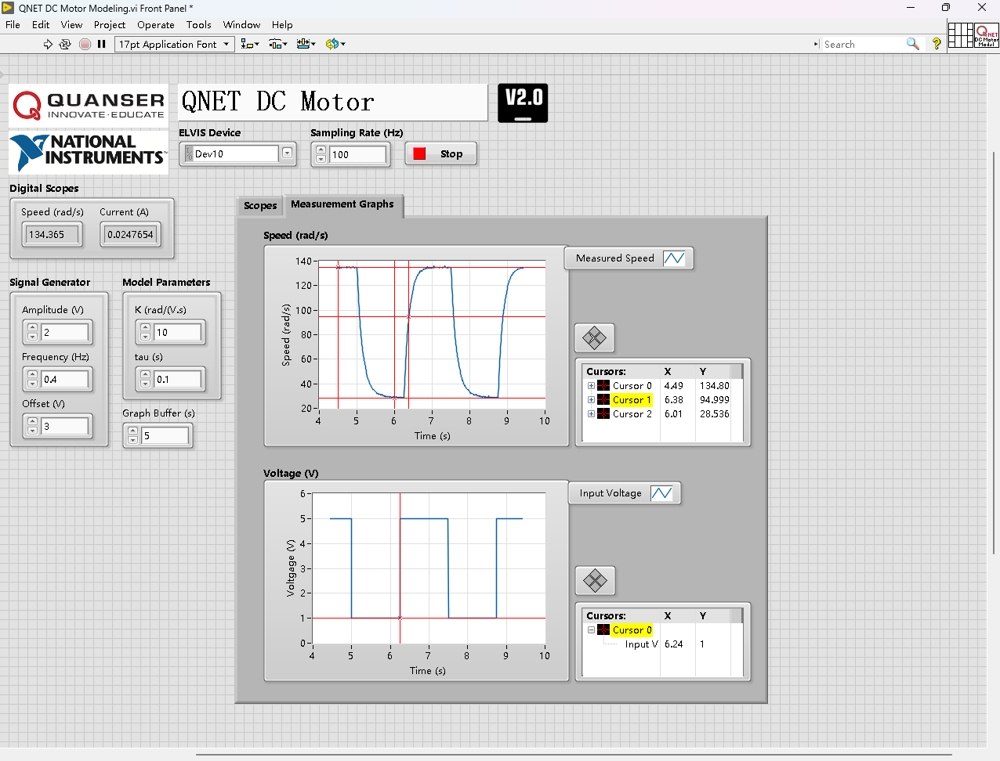
7. 稳态增益 
$$
K = \frac{\Delta y}{\Delta u} = \frac{134.80 - 28.536}{5 - 1} = 26.6
$$
8. 时间常数
$$
y(t_1) = 0.632y_{ss} + y_0 = 0.632 * 106.264 + 28.536 = 95.695
$$
由于精度限制，t_1大约为6.38
$$
\tau = 6.38 - 6.24 = 0.14s
$$

2.2 模型验证
1. 打开 QNET DC Motor Modeling.vi.  确保选择了正确的设备 Device
2. 运行 VI。可以听到直流电机开始运行，VI上的示波器显示如图1.2所示
3. 信号发生器Signal Generator 参数设置： 
• 振幅Amplitude (V) = 2.0 
• 频率Frequency (Hz) = 0.40 
• 偏移量Offset (V) = 3.0
4. 在VI的模型参数 Model Parameters  部分中，输入阶跃响应测试实验室中得出的模型参数K 和τ。蓝色的仿真曲线应该与红色的电机实测速度曲线很接近
5. 从示波器Scopes 选项上，获取速度Speed (rad/s) 和电压 Voltage (V) 响应图
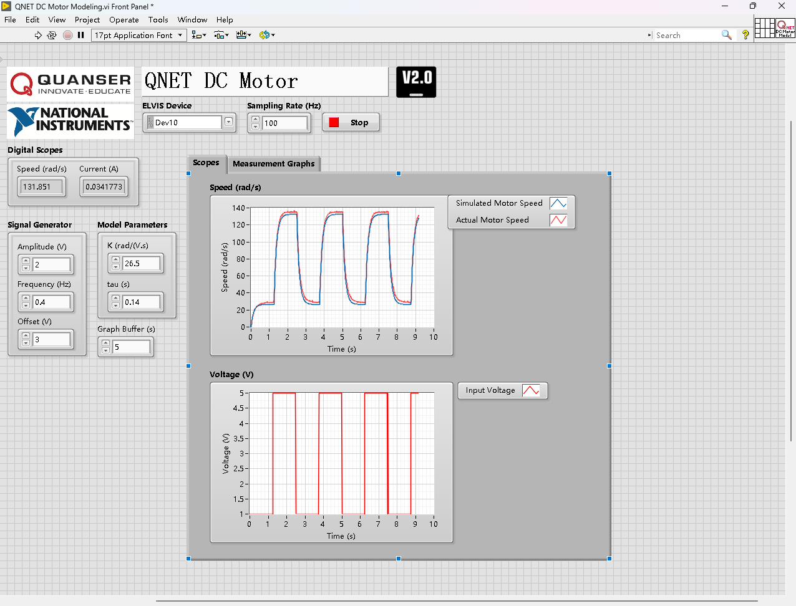
6. 所建模型表达实际系统的效果有怎样? 如果它们不匹配，请分析此差异的可能来源
> 效果较好，模拟曲线的响应时间与实际情况极为接近，但稳态情形下两者有绝对误差，实际曲线类似将蓝色曲线整体上移，可能的原因是：
> (1)参数估计误差。K（增益）和τ（时间常数）的估计不完全准确
> (2)模型简化与实际系统的差异。在实际电机中，可能会存在一些在模型中未考虑的影响因素。例如，电机的非线性行为、磁饱和效应、摩擦力、以及电机与负载之间的耦合等都可能对稳态响应产生影响。仿真模型通常会做出简化假设，这可能导致稳态误差。
> (3)其他误差例如，电源和信号发生器的稳定性误差，实际负载可能与理想负载不完全相同，传感器测量误差等
> 以上的误差都有可能导致实际响应曲线相对于模拟结果整体上移。

7. 调整模型参数 Model Parameters部分中的稳态增益K 和时间常数τ，使仿真曲线更好地匹配实际系统，并记下其值
$$
k = 27 \\
\tau = 0.14s
$$
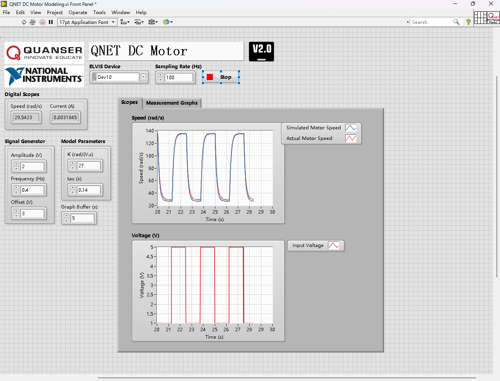

## 2 比例积分速度控制

### 2.1 公式推导

系统框图如下图

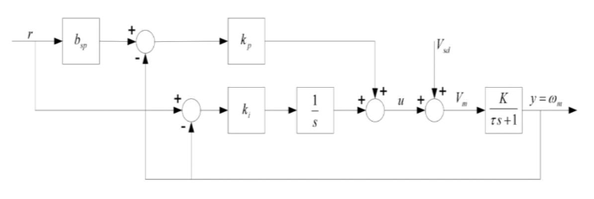

在无扰动条件下，即$V_{sd}=0$时，系统的传递函数为
$$
H(s) = \frac{W_m(s)}{R(s)} = K\cdot\frac{(b_{sp}k_ps+k_i)}{\tau s^2+(Kk_p+1)s+Kk_i} \tag{2-1}
$$
使用梅逊公式，该系统的前向通路是
$$
P_1=b_{sp}k_p\frac{K}{\tau s+1}\,\,\,,\,\,\,P_2=k_i\frac{1}{s}\frac{K}{\tau s+1}
$$
回路是
$$
L_1= -k_p\frac{K}{\tau s+1}\,\,\,,\,\,\, L_2 =-k_i\frac{1}{s}\frac{K}{\tau s+1}
$$
二者相互接触，且分别和$P_1,P_2$接触，那么$\Delta$为
$$
\Delta = 1+k_p\frac{K}{\tau s+1}+k_i\frac{1}{s}\frac{K}{\tau s+1}\\
\Delta_1 = \Delta _2 = 1
$$
系统的传递函数为$\frac{W_m(s)}{R(s)} = \frac{P_1\Delta_1+P_2\Delta_2}{\Delta}$，带入即可

对于这个二阶系统，刻画系统的数学量为
$$
\omega_n = \sqrt{\frac{Kk_i}{\tau}}\tag{2-2}
$$

$$
\zeta = \frac{Kk_p+1}{2\sqrt{Kk_i\tau}}\tag{2-3}
$$

### 2.2 实验练习

> 改变$k_p$变化产生的性能差异

当$k_p$减小时，比例控制的作用减小，系统的响应速度变慢，但是振荡会减小，超调量更小，稳定性提高；当其增大时变化相反，系统的振荡和超调量更大，但是响应更快，稳定性不太好说，应该是降低的。

> 计算当$\zeta=0.75,\omega_0=16.0\mathsf{rad/s}$时的峰值时间$t_p$和最大过调量$M_p$

峰值时间$t_p = \frac{\pi}{\omega_d} = \frac{\pi}{\omega_n\sqrt{1-\zeta^2}}=0.297\mathsf{s}$

最大过调量$M_p = e^{-\frac{\pi\sigma}{\omega_d}}\times100\% = e^{-\frac{\pi\zeta}{\sqrt{1-\zeta^2}}}\times100\% = 2.84\%$

> 稳态增益$K=26\mathsf{rad/V/s}$，时间常数$\tau=0.145\mathsf{s}$，在满足上题的指标下，计算比例和微分控制增益$k_p,k_i$

$\omega_n = \sqrt{\frac{Kk_i}{\tau}}, \zeta = \frac{Kk_p+1}{2\sqrt{Kk_i\tau}}$，带入得到$k_i=1.43 \mathsf{V/rad},k_p=0.0955\mathsf{V\cdot s/rad}$

> 增加$\zeta$对实测的速度响应有什么影响？控制增益怎么样？

当$\zeta$增大时，上升时间**变大**，峰值时间**不变**，最大过调量**减小**，调整时间**减小**。

**响应速度变慢**，但是系统变得稳定。**控制增益$k_p$变大，$k_i$不变**。

>增加$\omega_n$对实测的速度响应有什么影响？控制增益怎么样？

当$\omega_n$增大时，上升时间**减小**，峰值时间**减小**，最大过调量**不变**，调整时间**减小**。

**响应速度变快**。**控制增益$k_p$增大，$k_i$增大**。

### 2.3 实验结果

#### 2.3.1 定性的比例积分速度控制

设置默认参数下，得到参考速度（蓝色）与实测速度（红色）曲线如下：

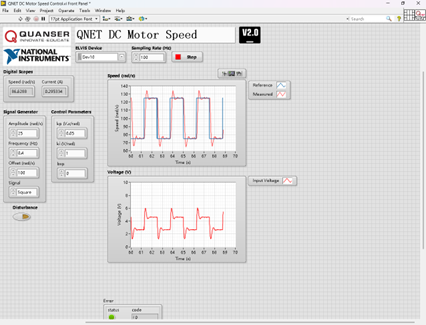

可见实测速度曲线与参考速度曲线趋势一致，但是在上升沿后与下降沿后出现明显的超调现象，随后再振荡趋于稳定值。这是由于积分控制具有一定的滞后性，当输入方波响应时其骤变导致误差突然增大，积分控制器需要一定的时间进行误差积累故导致明显的超调现象；但是随后误差会被逐渐消除

保持ki固定，改变kp的值:

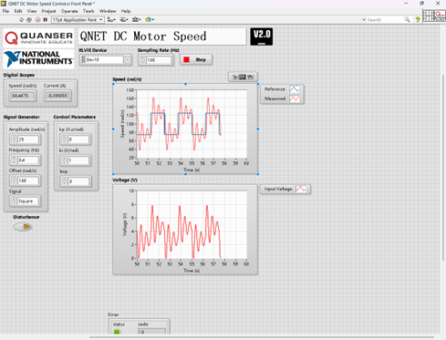

kp=0

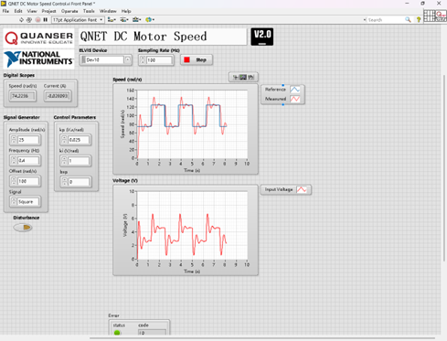

kp=0.025

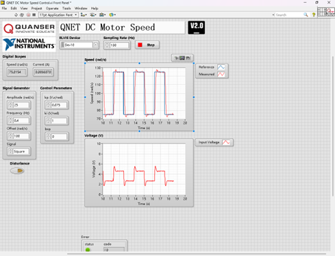

kp=0.075

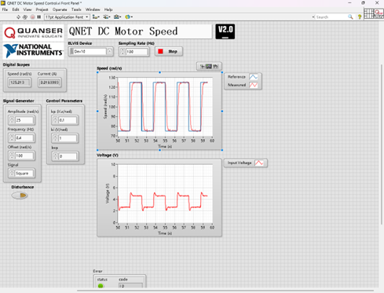

kp=0.1

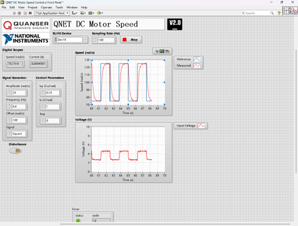

kp=0.15

观察到ki固定时，随着kp增大，系统的振荡现象逐渐减小直至几乎消失，达到稳定所需时间逐渐增大，标志着系统从欠阻尼状态变为过阻尼状态。这是由于系统的参数：
$$
\omega_n = \sqrt{\frac{Kk_i}{\tau}}\\
\zeta = \frac{Kk_p+1}{2\sqrt{Kk_i\tau}}
$$
阻尼系数随着kp的增大而增大，而自然频率不变，导致了系统性能的变化。

随后设置kp = ki = 0, 观察到电机停止转动

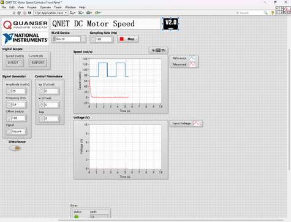

保持kp = 0.05, 改变ki，观察到如下现象

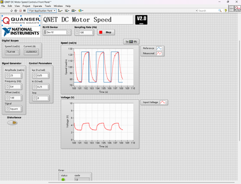

ki=0.25

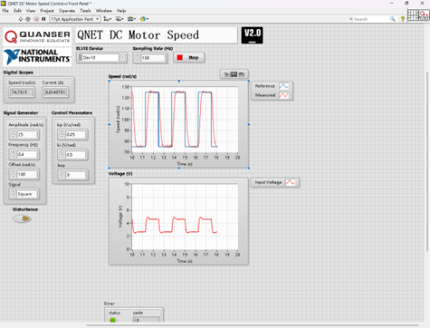

ki=0.5

ki=0.75

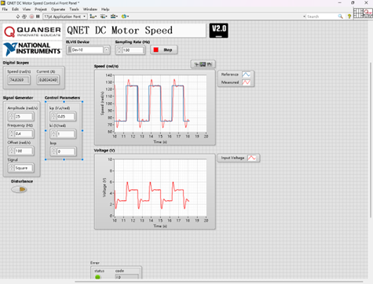

ki=1

观察到，当ki较低时，系统呈过阻尼状态，响应速度较慢但是无明显超调现象；反之，当ki较大时，系统呈欠阻尼状态，相应速度快但是出现明显的超调现象。这同样可以用系统的参数解释：阻尼系数随ki增大而减小，而自然频率则随ki增大而增大

#### 2.4.1 满足指标的PI速度控制

当$\zeta=0.75,\omega_0=16rad/s$时，得到$t_p=0.297s,M_p=2.84%$；此时规定$K=26rad/(V\cdot s),\tau=0.145s$，得到$k_i=1.43V/rad,k_p=0.0955(V\cdot s)/rad$

在此参数条件下，得到曲线

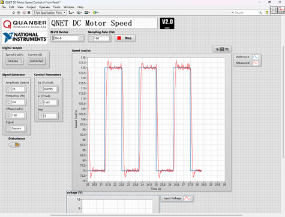

放大测量峰值时间和超调量百分比

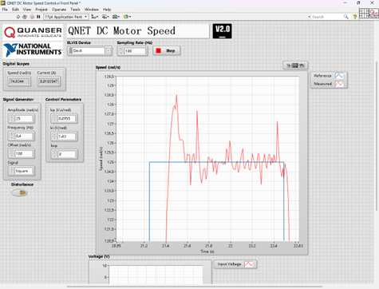

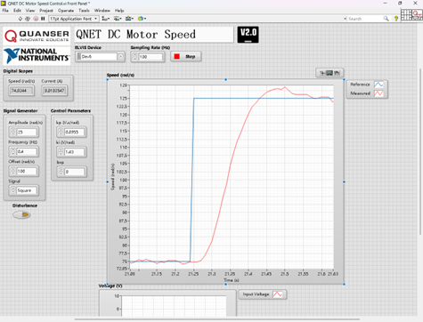

从图中读数得：峰值时间约0.23s, 最大过调量约 2.8%，基本符合指标要求

保持ki = 1.5, kp = 0.1不变,改变bsp的值从0~1，步长为0.1，得到结果如下：

<table>
    <tr>
        <td>

</td>
        <td>

</td>
        <td>
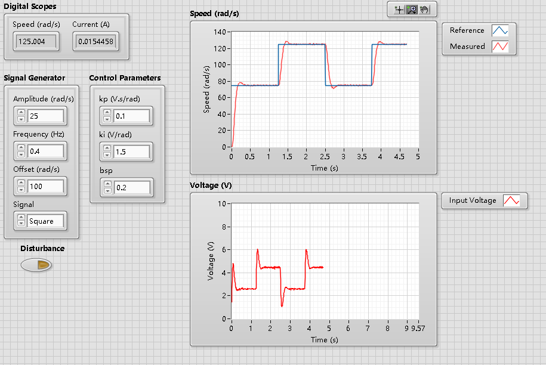
</td>
    </tr>
</table>

<table> <tr> <td>

</td> <td>

</td> <td>

</td> </tr> </table>

<table> <tr> <td>
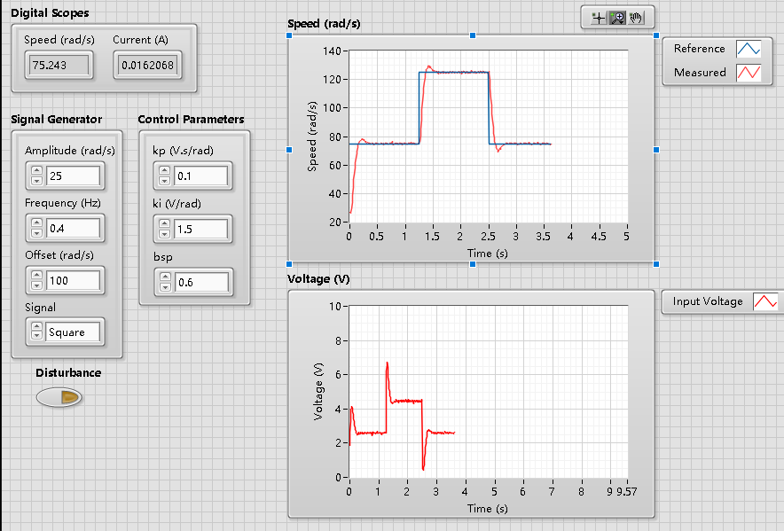
</td> <td>

</td> <td>

</td> </tr> </table>

观察到，随着bsp的逐渐增大,系统的超调量逐渐增大，但是响应速度也增快。

## 3 比例微分速度控制

### 3.1 公式推导

系统框图如下

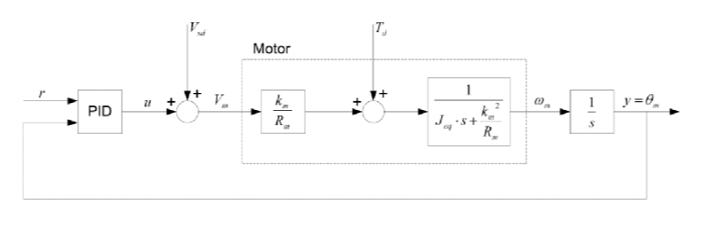

只考虑PD控制的作用下
$$
U(s) = PID(R(s), Y(s)) = k_p\left(b_{sp}R(s)-Y(s)\right)+k_ds(b_{sd}R(s)-Y(s))
$$
在无扰动的条件下，即$V_{sd}=0,T_d=0$时，系统的传递函数为
$$
H(s) = \frac{\Theta_m(s)}{R(s)} = \frac{k_m(k_pb_{sp}+k_db_{sd}s)}{R_mJ_{eq}s^2+(k_mk_d+k_m^2)s+k_mk_p}\tag{3-1}
$$
其中$\tau = \frac{R_mJ_{eq}}{k_m^2}, K=\frac{1}{k_m}$

相应的刻画系统特征的数学量为
$$
\omega_n = \sqrt{\frac{k_mk_p}{R_mJ_{eq}}} \tag{3-2}
$$

$$
\zeta = \frac{k_mk_d+k_m^2}{2\sqrt{R_mJ_{eq}k_mk_p}} \tag{3-3}
$$

### 3.2 实验练习

> 计算当$\zeta=0.60,\omega_0=25.0\mathsf{rad/s}$时的峰值时间$t_p$和最大过调量$M_p$

峰值时间$t_p = \frac{\pi}{\omega_d} = \frac{\pi}{\omega_n\sqrt{1-\zeta^2}}=0.157\mathsf{s}$

最大过调量$M_p = e^{-\frac{\pi\sigma}{\omega_d}}\times100\% = e^{-\frac{\pi\zeta}{\sqrt{1-\zeta^2}}}\times100\% = 9.49\%$

> 稳态增益$K=26\mathsf{V/rad}$，时间常数$\tau=0.145\mathsf{s}$，在满足上题的指标下，计算比例和微分控制增益$k_p,k_d$

$\omega_n = \sqrt{\frac{Kk_p}{\tau}}, \zeta = \frac{k_d+1/K}{2\sqrt{\frac{\tau k_p}{K}}}$，带入得到$k_p = 3.49\mathsf{rad/s/V}, k_d=0.129 \mathsf{rad/V}$

> 更改$\zeta$对测量的位置响应和产生的控制增益有什么影响

更改$\zeta$会对响应曲线的形状产生显著的影响，这里假定$\zeta<1$。当$\zeta$减小时，上升时间**减小**，峰值时间**不变**，最大过调量**增大**，调整时间**增大**；当$\zeta$大于1时，系统变成过阻尼，响应太慢，一般不会在这个区间内。

对于位置响应，响应**变快**，但是**更不稳定**；对于控制增益，**$k_p$增加，$k_d$减小**。这是在$\zeta$减小的情况下而言的。

> 更改$\omega_n$对测量的位置响应和产生的控制增益有什么影响

更改$\omega_n$也会对响应曲线造成影响，当$\omega_n$减小时，上升时间**增大**，峰值时间**增大**，最大过调量**不变**，调整时间**增大**。

对于位置响应，响应**变慢**，但是**变得稳定**；对于控制增益，**$k_p$减小，$k_d$不变**。这是在$\omega_n$减小的情况下而言的。

> 设置$k_p=1.5 \mathsf{V/rad}$，仅用比例增益，描述系统对阶跃输入的稳态误差

$R(s)=\frac{1}{s}, k_d=0$，利用终值定理得到$y_s(\infty) = 1$，稳态误差为0

### 3.3 实验结果

> 测量实际位置响应的峰值时间和超调量

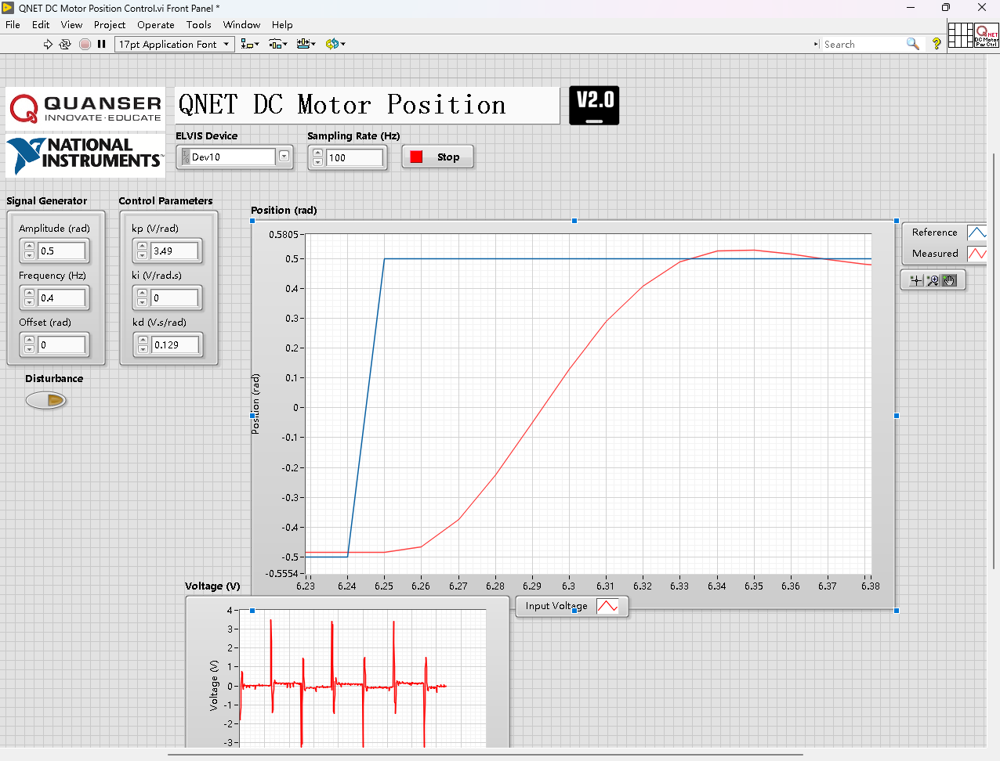

可以测出峰值时间为0.095s，超调量为0.5%，完全符合要求

> 更改ζ对位置响应和控制增益的影响

通过逐渐减小$k_d$来减小$\zeta$，得到的结果如下

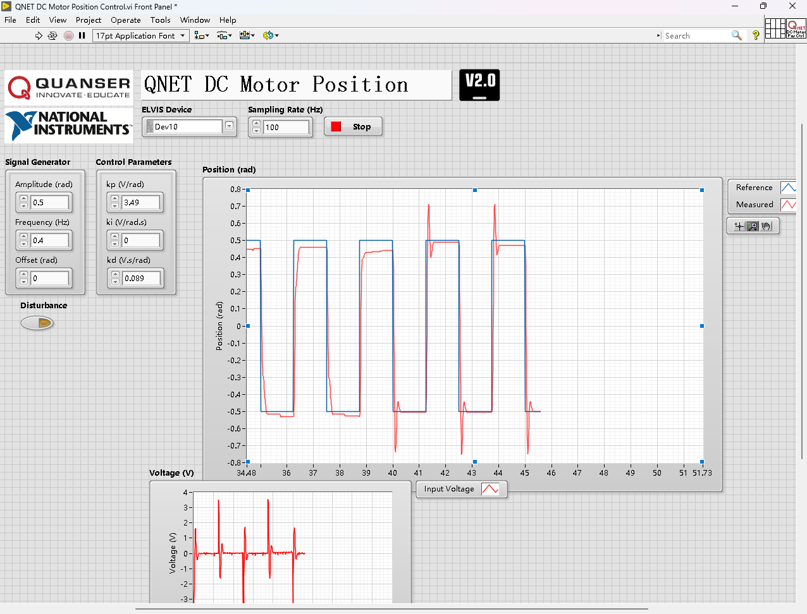

可以发现从过阻尼过渡到了欠阻尼，上升时间是减小了，但是最大超调量增大且峰值时间不变

> 更改$\omega_n$对位置响应和控制增益的影响

通过逐渐增大$k_p$来增大$\omega_n$，得到的结果如下

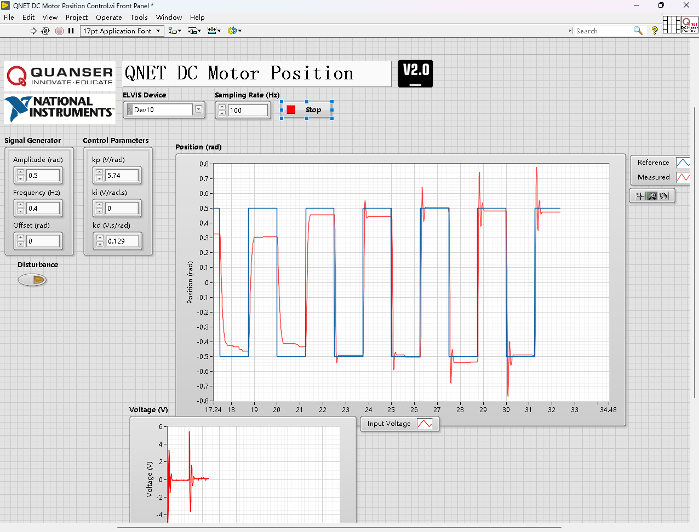

这里有一个问题，增大$k_p$会使得$\zeta$减小，所以这是$\omega_n$增大和$\zeta$减小的共同结果

具体的分析见3.2章节

> 改变$k_p$，观察发生了什么

将$k_p$从0.5，按0.25的步长增加到2.0，结果如下

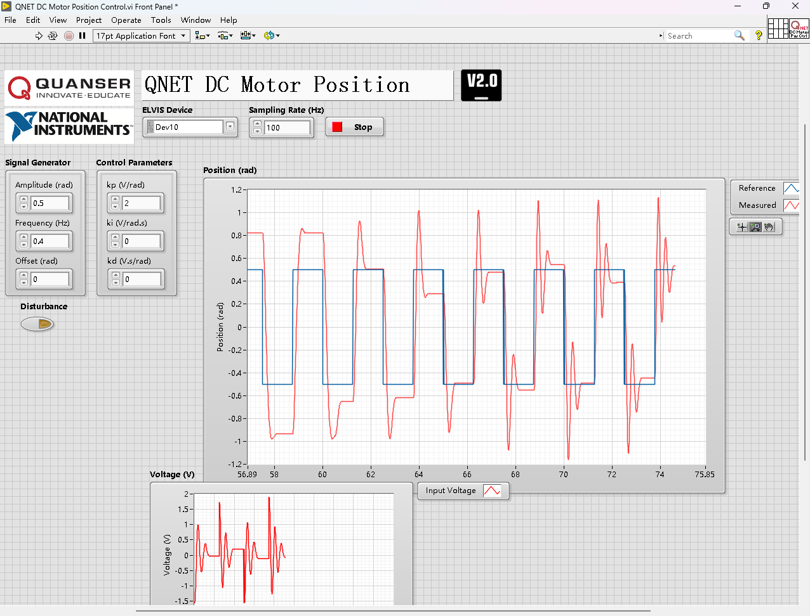

从第一个完整的周期开始，$k_p$依次增大；每次增大发生在下半周期，上半周期无影响

可以发现，增大$k_p$，使得系统从过阻尼变化为了欠阻尼，超调量变大，且稳态输出更接近理论值

关于前者，因为$k_p$增大会导致$\zeta$的减小，故系统的响应会变化；关于后者，当$k_p$很小时相当于只有微分控制，这是非因果的，输出有问题

>设置$k_p$=1.5V/rad，$k_d$=0，描述稳态误差

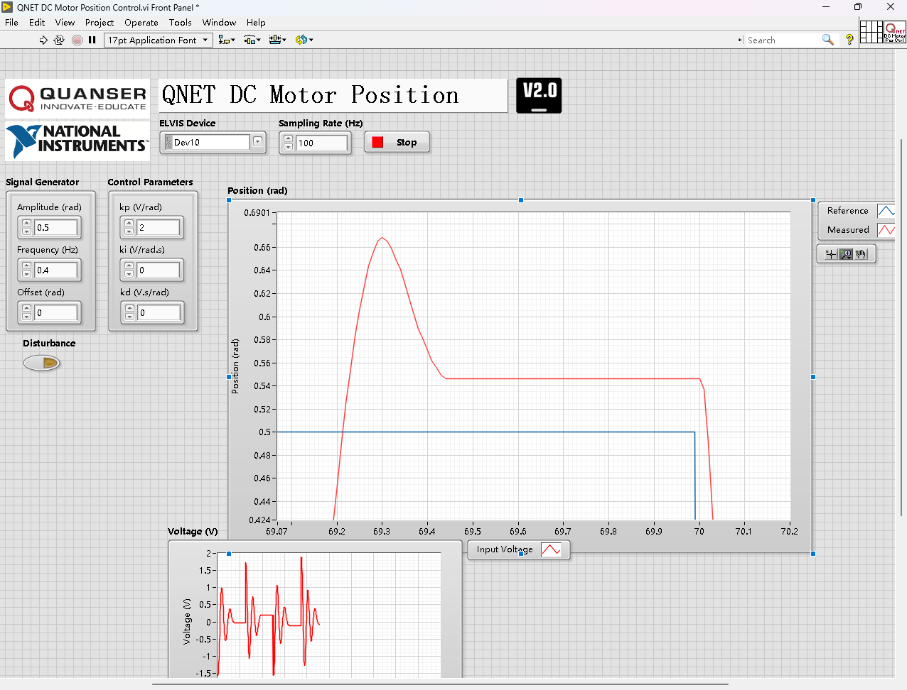

虽然图中的$k_p$是2，但这是在上面那张图中截的，所以实际上还是$k_p=1.5$

稳态误差为0.045rad，理论上应该是0，但是考虑到实验误差，稳态误差的误差是9%，还是可以接受的

> 以0.01Vs/rad的步长增加微分增益$k_d$，解释发生了什么

由于一些原因，我们的仪器在更改$k_d$后的几个周期内无法稳定输出，故实验结果的截图并没有，但是整体的趋势是：随着$k_d$的增加，输出减小，单周期内的振荡也减小

原因是随着$k_d$的增大，$\zeta$增大，使得系统从欠阻尼向过阻尼靠近，最大超调量也减小

为什么会多周期不稳定呢？当$k_d$增大，微分项的权重变大，系统更能预测将来的变化，可能由于输入电压的波动使得电机控制出现波动，而微分项放大预测这个变化，但预测错了；也有可能是哪里接触不良

## 4 跟踪和扰动抑制

### 4.1 公式推导

当存在扰动时的系统框图如下

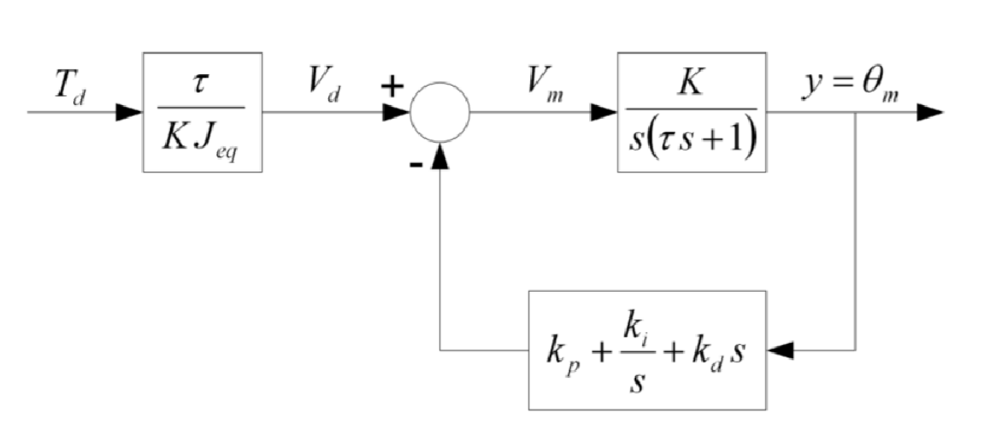

在无参考输入、存在误差的情况下，即$U(s)=0,V_d,T_d \neq0$，系统的传递函数为
$$
H(s) = \frac{\Theta_m(s)}{T_d(s)} = \frac{\tau}{J_{eq}}\cdot \frac{s}{\tau s^3+(Kk_d+1)s^2+Kk_ps+Kk_i} \tag{4-1}
$$
当外界扰动近似为阶跃输入，即$T_d(s) = \frac{A}{s}$时，系统的稳态输出为
$$
\theta_s(\infty) = \lim\limits_{s\rightarrow 0}sH(s)T_d(s) = 0\tag{4-2}
$$

### 4.2 实验练习

> 没有参考信号，扰动是模拟扰动电压$V_{sd}$，给出整个系统的框图

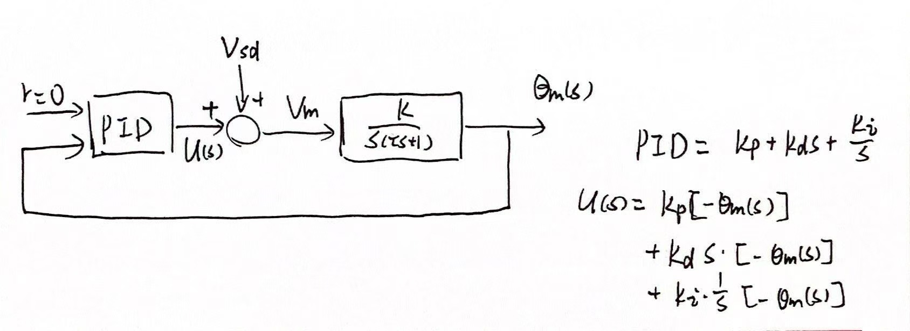

此时的闭环传递函数为
$$
\frac{\Theta_m(s)}{V_{sd}(s)} = \frac{Ks}{\tau s^3+(Kk_d+1)s^2+Kk_p s+Kk_i}
$$
当在$PID$控制下，电机的稳态转角为$0$，在$PD$控制下，电机的稳态转角为$\frac{V_{sd0}}{k_p}=1.5\mathsf{rad}$

> 解释积分作用下扰动响应差异

积分器为系统引入了一个$z=0$的开环零点，消除了主导极点的作用

### 4.3 实验结果

2.1 跟踪三角波信号
1. 打开QNET DC Motor Speed Control .vi。确保选择了正确的设备 Device
2. 运行VI. 电机应该开始旋转
3. 信号发生器 Signal Generator 设置： 
- 幅值Amplitude (rad/s) = 50.0 
- 频率Frequency (Hz) = 0.40 
- 偏移量Offset (rad/s) = 100.0 
- 信号=‘锯齿波’Signal = 'Sawtooth' 
4. 控制参数Control Parameters部分设置： 
• kp (V.s/rad) = 0.20 
• ki (V/rad) = 0.00 
• bsp = 1.00 
5. 将参考速度和实测速度进行比较。解释一下：为什么会有跟踪误差？ 
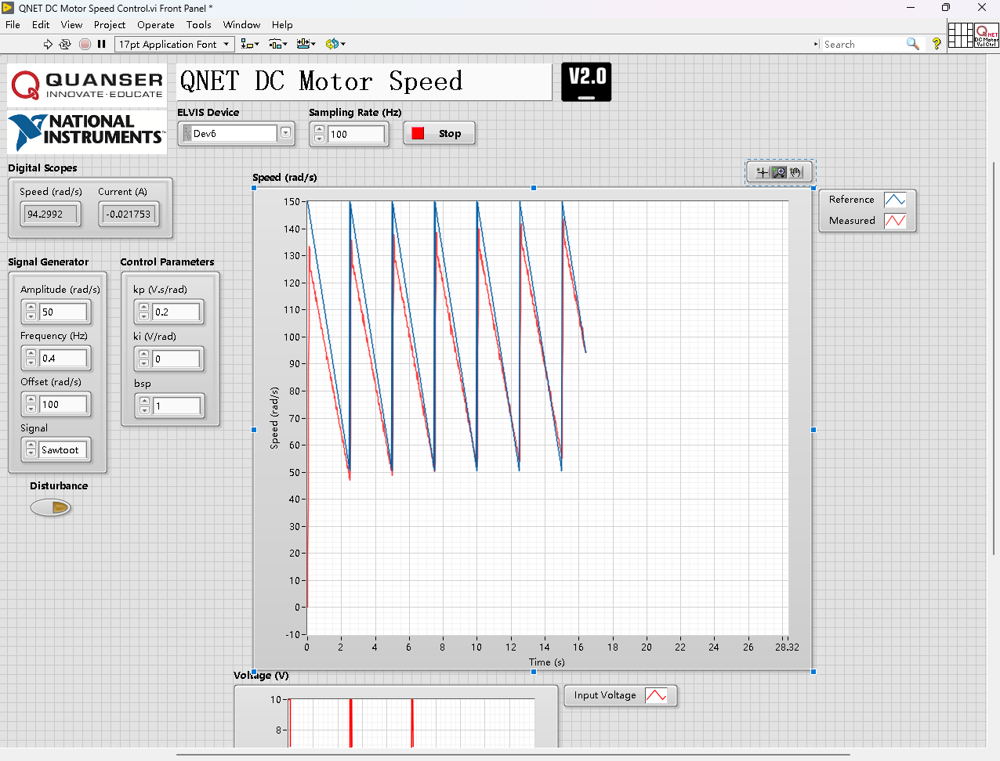
因为k_i为0，根据前面的公式推导，系统无法消除扰动引起的稳态误差
6. 增加k_i的值，观察响应。ki在0.1 V/rad到1.0V/rad间变化
变化如图：
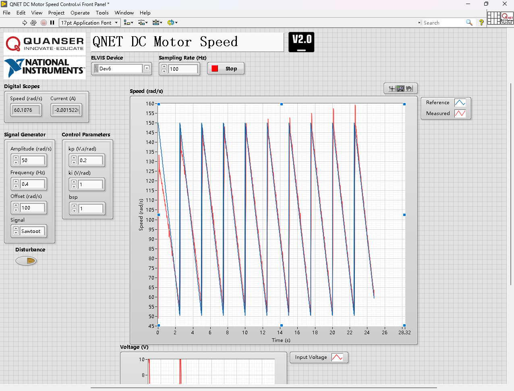
7. 增加ki对实测信号的跟踪能力有什么影响？根据示波器中观察到的系统行为给出解释
> 增加k_i控制器的积分作用越来越强，稳态误差逐步消除，特别是在高频段，控制器通过积分作用能够有效地补偿误差，确保电机的速度与参考信号的变化更加一致。从示波器的曲线中可以看到系统的跟踪误差逐渐减小。但是随着k_i继续增大，会导致系统对误差累计的补偿过度，表现为超调。
8. 点击停止Stop按钮停止运行VI

#### 负载扰动选做，本组未做
2.2 对负载扰动的响应

1. 
2. 如图：
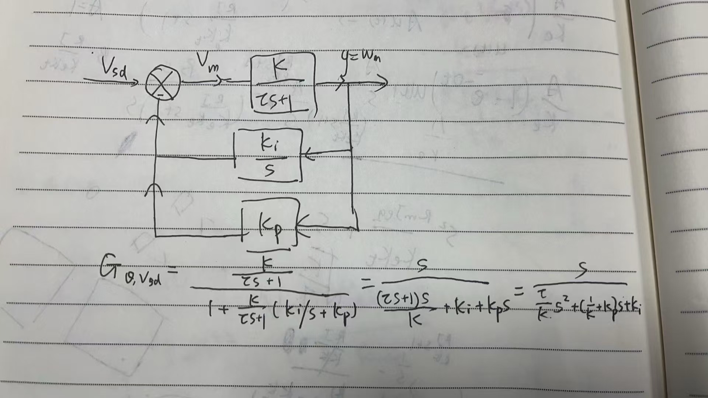
3. 求稳态角
第一个（ki为0）
$$
\frac{\tau A}{2J_{eq} K}
$$
ki不为0时稳态角为0