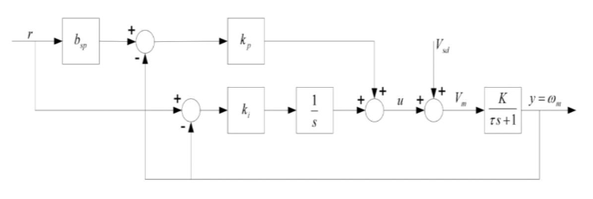
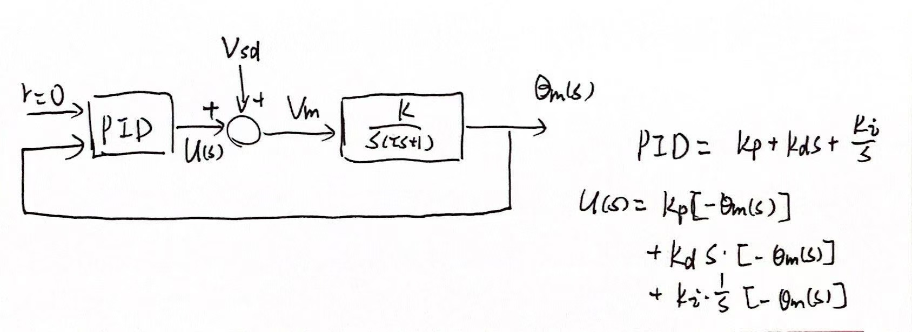

# 自控实验预习报告

## 1 建模

### 1.1 公式推导

如图的电机

如果认为电感远小于电阻，得到
$$
V_m(t) - R_mi_m(t) -e_b(t)  =0
$$
其中$e_b(t) = K_ew_m(t)$是电机的电压，右边是反电动势常数和电机转速，带入对上式进行$Laplace$变换，得到
$$
I_m(s) = \frac{V_m(s) - K_eW_m(s)}{R_m} \tag{1-1}
$$
又知电机的转速与负载质量和输出扭矩的关系是
$$
J_{eq}\dot{w}_m(t) = K_ti_m(t)\Rightarrow J_{eq}sW_m(s) = K_tI_m(s)\\\tag{1-2}
J_{eq} = J_m + J_h + J_d,\,\,\,\,\,J = \frac{1}{2}mr^2
$$
联立式(1-1)和(1-2)得到转速关于电压的传递函数
$$
\frac{W_m(s)}{V_m(s)} = \frac{\frac{1}{K_e}}{\frac{J_{eq}R_m}{K_eK_t}s+1} \tag{1-3}
$$
若输入电压为阶跃信号，即$V(t) = Au(t)$，得到转速的阶跃响应
$$
W_m(s)= \frac{A}{K_e}\cdot \frac{1}{s} - \frac{A}{K_e}\cdot\frac{1}{s+\frac{K_eK_t}{J_{eq}R_m}}\tag{1-4}
$$

$$
w_m(t) = \frac{A}{K_e} u(t) - \frac{A}{K_e} e^{-\frac{K_eK_t}{J_{eq}R_m}t}u(t)\tag{1-5}
$$

## 2 比例积分速度控制

### 2.1 公式推导

系统框图如下图

在无扰动条件下，即$V_{sd}=0$时，系统的传递函数为
$$
H(s) = \frac{W_m(s)}{R(s)} = K\cdot\frac{(b_{sp}k_ps+k_i)}{\tau s^2+(Kk_p+1)s+Kk_i} \tag{2-1}
$$
使用梅逊公式，该系统的前向通路是
$$
P_1=b_{sp}k_p\frac{K}{\tau s+1}\,\,\,,\,\,\,P_2=k_i\frac{1}{s}\frac{K}{\tau s+1}
$$
回路是
$$
L_1= -k_p\frac{K}{\tau s+1}\,\,\,,\,\,\, L_2 =-k_i\frac{1}{s}\frac{K}{\tau s+1}
$$
二者相互接触，且分别和$P_1,P_2$接触，那么$\Delta$为
$$
\Delta = 1+k_p\frac{K}{\tau s+1}+k_i\frac{1}{s}\frac{K}{\tau s+1}\\
\Delta_1 = \Delta _2 = 1
$$
系统的传递函数为$\frac{W_m(s)}{R(s)} = \frac{P_1\Delta_1+P_2\Delta_2}{\Delta}$，带入即可

对于这个二阶系统，刻画系统的数学量为
$$
\omega_n = \sqrt{\frac{Kk_i}{\tau}}\tag{2-2}
$$

$$
\zeta = \frac{Kk_p+1}{2\sqrt{Kk_i\tau}}\tag{2-3}
$$

### 2.2 实验练习

> 改变$k_p$变化产生的性能差异

当$k_p$减小时，比例控制的作用减小，系统的响应速度变慢，但是振荡会减小，超调量更小，稳定性提高；当其增大时变化相反，系统的振荡和超调量更大，但是响应更快，稳定性不太好说，应该是降低的。

> 计算当$\zeta=0.75,\omega_0=16.0\mathsf{rad/s}$时的峰值时间$t_p$和最大过调量$M_p$

峰值时间$t_p = \frac{\pi}{\omega_d} = \frac{\pi}{\omega_n\sqrt{1-\zeta^2}}=0.297\mathsf{s}$

最大过调量$M_p = e^{-\frac{\pi\sigma}{\omega_d}}\times100\% = e^{-\frac{\pi\zeta}{\sqrt{1-\zeta^2}}}\times100\% = 2.84\%$

> 稳态增益$K=26\mathsf{rad/V/s}$，时间常数$\tau=0.145\mathsf{s}$，在满足上题的指标下，计算比例和微分控制增益$k_p,k_i$

$\omega_n = \sqrt{\frac{Kk_i}{\tau}}, \zeta = \frac{Kk_p+1}{2\sqrt{Kk_i\tau}}$，带入得到$k_i=1.43 \mathsf{V/rad},k_p=0.0955\mathsf{V\cdot s/rad}$

> 增加$\zeta$对实测的速度响应有什么影响？控制增益怎么样？

当$\zeta$增大时，上升时间**变大**，峰值时间**不变**，最大过调量**减小**，调整时间**减小**。

**响应速度变慢**，但是系统变得稳定。**控制增益$k_p$变大，$k_i$不变**。

>增加$\omega_n$对实测的速度响应有什么影响？控制增益怎么样？

当$\omega_n$增大时，上升时间**减小**，峰值时间**减小**，最大过调量**不变**，调整时间**减小**。

**响应速度变快**。**控制增益$k_p$增大，$k_i$增大**。

## 3 比例微分速度控制

### 3.1 公式推导

系统框图如下

只考虑PD控制的作用下
$$
U(s) = PID(R(s), Y(s)) = k_p\left(b_{sp}R(s)-Y(s)\right)+k_ds(b_{sd}R(s)-Y(s))
$$
在无扰动的条件下，即$V_{sd}=0,T_d=0$时，系统的传递函数为
$$
H(s) = \frac{\Theta_m(s)}{R(s)} = \frac{k_m(k_pb_{sp}+k_db_{sd}s)}{R_mJ_{eq}s^2+(k_mk_d+k_m^2)s+k_mk_p}\tag{3-1}
$$
其中$\tau = \frac{R_mJ_{eq}}{k_m^2}, K=\frac{1}{k_m}$

相应的刻画系统特征的数学量为
$$
\omega_n = \sqrt{\frac{k_mk_p}{R_mJ_{eq}}} \tag{3-2}
$$

$$
\zeta = \frac{k_mk_d+k_m^2}{2\sqrt{R_mJ_{eq}k_mk_p}} \tag{3-3}
$$

### 3.2 实验练习

> 计算当$\zeta=0.60,\omega_0=25.0\mathsf{rad/s}$时的峰值时间$t_p$和最大过调量$M_p$

峰值时间$t_p = \frac{\pi}{\omega_d} = \frac{\pi}{\omega_n\sqrt{1-\zeta^2}}=0.157\mathsf{s}$

最大过调量$M_p = e^{-\frac{\pi\sigma}{\omega_d}}\times100\% = e^{-\frac{\pi\zeta}{\sqrt{1-\zeta^2}}}\times100\% = 9.49\%$

> 稳态增益$K=26\mathsf{V/rad}$，时间常数$\tau=0.145\mathsf{s}$，在满足上题的指标下，计算比例和微分控制增益$k_p,k_d$

$\omega_n = \sqrt{\frac{Kk_p}{\tau}}, \zeta = \frac{k_d+1/K}{2\sqrt{\frac{\tau k_p}{K}}}$，带入得到$k_p = 3.49\mathsf{rad/s/V}, k_d=0.129 \mathsf{rad/V}$

> 更改$\zeta$对测量的位置响应和产生的控制增益有什么影响

更改$\zeta$会对响应曲线的形状产生显著的影响，这里假定$\zeta<1$。当$\zeta$减小时，上升时间**减小**，峰值时间**不变**，最大过调量**增大**，调整时间**增大**；当$\zeta$大于1时，系统变成过阻尼，响应太慢，一般不会在这个区间内。

对于位置响应，响应**变快**，但是**更不稳定**；对于控制增益，**$k_p$增加，$k_d$减小**。这是在$\zeta$减小的情况下而言的。

> 更改$\omega_n$对测量的位置响应和产生的控制增益有什么影响

更改$\omega_n$也会对响应曲线造成影响，当$\omega_n$减小时，上升时间**增大**，峰值时间**增大**，最大过调量**不变**，调整时间**增大**。

对于位置响应，响应**变慢**，但是**变得稳定**；对于控制增益，**$k_p$减小，$k_d$不变**。这是在$\omega_n$减小的情况下而言的。

> 设置$k_p=1.5 \mathsf{V/rad}$，仅用比例增益，描述系统对阶跃输入的稳态误差

$R(s)=\frac{1}{s}, k_d=0$，利用终值定理得到$y_s(\infty) = 1$，稳态误差为0

## 4 跟踪和扰动抑制

### 4.1 公式推导

当存在扰动时的系统框图如下

在无参考输入、存在误差的情况下，即$U(s)=0,V_d,T_d \neq0$，系统的传递函数为
$$
H(s) = \frac{\Theta_m(s)}{T_d(s)} = \frac{\tau}{J_{eq}}\cdot \frac{s}{\tau s^3+(Kk_d+1)s^2+Kk_ps+Kk_i} \tag{4-1}
$$
当外界扰动近似为阶跃输入，即$T_d(s) = \frac{A}{s}$时，系统的稳态输出为
$$
\theta_s(\infty) = \lim\limits_{s\rightarrow 0}sH(s)T_d(s) = 0\tag{4-2}
$$

### 4.2 实验练习

> 没有参考信号，扰动是模拟扰动电压$V_{sd}$，给出整个系统的框图

此时的闭环传递函数为
$$
\frac{\Theta_m(s)}{V_{sd}(s)} = \frac{Ks}{\tau s^3+(Kk_d+1)s^2+Kk_p s+Kk_i}
$$
当在$PID$控制下，电机的稳态转角为$0$，在$PD$控制下，电机的稳态转角为$\frac{V_{sd0}}{k_p}=1.5\mathsf{rad}$

> 解释积分作用下扰动响应差异

积分器为系统引入了一个$z=0$的开环零点，消除了主导极点的作用