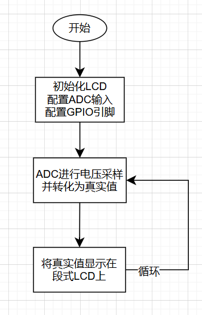
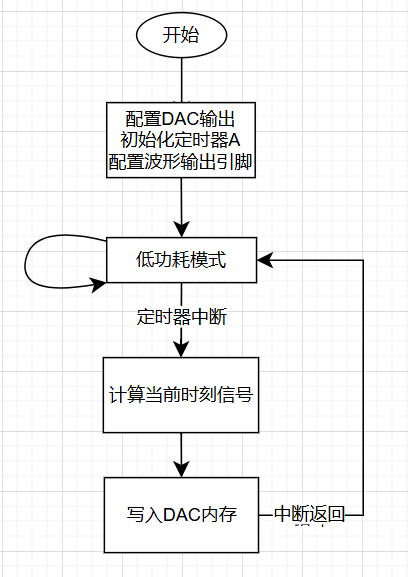
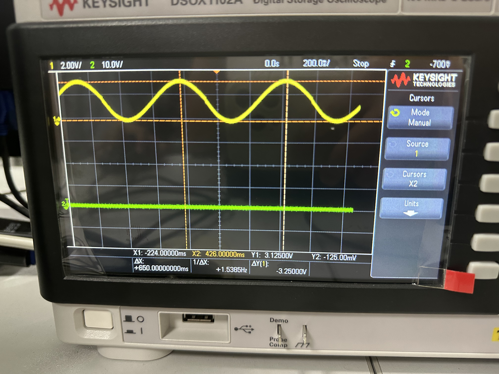

# MSP430实验 7&8

## 7 ADC

### 7.1 实验目的

* 了解ADC的接口
* 了解MSP430 ADC的原理，能够转化ADC输出为可读量
* 巩固LCD显示屏相关知识


### 7.2 实验内容

* 配置ADC，采集滑动变阻器的电压值
* 将ADC读数转化为电压值，利用满量程和参考值
* 将采集到的电压值显示在LDC上

软件流程图如下

<center></center>

硬件接口

* 调用了`LCDMEM`低级API进行显存的修改
* 调用了`LCDSEG_SetDigit(int, int)`高级API进行显示内容的修改
* 使用ADC的内存`ADC12MEM0`传递ADC记录的原始结果


### 7.3 实验结果

关键函数如下，由于ADC有12bit外部输入，因此满量程应该是$2^{12}=4096$，而参考电压为$V_{ref}=3.3$V，可以得到真实电压的计算方法

上面算出来的电压还需要进一步的四舍五入才能进行显示，否则LCD显示不下；主函数里为了方便，直接将采样结果*1000后取整数，这样可以显示三位小数，精度已经足够

```c
void main(void)
{
	WDTCTL = WDTPW + WDTHOLD;//关闭看门狗
    initClock();  // 配置系统时钟
    initLcdSeg(); // 初始化段式液晶
	P4DIR |= BIT5 + BIT6 + BIT7;//配置GPIO引脚
	P5DIR |= BIT7;
	P8DIR |= BIT0;
	ADC12CTL0 |= ADC12MSC;//自动循环采样转换
	ADC12CTL0 |= ADC12ON;//启动ADC12模块
	ADC12CTL1 |= ADC12CONSEQ1 ;//选择单通道循环采样转换
	ADC12CTL1 |= ADC12SHP;//采样保持模式
	ADC12MCTL0 |= ADC12INCH_15; //选择通道15，连接拨码电位器
	ADC12CTL0 |= ADC12ENC;

	volatile unsigned int value = 0;//设置判断变量
	float voltage = 0;				// 储存真实电压

	while(1)
	{
		ADC12CTL0 |= ADC12SC;//开始采样转换
		value = ADC12MEM0;//把结果赋给变量
		voltage = 3.3 * value / 4096;	// 转换为真实电压
		voltage = (int)roundf(voltage * 1000); 	// 保留三位小数

		LCDSEG_Display(voltage);	// 调用显示函数
	}
}
```

显示函数如下，这部分类似实验2，区别是需要手动计算每一位

```c
void LCDSEG_Display(int num)
{
    // 定义数字段码映射表：0-9、A-F、-对应的段码
    const uint8_t SEG_CTRL_BIN[10] = {
        0x3F, // display 0
        0x06, // display 1
        0x5B, // display 2
        0x4F, // display 3
        0x66, // display 4
        0x6D, // display 5
        0x7D, // display 6
        0x07, // display 7
        0x7F, // display 8
        0x6F, // display 9
    };

    // 映射表：0-6对应a-g，最后一位是小数点
    const static uint8_t map[8] = {BIT7, BIT6, BIT5, BIT0,
                                   BIT1, BIT3, BIT2, BIT4};
    int i;
    // 定义临时变量
    uint8_t mem;
    // 用于储存显示的值
    uint8_t values[6] = {0};

    // 取num的每一位
    int j = 5;		// 取余是倒着来的
    while(num)
    {
    	values[j] = SEG_CTRL_BIN[num % 10];
    	num /= 10;
    	j--;
    }

    values[3] |= BIT7; // 设置小数点

    // 逐个设置显示的段码
    for (i = 0; i < 6; i++) {
        mem = LCDMEM[i];
        mem &= 0x10; // 清空控制数字段的位
        int j;
        for (j = 0; j < 8; ++j) {
            if (values[i] & (1 << j)) {
                mem |= map[j];
            }
        }
        LCDMEM[i] = mem;
    }
}
```

实验结果以视频的形式存放在`实验结果\ADC`中，随着滑动变阻器的旋转可以实现LCD显示`0.000`到`3.299`

因为存在量化误差，故不会是`3.300`整，理论上最大显示的应该是$3.3\times\frac{4095}{4096}$V


## 8 DAC

### 8.1 实验目的

* 了解DAC的工作原理
* 通过写DAC内存来改变输出
* 巩固定时器的使用


### 8.2 实验内容

* 初始化DAC
* 利用定时器产生一个周期变化的波形
* 将波形在每一时刻的值赋给DAC的输出内存`DAC12_0DAT`
* 选择DAC输出通道，用示波器测量显示波形

软件流程图如下

<center></center>

硬件接口

* DAC输出内存位于`DAC12_0DAT`
* DAC输出到引脚`P7.6`


### 8.3 实验结果

主程序如下，初始化DAC并定义了几个常数

规定了定时器的定时时长，这个时长相当于对一个模拟正弦信号的采样频率

如：定时器定10ms，那么就每个10ms采集一次信号

```c
#include<msp430f6638.h>
#include<math.h>

int bias = 0x7FF;			// 指定偏置，因为DAC不能输出负数
double pi = 3.1415926535;	// pi
int t = 0;					// 时间变化
int sine = 0;				// 存放波形变化
int T = 100;				// 周期

void main(void)
{
	WDTCTL = WDTPW + WDTHOLD; //关闭看门狗
	P7DIR |= BIT6;//设置P7.6口为输出口
	P7SEL |= BIT6;//使能P7.6口第二功能位
	DAC12_0CTL0 |= DAC12IR; //设置参考电压满刻度值，使Vout = Vref×(DAC12_xDAT/4096)
	DAC12_0CTL0 |= DAC12SREF_1; //设置参考电压为AVCC
	DAC12_0CTL0 |= DAC12AMP_5;	//设置运算放大器输入输出缓冲器为中速中电流
	DAC12_0CTL0 |= DAC12CALON; //启动校验功能
	DAC12_0CTL0 |= DAC12OPS;//选择第二通道P7.6
	DAC12_0CTL0 |= DAC12ENC; //转化使能

	// TimerA初始化
	TA0CTL |= MC_1 + TASSEL_2 + TACLR;
	//时钟为SMCLK,比较模式，开始时清零计数器
	TA0CCTL0 = CCIE;//比较器中断使能
	TA0CCR0  = 15000;					// 相当于15ms的时间间隔，修改这里可以更改采样时间，当前为15ms

	__bis_SR_register(LPM0_bits + GIE);	// 进入低功耗并开启总中断
	__no_operation();
}
```

定时器中断如下，可以视为对正弦信号的采样

T乘上定时器时长表示模型信号的周期，如：定时10ms，T=100，那么周期为1s

```C
#pragma vector = TIMER0_A0_VECTOR
__interrupt void Timer_A (void)
{	
	t++;
	if (t < T)		
	{
		sine = (int)roundf(bias - bias * sin(2*pi*t/T));
	}
	else
	{
		t = 0;
		sine = bias;
	}
	DAC12_0DAT = sine;		// 更改DAC输出
}
```

由于DAC不能输入负数，因此用半量程`bias=0x7FF`进行信号的偏置

实验结果如下，超参数为`T=100, TA0CCR0=15000`

<center></center>

测量波形得到的周期为$1.5$Hz，符合预期