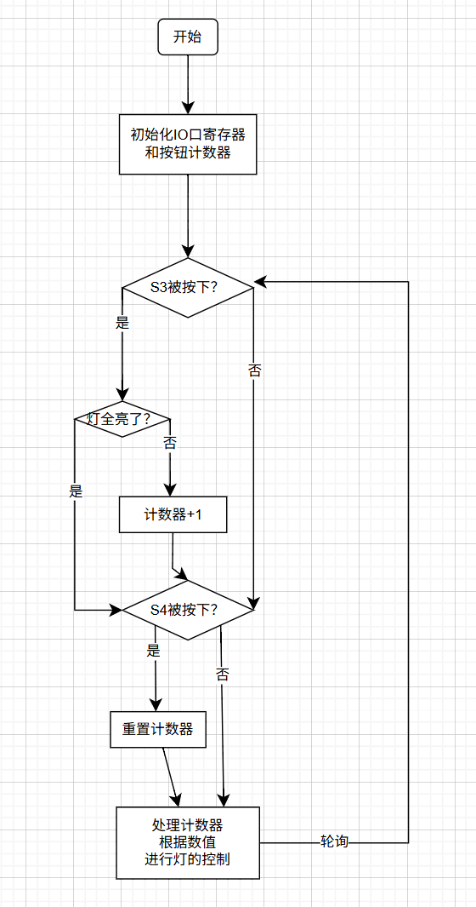
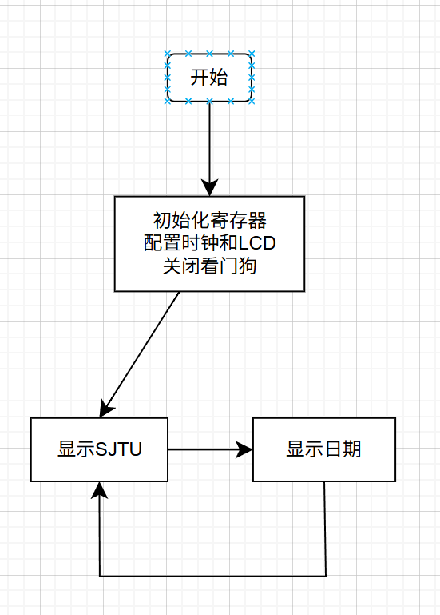

# MSP430实验 1&2

## 1 GPIO原理及接口技术

### 1.1 实验目的

* 了解MSP430IO口工作原理
* 学会初始化IO口寄存器并进行使用
* 认识按钮的抖动
* 实现按钮的防抖


### 1.2 实验内容

* 通过按钮`S3`按下的次数进行LED亮灯数目的控制
* 通过按钮`S4`进行全部灭灯操作
* 查看效果，了解按钮抖动的影响
* 加入防抖模块，实现按钮防抖

软件流程图如下

<center></center>


硬件接口

* `S3`对应于`P4.4`，`S4`对应于`P4.3`
* 五个LED灯依次对应于`P4.5, P4.6, P4.7, P5.7, P8.0`


### 1.3 实验结果

关键程序如下

```c
 while (1) {
        // 如果S3按键被按下
        if (debounce(BIT4) && count < 4) {
            count++; // 计数器加1
        }

        // 如果S4按键被按下
        if (debounce(BIT3)) {
            count = -1; // 计数器重置，灯全灭
        }

        // 点亮对应的LED灯
        if (count != -1) {
            for (i = 0; i <= count; ++i) {
                *LED_GPIO[i]->PxOUT |= LED_PORT[i];		// 按顺序依次点亮
            }
        } else {
            // 关闭所有LED灯
            for (i = 0; i < 5; ++i) {
                *LED_GPIO[i]->PxOUT &= ~LED_PORT[i];		// 全部熄灭
            }
        }
    }
```


防抖模块如下

```c
// 防抖模块，原理是判断按钮的上升沿（松开的瞬间）
int debounce(uint8_t BITx)
{
    // 检测按键是否被按下
    if (!(P4IN & BITx)) {
        // 延时约100ms
        __delay_cycles(3276);

        // 再次检测按键状态
        if (P4IN & BITx) {
            return 1; // 按键有效
        }
    }
    return 0; // 按键无效
}
```

当没有使用防抖时，每次快速按下松开按钮依然点亮了2~3盏灯，说明按钮比较抖动，需要使用防抖

当使用了防抖时，由于是进行上升沿判断，仅会在松开按钮时进行一次判断

实验结果以视频的形式放在`实验结果`文件夹下，包括了有无防抖的对比


## 2 段式LCD显示

### 2.1 实验目的

* 了解高级API进行LCD显示
* 了解LCD显示原理，通过修改显存进行额外的字母显示


### 2.2 实验内容

* 通过高级API调用显示当前日期（`0506.25`）
* 通过修改显存显示`SJTU`


软件流程图如下

<center></center>


硬件接口

* 调用了`LCDMEM`低级API进行显存的修改
* 调用了`LCDSEG_SetDigit(int, int)`高级API进行显示内容的修改


### 2.3 实验结果

显示`SJTU`的函数如下

```c
// 显示SJTU的函数
void LCDSEG_SetSJTU()
{
    // 映射表：0-6对应a-g，这是4复用模式对应的段在显存内的位置
    // 这里的a-g对应的比特位就是显存中的位置
    const static uint8_t map[7] = {BIT7, BIT6, BIT5, BIT0, BIT1, BIT3, BIT2};

    // 显示SJTU的段码，这里的a-g对应的比特位是0-7
    // 之所以这样表示是便于维护、添加新的显示字母
    const uint8_t CONTROL_BIN[4] = {
        0x6d, // S
        0x0e, // J
        0x07, // T
        0x3e, // U
    };
    uint8_t mem;   // 当前显示的段码

    int j;
    for (j = 0; j < 4; j++) 
    {
        mem = LCDMEM[j];    // 读取当前显示的段码
        mem &= 0x10; // 清空控制数字段的位

        int i;
        // 对每个字母，验证每一个段是否需要点亮
        for (i = 0; i < 7; ++i) 
        {
            // 通过移位操作，判断当前段是否需要点亮
            // 如果需要，那么用或操作和map映射表点亮
            if (CONTROL_BIN[j] & (1 << i))
            {
                mem |= map[i];
            }
        }
        LCDMEM[j] = mem;    // 更新显示的段码
    }
}
```

需要注意的是，在`CONTROL_BIN`中定义的段码和显存中段码的存放顺序不同，因此额外定义了一个`map`映射表进行转化


显示日期的函数如下

```c
void LCDSEG_SetDate(int year, int month, int day)
{
    // 定义数字段码映射表：0-9、A-F、-对应的段码
    // 这里依然是a-h对应0-7比特位
    const uint8_t SEG_CTRL_BIN[17] = {
        0x3F, // display 0
        0x06, // display 1
        0x5B, // display 2
        0x4F, // display 3
        0x66, // display 4
        0x6D, // display 5
        0x7D, // display 6
        0x07, // display 7
        0x7F, // display 8
        0x6F, // display 9
        0x77, // display A
        0x7C, // display b
        0x39, // display C
        0x5E, // display d
        0x79, // display E
        0x71, // display F
        0x40, // display -
    };

    // 映射表：0-6对应a-g，最后一位是小数点
    // 这里是对应的4复用模式的显存比特位
    const static uint8_t map[8] = {BIT7, BIT6, BIT5, BIT0,
                                   BIT1, BIT3, BIT2, BIT4};
    int i;
    // 定义临时变量
    uint8_t mem;
    // 用于储存显示的值
    uint8_t values[6] = {0};

    // 检查输入的日期是否合法
    if (month < 1 || month > 12 || day < 1 || day > 31) {
        return;
    }

    // 根据年月日计算显示内容
    // 当月份小于10时，显示0X
    if (month < 10) {
        values[0] = SEG_CTRL_BIN[0];
        values[1] = SEG_CTRL_BIN[month];
    } else {
        values[0] = SEG_CTRL_BIN[month / 10];   // 显示十位数
        values[1] = SEG_CTRL_BIN[month % 10];   // 显示个位数
    }
    // 显示日期
    if (day < 10) {
        values[2] = SEG_CTRL_BIN[0];
        values[3] = SEG_CTRL_BIN[day];
    } else {
        values[2] = SEG_CTRL_BIN[day / 10];
        values[3] = SEG_CTRL_BIN[day % 10];
    }
    // 显示年份
    if (year < 10) {
        values[4] = SEG_CTRL_BIN[0];
        values[5] = SEG_CTRL_BIN[year];
    } else {
        values[4] = SEG_CTRL_BIN[year / 10];
        values[5] = SEG_CTRL_BIN[year % 10];
    }
    values[4] |= BIT7; // 设置小数点

    // 逐个设置显示的段码
    for (i = 0; i < 6; i++) {
        mem = LCDMEM[i];
        mem &= 0x10; // 清空控制数字段的位
        int j;
        for (j = 0; j < 8; ++j) {
            if (values[i] & (1 << j)) {
                mem |= map[j];
            }
        }
        LCDMEM[i] = mem;
    }
}
```

和显示`SJTU`差不多，但是多了一个小数点的显示

同样的，`values`数组内存放的是便于阅读的段码表示，需要使用`map`进行映射

因此，在设置小数点时，用的依然是`1000 0000`表示`.`（即h对应第7位）


主函数如下

```c
int main(void)
{
    unsigned char i;
    initClock();  // 配置系统时钟
    initLcdSeg(); // 初始化段式液晶

    WDTCTL = WDTPW | WDTHOLD; // Stop watchdog timer

    int flag = 0;
    while (1) {

        if (flag) {
            LCDSEG_SetSJTU();          // 显示SJTU
            __delay_cycles(MCLK_FREQ); // 延时1s
            flag ^= 1;                 // 取反flag，为了显示日期
            for (i = 0; i < 6; i++) {
                LCDSEG_SetDigit(i, -1); // 清屏
            }
        } else {
            LCDSEG_SetDate(25, 5, 6);  // 显示日期，这里是2025年5月6日
            __delay_cycles(MCLK_FREQ); // 延时1s
            flag ^= 1;
            for (i = 0; i < 6; i++) {
                LCDSEG_SetDigit(i, -1); // 清屏
            }
            LCDMEM[4] &= ~BIT4; // 清除小数点，这里是用的显存中的位置
        }
    }
    return 0;
}
```

在这里，清楚小数点时调用的低级的`LCDMEM`，因此是对第4位操作，而非第7位

这个主函数会让LCD轮流显示日期和`SJTU`两个字符串


实验结果以视频的形式放在`实验结果`文件夹下