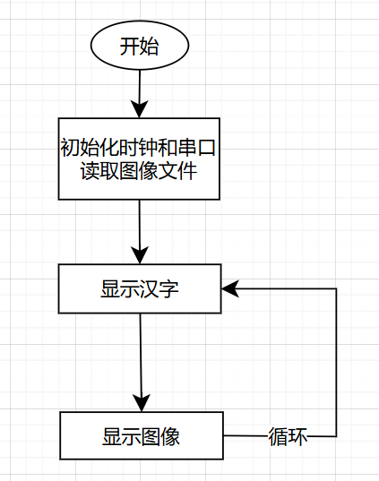
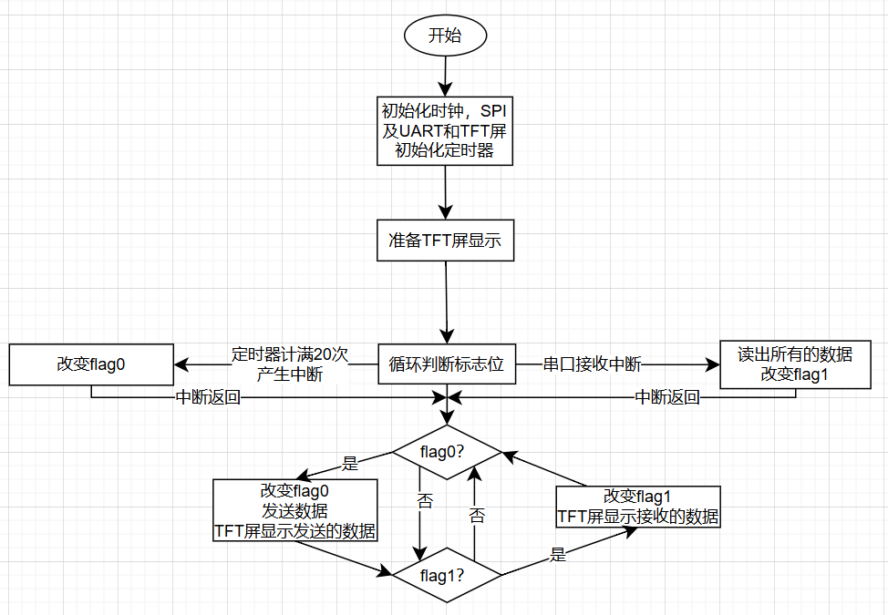
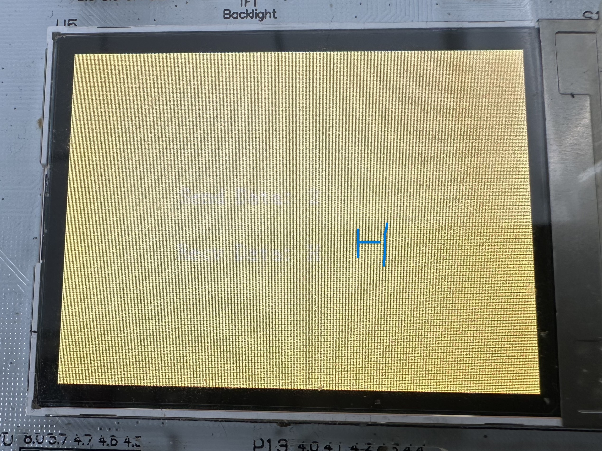
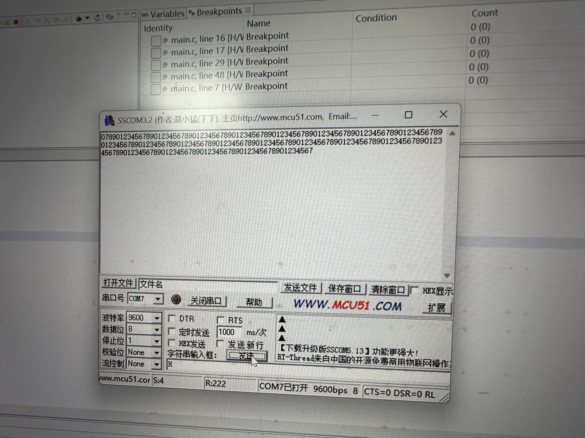

# MSP430实验 9&10

## 9 SPI

### 9.1 实验目的

* 了解USCI的SPI通讯
* 了解TFT屏显示原理和接口
* 通过修改显示函数进行自定义内容显示
* 了解汉字/图像的显示原理与存储格式


### 9.2 实验内容

* 设计汉字和图像，转换为点阵格式进行显示
* 与TFT屏进行SPI通讯，显示自定义内容

软件流程图如下

<center></center>

其中初始化必须被

```c
_DINT();
//	initialization
_EINT();
```

包裹，保证初始化期间关闭了所有的中断，防止发生意外


**硬件接口**

* `P5.0`与TFT的片选引脚连接
* `P8.4`是430的时钟输出，与TFT的时钟输入相连，达成同步的条件
* `P8.5`是SIMO口，用于输出信息到TFT
* 由于TFT是显示器，不会有对主机的输入，因此就三根线


### 9.3 实验结果

关键函数如下

这是显示汉字的程序，它可以显示一个16\*16的汉字点阵

```c
void display_hanzi(const char* str, uint16_t sx, uint16_t sy, uint16_t fRGB, uint16_t bRGB)
{
	uint16_t cx, cy;

	cx = 0;
	cy = 0;
	//屏幕是横的，XY要对调
	tft_SendCmd(TFTREG_WIN_MINX, sx);//x start point
	tft_SendCmd(TFTREG_WIN_MINY, sy);//y start point
	tft_SendCmd(TFTREG_WIN_MAXX, sx+15);//x end point
	tft_SendCmd(TFTREG_WIN_MAXY, sy+15);//y end point
	tft_SendCmd(TFTREG_RAM_XADDR, sx);//x start point
	tft_SendCmd(TFTREG_RAM_YADDR, sy);//y start point
	tft_SendIndex(TFTREG_RAM_ACCESS);

	uint16_t color;
	while(cy < 32)						// 16*16点阵共32个字节
	{
		if(cx >= 8)						// 每个字节有8bit
		{
			cx = 0;
			cy++;
		}

		if((str[cy] << cx) & 0x80)		// 取当前位
			color = fRGB;				// 如果点阵中是填充的就是前景
		else							// 否则是背景
			color = bRGB;

		tft_SendData(color);
		cx++; //X自增
	}

}
```

基本原理如下：

* 调用`tft_SendCmd`设置显示区域
* 针对一个`uint8_t`类型的数组，每一个Byte有8位，这是`cx>=8`这个判断条件的由来
* 16\*16的汉字点阵由32个`uint8_t`组成，这是退出条件`cy>32`的由来
* 对于每一个字节，依次判断每一位是否为1，这里借用了原来的函数，实际上这句话等价于`if(str[cy] & pow(2, cx))`

在调试过程中我们发现汉字显示不全，查看程序后发现是退出逻辑做的不对，一开始用`cy>16`作为推出逻辑，错把数组长度算成了字符高度，后来改为32就正常了


这是显示图像的函数，它可以显示预先转化为数组的图像

```c
void display_logo()
{	
    // 设置图像显示在中央
    uint16_t offsetX = (TFT_WIDTH - LOGO_WIDTH) / 2;
    uint16_t offsetY = (TFT_HEIGHT - LOGO_HEIGHT) / 2;
    uint16_t x,y;
    for (y = 0; y < LOGO_HEIGHT; y++) 
    {
        for (x = 0; x < LOGO_WIDTH; x++) 
        {
            uint16_t color;
            switch (ow_logo[y][x]) 
            {
                case 0: color = 0; break;
                case 1: color = 65535; break;
            }
            etft_AreaSet(x, y + offsetY, x+offsetX, y + offsetY, color);
        }
    }
}

```

选择一个个点进行画，原理和上面差不多

实验结果以视频的形式存放在实验结果文件夹内


## 10 UART

### 10.1 实验目的

* 验证UART通讯
* 通过辅助软件实验MSP430与电脑双向通讯


### 10.2 实验内容

* 在断开电源时短接MSP430的Rx和Tx，验证功能
* PC传一组数据到MSP430上，并用TFT显示
* MSP430传一些字符到PC，并保存为本地文件

软件流程图如下

<center></center>

为了保证程序允许的效率，中断例程内不含有复杂的操作，仅做简单操作

复杂的操作在主程序中完成


**硬件接口**

* `P8.2`是UART的`TXD`引脚
* `P8.3`是UART的`RXD`引脚


### 10.3 实验结果

程序就是原来的光盘文件中的程序，我们没有改动

关键函数如下：

这是主程序中的接收和发送操作

```C
while(1)
	{
		if(flag0)			//flag0在定时器计时到达1s时被赋值为1
		{
			flag0=0;
			UCA1TXBUF=send_data[0];		//写一个字符到发送缓存发送数据
			etft_DisplayString(send_data,170,100,65535,0);	//TFT屏上显示发送的字符
			send_data[0]++;				//字符加1
			if(send_data[0]>'9')		//字符超过'9'则重新置'0'
				send_data[0]='0';
		}

		if(flag1)			//flag1在接收中断中被赋值为1
		{
			flag1=0;
			etft_DisplayString(recv_data,170,140,65535,0);	//TFT屏幕上显示接收到的字符
		}
	}
```

下面是UART接收中断

```c
#pragma vector=USCI_A1_VECTOR	//USCI中断服务函数
__interrupt void USCI_A1_ISR(void)
{
	switch(__even_in_range(UCA1IV,4))
	{
	case 0:break;			//无中断
	case 2:					//接收中断处理
		while(!(UCA1IFG&UCTXIFG));	//等待完成接收
		recv_data[0]=UCA1RXBUF;		//数据读出
		flag1=1;					//置标识数据的值
		break;
	case 4:break;			//发送中断不处理
	default:break;			//其他情况无操作

	}
}
```

实现了读取接收缓冲池

为了保障中断的快速处理以保证CPU效率，所有耗时操作都在主程序中完成


由于`UCA1TXBUF,UCA1RXBUF`都只是一个8bit的寄存器，因此无法保存超过1B的内容，虽然能通过将接收内容保存在内存中来保存多字节输入，但因为时间关系我们并没有实现这个功能


具体的实验结果如下：

在关机状态下使用跳线帽短接实验箱左侧的Rx和Tx口，实现了自机通讯，发送和接收的数据都是一样的

实验结果以视频的形式存放在实验结果文件夹内，由于这个板子的TFT屏老化了，因此看得不是很清楚

然后在关机状态下拿开跳线帽，让430能够显示PC发送的信息而不是一直被自己发送的信息中断

在PC端打开串口助手，设置端口为`COM7`，设置波特率为9600标准波特率，就可以正常通讯了

下图展示了430接收PC发送的字符`H`和PC接收430循环发送的数字

<center></center>

<center></center>

在与PC的通讯中，我们发现如果必须有顺序地进行一下操作才能让软件正确识别到430

1. 连接USB线
2. 打开软件，识别串口
3. 烧录程序

否则430能够正常允许，但是PC无法接收/发送信息