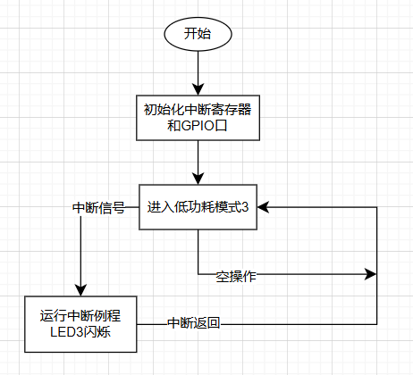
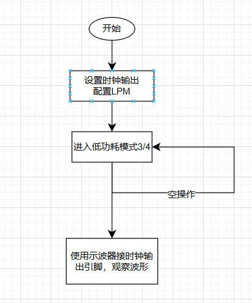
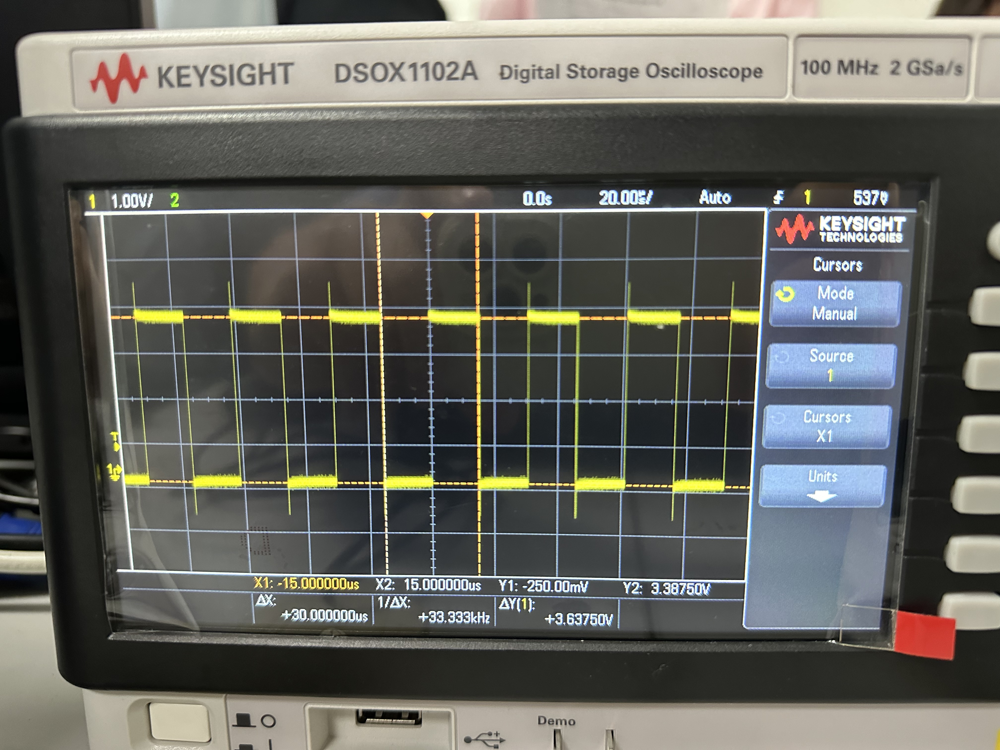
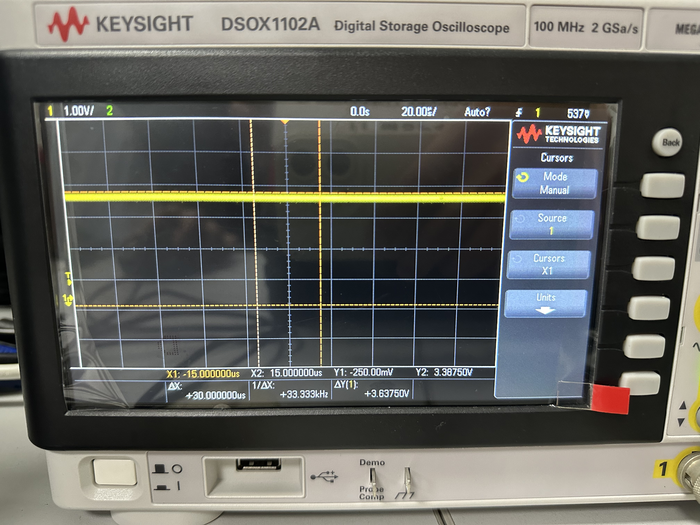
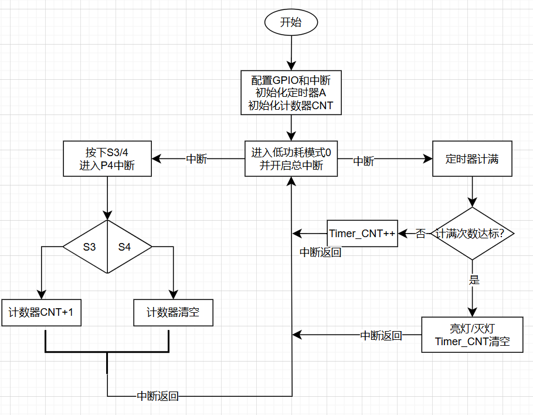
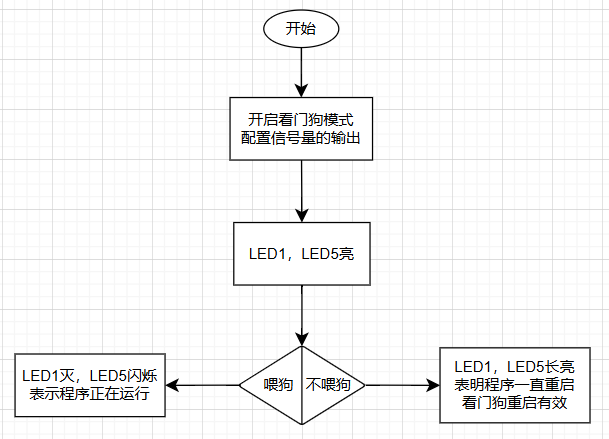

# MSP430实验 3/4/5/6

##  3 中断

### 3.1 实验目的

* 掌握中断寄存器配置方法
* 编写中断例程，注意中断标志位等寄存器的行为
* 验证中断是否成功


### 3.2 实验内容

* 将S7按键设置为中断工作模式
* 初始化各外设之后，将CPU进入LPM3低功耗模式，等待按键中断唤醒
* S7按键按下，将CPU从低功耗模式唤醒，进入中断服务程序，点亮LED3，持续1s钟
* LED3熄灭之后，重新进入低功耗模式，等待下一次按键唤醒

软件流程图如下

<center></center>

硬件接口

* `S7`连接在`P4.0`
* `LED3`连接在`P4.7`


### 3.3 实验结果

关键程序如下

```c#
void main(void)
{
  WDTCTL = WDTPW + WDTHOLD;                 //关闭看门狗
  P4DIR |= BIT7;                            //设置P4.7口方向为输出
  P4DIR &= ~BIT0;
  P4REN |= BIT0;                            //使能P4.0上拉电阻
  P4OUT |= BIT0;                            //P4.0口置高电平
  // 配置中断相关寄存器
  P4IES |= BIT0;                            //中断沿设置（下降沿触发）
  P4IFG &= ~BIT0;                           //清P4.0中断标志
  P4IE |= BIT0;                             //使能P4.0口中断
  P4OUT |= BIT7;							// 开始点亮
    
  __bis_SR_register(LPM3_bits + GIE);       //进入低功耗模式3 开中断
  while(1)
  __no_operation();                         //空操作
}

// P4中断函数
#pragma vector=PORT4_VECTOR
__interrupt void Port_4(void)
{
  P4OUT ^= BIT7;                            //改变LED3灯状态，点亮LED3
  __delay_cycles(327600);					// 延时约1000ms
  P4OUT ^= BIT7;							// 关闭LED3
  P4IFG &= ~BIT0;                          	//清P4.0中断标志位
}
```

实验结果以视频的形式存放在`实验结果/中断与低功耗/3-1中断`中

由于程序设置为`LED3`一开始点亮，因此实际效果是按下`S7`，`LED3`快速闪烁一次


## 4 低功耗模式的启用

### 4.1 实验目的

* 了解低功耗模式的启用/关闭
* 了解不同LPM的区别
* 学会示波器的使用


### 4.2 实验内容

* 分别配置`LPM3/LPM4`
* 在`LPM4`状态下所有始终都被关闭，与`LPM3`有区别
* 将时钟输出到对应的引脚，外接示波器观察波形
* 通过波形的有无来验证当前处于的低功耗模式

流程图如下

<center></center>

硬件接口

* 辅助时钟`ACLOCK`输出接口为`P1.0`，位于实验箱的6号口


### 4.3 实验结果

关键程序如下

```c
#include <msp430f6638.h>
void main(void)
{
  WDTCTL = WDTPW + WDTHOLD;                 //关闭看门狗

  P1SEL|= BIT0;     						// 外设模式，输出辅助时钟信号
  P1DIR|= BIT0;								// 方向为输出，输出辅助时钟信号
  __bis_SR_register(GIE);
  __bis_SR_register(LPM3_bits + GIE);       //进入低功耗模式3开中断
  __no_operation();                         //空操作
}
```

若要进入`LPM4`，则将对应语句改为

```c
__bis_SR_register(LPM4_bits + GIE);       //进入低功耗模式4开中断
```


当处于`LPM3`时示波器显示波形如下

<center></center>

可以发现时钟的低电平为-0.25V，高电平为3.3V，时钟周期为30us

查阅资料得到辅助时钟的频率：

> ACLK(辅助系统时钟):可选时钟源 LFXT1CLK(只能是外部时钟源)，且一般为 32768hz 手表晶体)

来源为：https://www.ti.com/cn/lit/ml/zhcu100/zhcu100.pdf

换算为周期大约是30.5us，与实验结果相当接近


当处于`LPM4`时，波形为噪声

<center></center>


## 5 定时器A

### 5.1 实验目的

* 了解定时器的定时功能
* 设定任意时间的定时能力
* 编写定时器中断例程
* 编写GPIO的中断处理


### 5.2 实验内容

* 定时器产生一秒的定时，用于LED灯亮灭延时的控制
* 用中断方式检测GPIO的按键输入
* 按键S3，按一下，点亮一盏LED灯，并以一秒的频率闪烁，亮一秒，灭一秒
* 按S4 ，LED关灭，不再闪烁

软件流程图如下

<center></center>

硬件接口

* 五个LED灯依次对应于`P4.5, P4.6, P4.7, P5.7, P8.0`
* `S3`对应于`P4.4`，`S4`对应于`P4.3`


### 5.3 实验结果

主程序如下

```c
void main(void)
{
	WDTCTL = WDTPW + WDTHOLD;//关闭看门狗
	P1DIR |= BIT5;//控制蜂鸣器输出
	P4DIR |= BIT5;//控制LED输出
	TA0CTL |= MC_1 + TASSEL_2 + TACLR;
	//时钟为SMCLK,比较模式，开始时清零计数器
	TA0CCTL0 = CCIE;//比较器中断使能
	TA0CCR0  = 50000;//比较值设为50000，相当于50ms的时间间隔


    // 下面出现的BIT3对应与S4（P4.3），BIT4对应S3（P4.4）
    // 设置S4按键
    P4REN |= BIT3; // 使能上下拉电阻
    P4OUT |= BIT3; // 上拉电阻
    // 设置S3按键
    P4REN |= BIT4; // 使能上下拉电阻
    P4OUT |= BIT4; // 上拉电阻

    // 配置中断寄存器
    P4IES |= (BIT3+BIT4);                            //中断沿设置（下降沿触发）
	P4IFG &= ~(BIT3+BIT4);                           //清P4.3/4.4中断标志
	P4IE |= (BIT3+BIT4);                             //使能P4.3/4.4口中断

    int i;
    for (i = 0; i < 5; ++i)
        *LED_GPIO[i]->PxDIR |= LED_PORT[i]; // 设置各LED灯所在端口为输出方向

    // 设置LED初始时不亮
    for (i = 0; i < 5; ++i) {
        *LED_GPIO[i]->PxOUT &= ~LED_PORT[i];
    }


	__bis_SR_register(LPM0_bits + GIE);//进入低功耗并开启总中断
}
```

P4中断例程如下，仅识别按键的输入

```c
int count = -1; // 计数器初始化

// P4中断函数，检测按键并对count进行处理
#pragma vector=PORT4_VECTOR
__interrupt void Port_4(void)
{
	if (P4IFG & BIT4)			// 如果按下的是P3
	{
		if (count < 4)
		{
			count += 1;
		}
		else
		{
			count = 4;			// 防止溢出
		}

		P4IFG &= ~BIT4;			// 清中断标志
	}

	if (P4IFG & BIT3)			// 如果按下的是P4
	{
		count = -1;
		P4IFG &= ~BIT3;			// 清中断标志
	}

}
```

定时器A中断如下，使用累加器扩展定时范围，每进入20次中断(20*50ms=1s)才真正进行服务

```c
int timer_count = 0; // 由于16bit计数器计不到1s，用一个累加器进行扩展

#pragma vector = TIMER0_A0_VECTOR
__interrupt void Timer_A (void)
{
	int i = 0;
	timer_count += 1;
	if (timer_count == 20)		// 进入20次，即20*50ms=1000ms
	{
		// 点亮对应的LED灯
		if (count != -1)
		{
			for (i = 0; i <= count; ++i)
			{
				*LED_GPIO[i]->PxOUT ^= LED_PORT[i];		// 按顺序依次点亮
			}
		}

		// 关闭所有LED灯
		else
		{
			for (i = 0; i < 5; ++i)
			{
				*LED_GPIO[i]->PxOUT &= ~LED_PORT[i];		// 全部熄灭
			}
		}
		timer_count = 0;
	}
}
```

实验结果以视频的形式放在`实验结果\定时器与WDT\定时器`中

需要注意的是，由于每次控制LED的输出的取反，而5个LED分别有独立的引脚配置，因此，5个LED可能不会同步亮/灭，但状态切换的时机是一致的


## 6 看门狗计时器

### 6.1 实验目的

* 了解WDT的看门作用
* 学会如何进行喂狗
* 验证长时间不喂狗的情况下WDT的作用


### 6.2 实验内容

* 将MSP430的WDT 配置为看门狗模式，验证如下两个情况
* 不要定期喂狗，系统是否会自动重新启动
* 定期喂狗，系统是否还会自动重启

软件流程图如下

<center></center>

硬件接口

* 看门狗控制寄存器`WDTCTL`的第3bit为`WDTCNCL`，=1表示喂狗，清空计数器
* `WDTCTL`的第2-0bit为`WDTIS`，用于计满的时间


### 6.3 实验结果

程序如下，初始化进入时与唯一的信号量：两盏LED全亮

```c
/*
 * main.c
 */
#include<msp430f6638.h>

void main(void) {
    WDTCTL = WDTPW + WDTCNTCL+WDTIS2; 	// 启用看门狗并立即喂狗
    P4DIR |= BIT5;             	// 配置LED5
    P8DIR |= BIT0;				// 配置LED1，作为重启的信号量
    P8OUT |= BIT0;				// 初始化为输出
    P4OUT |= BIT5;
    while (1) {
    	WDTCTL = WDTPW + WDTCNTCL; // 定期喂狗
        __delay_cycles(32760); // 模拟耗时操作
        P8OUT &= ~BIT0;			// 关闭LED1
        P4OUT ^= BIT5;          // LED5闪烁表示程序运行中
    }
}
```

当定期喂狗时，能够进行循环内的操作，`LED1`会一直关闭，`LED5`会闪烁

当不喂狗时，当WDT计满就会重启，会出现初始化信号量

实验结果以视频的形式放在`实验结果\定时器与WDT\WDT`中