# 嵌入式作业 4 实验报告

## 1 PPT中的实例复现

### 1.1 例1 求平方

复现所用程序如下

```assembly
ORG 0000H
	LJMP prepare
	
ORG 0400H
	prepare:	MOV 20H, #02H	;支持修改为[0,5]的整数
	LJMP start

org 1000h
start:mov dptr,#table
      mov a,20h
      movc a,@a+dptr
      mov 21h,a
      sjmp $;????，这些问号是因为我的keil不支持中文显示，所有中文都是在文档中编辑的，下同
org 2000h
table:db 0,1,4,9,16,25
  
end
```

预期结果是在`d:0x0021`处的数据由`00H`变为`04H`；结果如下，符合预期

<table>
    <tr>
        <td><center>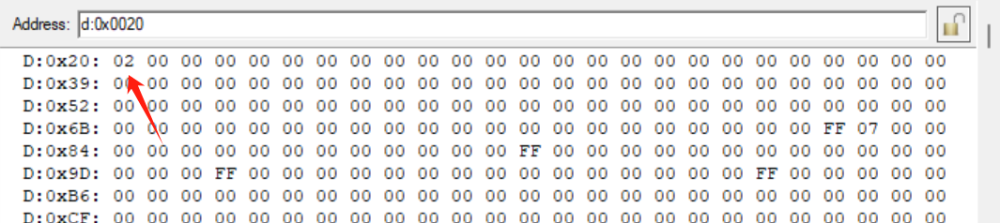</center></td>
        <td><center>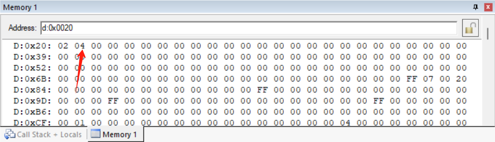</center></td>
    </tr>
</table>

将`#02H`变为`#04H`，得到结果如下，符合预期

<table>
    <tr>
        <td><center></center></td>
        <td><center>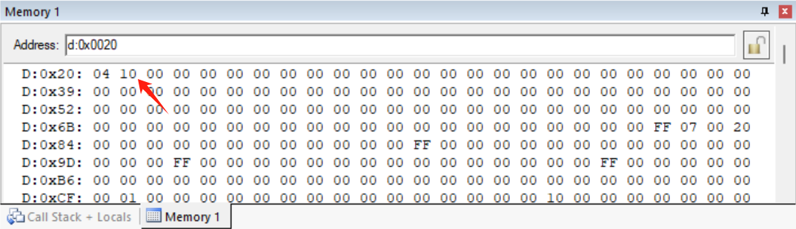</center></td>
    </tr>
</table>


### 1.2 例2 分支决策

这里我使用了自己的程序

```assembly
ORG 0000H
LJMP PREPARE
PREPARE: 
		MOV 30H, #00H		;支持更换
		LJMP START
ORG 1000H
START:	MOV A, 30H
		JZ ZERO
		ANL	A, #80H			
		JNZ MINUS
		LJMP DAYU0
ZERO:	MOV 30H, #20H
		LJMP OVER
MINUS:	MOV A, 30H
		ADD A, #5H
		MOV 30H, A
		LJMP OVER
DAYU0:	NOP
OVER:	SJMP $
END
```

当`(30H) = 00H`时，结果如下

<table>
    <tr>
        <td><center>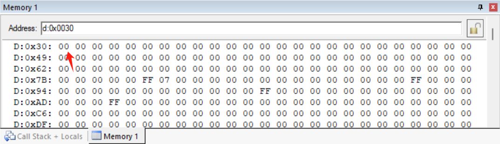</center></td>
        <td><center>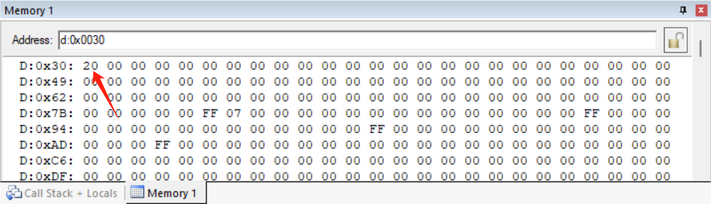</center></td>
    </tr>
</table>

当`(30H) = 05H`时，结果如下

<table>
    <tr>
        <td><center>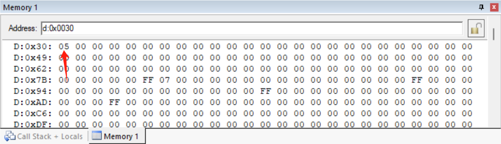</center></td>
        <td><center></center></td>
    </tr>
</table>

当`(30H) = -5`时，结果如下

<table>
    <tr>
        <td><center>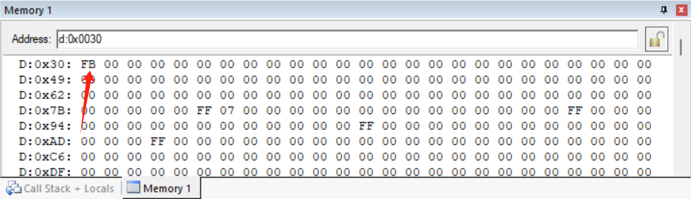</center></td>
        <td><center>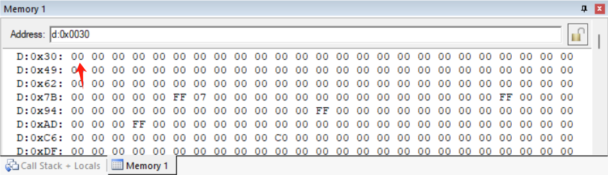</center></td>
    </tr>
</table>

都是符合预期的


### 1.3 例3 延时子程序

测试的程序如下，由于多次调用，反复进行栈操作太繁琐，在作业中略去；实际工程中会保护的

```assembly
ORG 0000H
		LJMP START3
	
ORG 0100H
START3:	MOV P1, #0FFH
		LCALL DEL 
		MOV P1, #00H
        LCALL DEL
        LJMP START3

DEL: 	MOV R7,#200      ;1MC
DEL1:	MOV R6,#123      ;1MC
        NOP              ;1MC
        DJNZ R6,$        ;2MC,???
        DJNZ R7,DEL1     ;2MC
        RET              ;2MC
END
```

硬件连接如下

<center>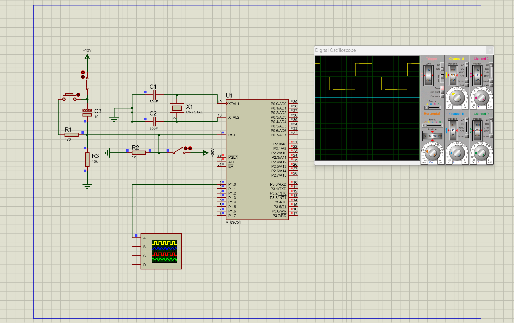</center>

放大示波器

<center>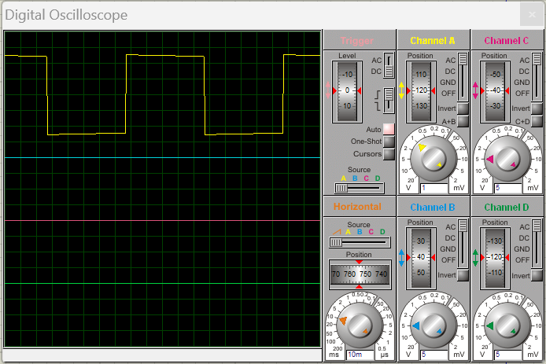</center>

不能做到完全理想的方波，但是图中已经是很好的周期为100ms的方波了


### 1.4 例4 字符串传送

程序如下

```assembly
; 定义数据段
data    EQU     30H     ; 内部RAM起始地址
buffer  EQU     2000H   ; 外部RAM起始地址

ORG     0000H   
        MOV     R0, #data       
        MOV     DPTR, #buffer   

LOOP1:  MOV     A, @R0          
        CJNE    A, #24H, LOOP2  
        SJMP    LOOP3           
LOOP2:  MOVX    @DPTR, A        
        INC     R0              
        INC     DPTR            
        SJMP    LOOP1           

LOOP3:  END                     
```

由于我不知道KEIL怎么添加外部MEM，暂时做不到结果的验证


### 1.5 例5 实现平方和

程序如下

```assembly
ORG 0000H
	AddressA EQU 20H
	AddressB EQU 39H
	AddressC EQU 52H
	LJMP START

ORG 1000H
START:
	MOV AddressA, #03H
	MOV AddressB, #04H
	MOV A,AddressA           ;?a,DA,DB,DC????
    ACALL SQR          ;???????
    MOV R1,A           ;a?????R1?
    MOV A,AddressB           ;?b,DB????,?????
    ACALL SQR          ;???????
    ADD A,R1           ;????????A?
    MOV AddressC,A           ;????DC ?
    SJMP  $
SQR:MOV DPTR,#TAB      ;???
    MOVC  A,@A+DPTR
    RET
TAB: DB 0,1,4,9,16,25,36,49,64,81
    END      
```

结果如下

<table>
    <tr>
        <td><center>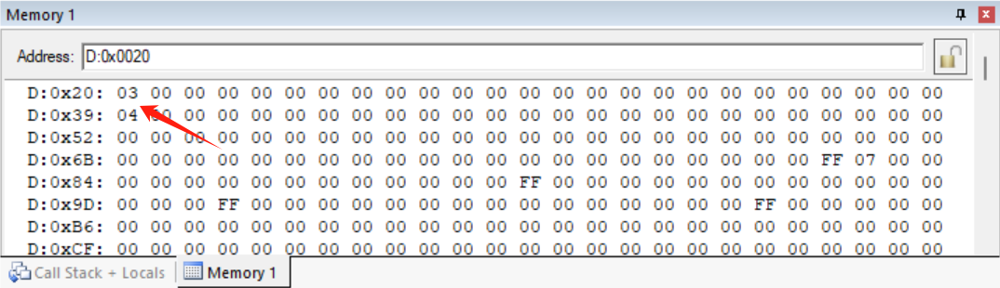</center></td>
        <td><center>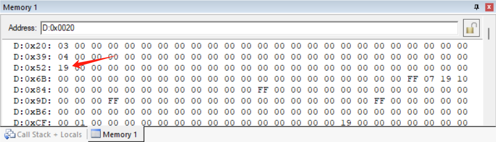</center></td>
    </tr>
</table>


## 2 混合编程

### 2.1 完全C语言

程序如下

```c
#include<reg51.h>

int RM(int A, int B){
	int C = A*A + B*B;
	return C;
}

int main(){
	int A = 3;
	int B = 4;
	int C = 0;
	C = RM(A, B);
	return 0;
}
```

执行完初始化程序后寄存器如下

<center>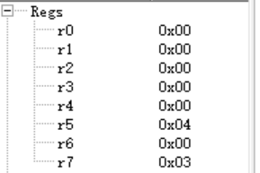</center>

子程序返回后寄存器如下

<center>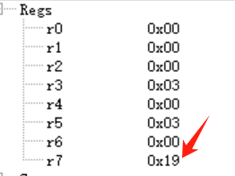</center>


### 2.2 完全汇编

程序如下，考虑到了`8bit`寄存器的溢出情况，分为高低位储存，最终结果低8bit在`A`，高8bit在`B`，最高位在`R7`

```assembly
ORG 0000H
	LJMP START
	
ORG 2000H
START:	MOV R0, #255
		MOV R1, #254
		ACALL RM
LOOP:	SJMP $
				
RM:		
		MOV A, R0
		MOV B, R0
		MUL AB
		MOV R2, A
		MOV R3, B
		
		MOV A, R1
		MOV B, R1
		MUL AB
		
		CLR C
		ADD A, R2
		MOV R4, A
		MOV A, B
		ADDC A, R3
		MOV B, A
		MOV A, R4
		JC CARRY
		RET
CARRY:	MOV R7, #01H
		RET
		
END
```

初始化结果如下

<center>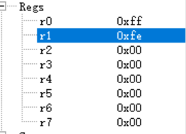</center>

程序返回结果为

<center>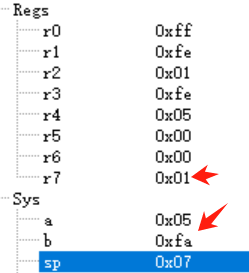</center>

即$255^2+254^2 = 1\mathsf{FA}05\mathsf{H} = 129541$，结果正确


### 2.3 混合编程

C语言程序如下

```c
#include<reg51.h>

extern int SQR(int a, int b);	

int main()
{
	int a = 255;
	int b = 254;
	int c = SQR(a, b);
	return 0;
}
```

汇编语言程序如下

```assembly
?PR?FUNCTION SEGMENT CODE
RSEG ?PR?FUNCTION

public _SQR
_SQR:
START:	MOV A, R7
		MOV R0, A
		MOV A, R5
		MOV R1, A
		ACALL RM
		RET
				
RM:		
		MOV A, R0
		MOV B, R0
		MUL AB
		MOV R2, A
		MOV R3, B
		
		MOV A, R1
		MOV B, R1
		MUL AB
		
		CLR C
		ADD A, R2
		MOV R4, A
		MOV A, B
		ADDC A, R3
		MOV B, A
		MOV A, R4
		JC CARRY
		RET
CARRY:	MOV R7, #01H
		RET
		
END
```

测试结果同2.2节，不赘述


## 3 中断例程

### 3.1 复现PPT

程序如PPT中所示，硬件连接如下

<center>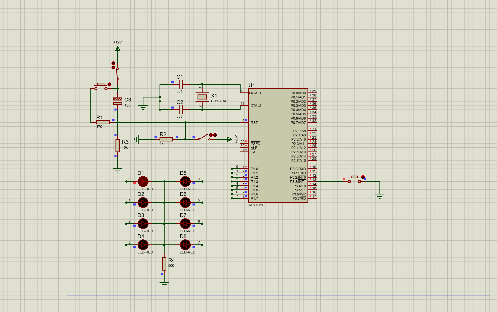</center>

不断按下按钮，从D2开始循环亮，与程序预期一致，结果节选如下

<table>
    <tr>
        <td><center>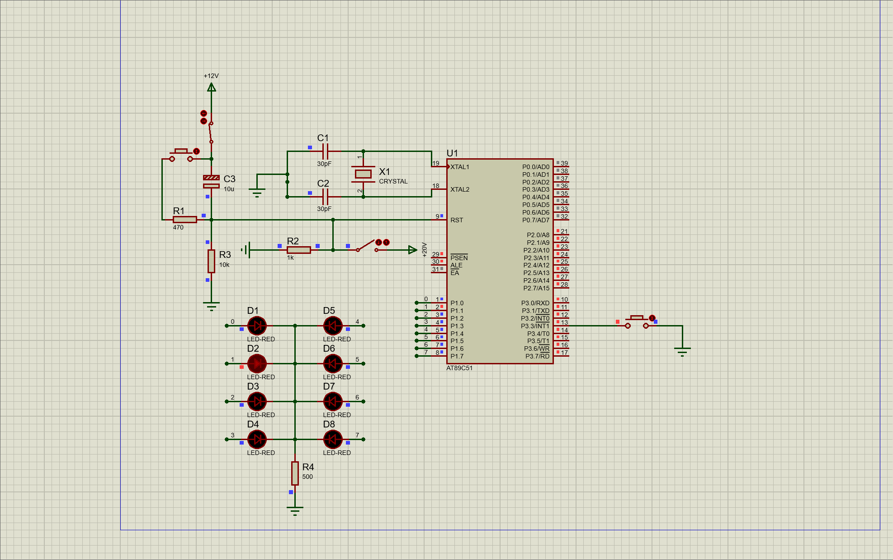</center></td>
        <td><center>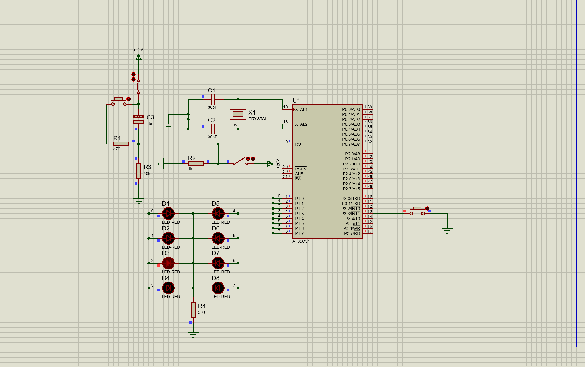</center></td>
    </tr>
</table>


### 3.2 一些改进

程序如下，重要的修改已用注释标出

```assembly
ORG 0000H 
		LJMP  MAIN
		ORG   0003H       			;INT0的入口
		LJMP  ITR0
MAIN:	SETB  EA          
		SETB  EX0          			;修改为EX0，去掉了SETB，因为是低电平而非下降沿
		CLR   PX1            
		MOV   A, #01111111B    		;修正了BUG，能从第一盏灯开始亮，且是低电平亮
LOOP:	SJMP  LOOP
ITR0:	RL    A               
		MOV   P1,A        
		ACALL DEL					;由于低电平触发，当按下按钮时灯会一直变，需要加入一个延时让人能看清楚
		RETI                     	;这个延时大约在1s

DEL:	MOV   R7, #20
DEL1: 	MOV   R6, #200      
DEL2:	MOV   R5, #123      
        NOP              
        DJNZ  R5, $        
        DJNZ  R6, DEL2     
		DJNZ  R7, DEL1
        RET              	
		
END
```

硬件连接如下，主要改变了按钮的输入和二极管的方向

<center>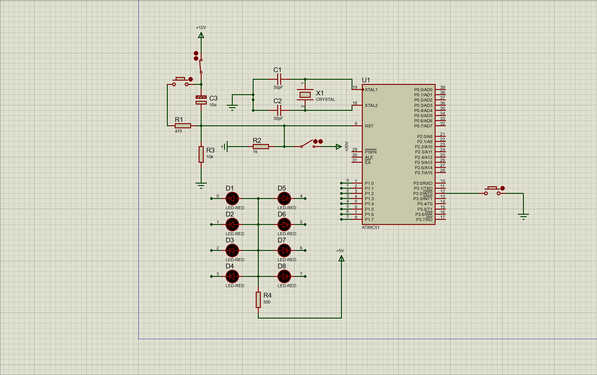</center>

节选的演示效果如下，一直按下按钮，每隔1s，灯会交替亮起，达到流水灯的效果

<table>
    <tr>
        <td><center>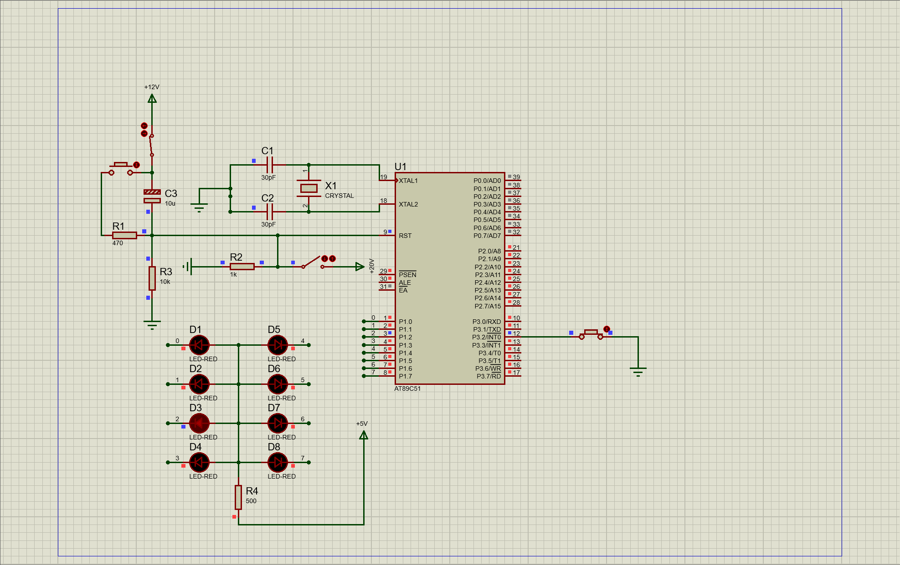</center></td>
        <td><center>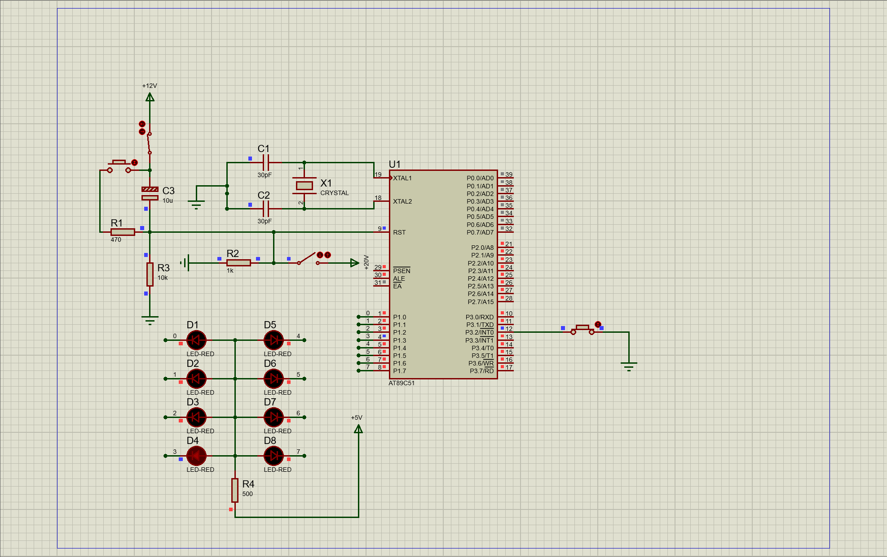</center></td>
    </tr>
</table>

可以发现输出低电平才能亮，符合预期