# Homework 5

## 1 测量正脉冲宽度

程序如下

```assembly
ORG 	0000H
LJMP	START

ORG		0003H
LJMP	ITR0

ORG		0040H
START:
		MOV		TMOD,	#00101001B		; 初始化计时器，T1工作在模式2，T0工作在模式0
		MOV		SP,		#60H
		SETB	TR0
		SETB	EA
		SETB	EX0
		SETB	IT0
		MOV		TH0,	#0H
		MOV		TL0,	#0H
		MOV		SCON,	#01010000B		; 初始化串口，工作在方式1
		MOV		TH1,	#0FDH			; 设置波特率为9600
		MOV		TL1,	#0FDH			; 用于自动填充
		SETB	TR1	
		
		SJMP	$
		
		
COMMUNITY:
		PUSH	ACC
		MOV		A,		R1				; 保存高位
		MOV		30H,	A				
		MOV		SBUF,	A				; 输出高位到显示器
		JNB		TI,		$
		CLR		TI
		MOV		A,		R2				; 保存低位
		MOV		31H,	A				
		MOV		SBUF,	A				; 输出低位到显示器
		JNB		TI,		$
		CLR		TI
		POP		ACC
		RET

ITR0:	CLR		EX0						; 防止嵌套
		CLR		TR0						; 当中断产生时，立刻停止计时
		MOV		R1,		TH0				; 保存当前时刻
		MOV		R2,		TL0
		MOV		TH0,	#0H				; 清空
		MOV		TL0,	#0H
		LCALL	COMMUNITY				; 开始串口通讯
		SETB	TR0						; 为下一个中断做准备
		SETB	EX0
		RETI
		
END
```

硬件连接如下

<center>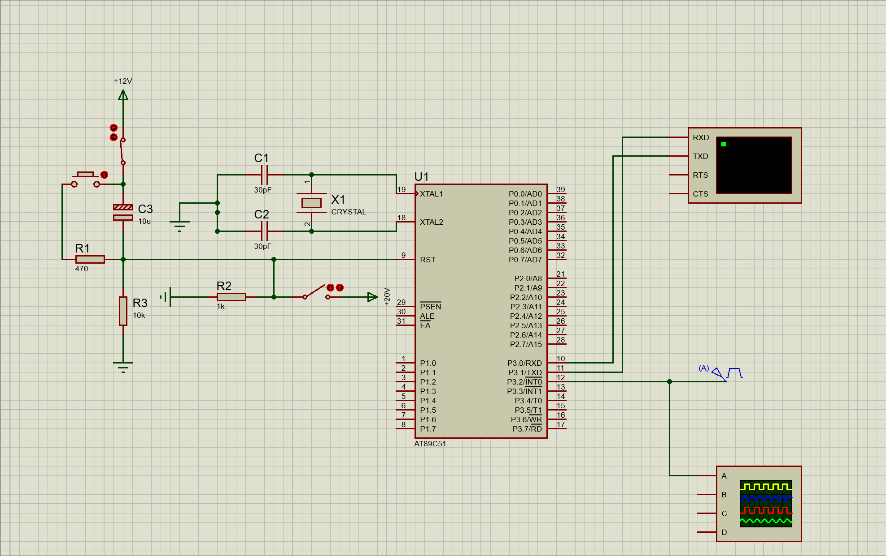</center>

当脉冲信号持续30ms时，输出如下

<center>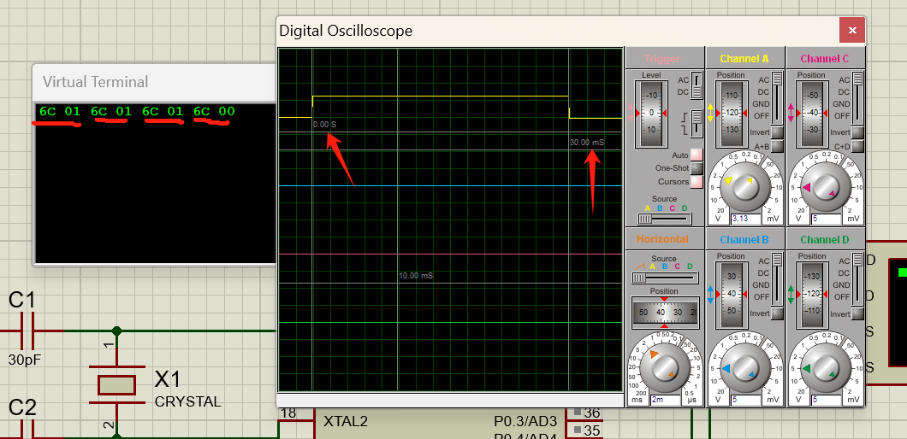</center>

而`6C01H = 27649D`，结合51单片机的内部时钟为11.0592MHz，计算出计时时长为
$$
27649 \times 1\div 11.0592\mathsf{M} \times 12 = 30.0\mathsf{ms}
$$
非常准确

将脉冲周期改为60ms，得到如下结果

<center>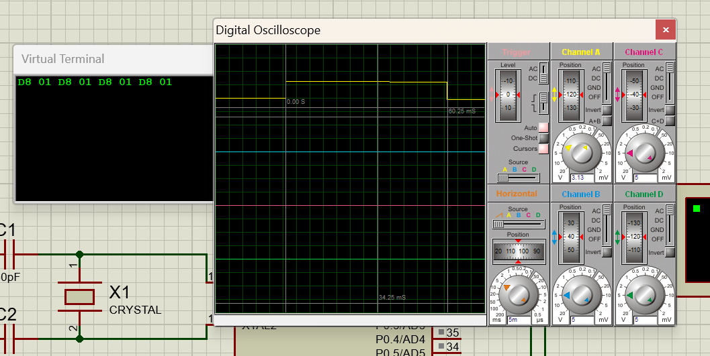</center>

这里不赘述了，计时的结果是60.0ms（60.001ms），非常准确

做这个任务最大体会就是51的内部时钟必须设置为11.0592MHz，否则通讯很不精确


## 2 方波发生器

程序如下

```assembly
ORG   	0000H
		LJMP  	MAIN             

ORG   	000BH              	
		LJMP  	DVT0                

ORG   	0100H
MAIN:
        MOV   	TMOD,	#01H 		; T0工作在方式1
        MOV   	TH0,	#0D8H       ; 这是根据时钟周期计算出的初值
        MOV   	TL0,	#0F0H          
        SETB  	ET0              
        SETB  	EA                
        SETB  	TR0              
        SJMP  	$                      
DVT0:
        CPL  	P1.0             
        MOV  	TH0,#0D8H        	; 重新装入
        MOV  	TL0,#0F0H           
        RETI                       
END

```

硬件连线如下

<center>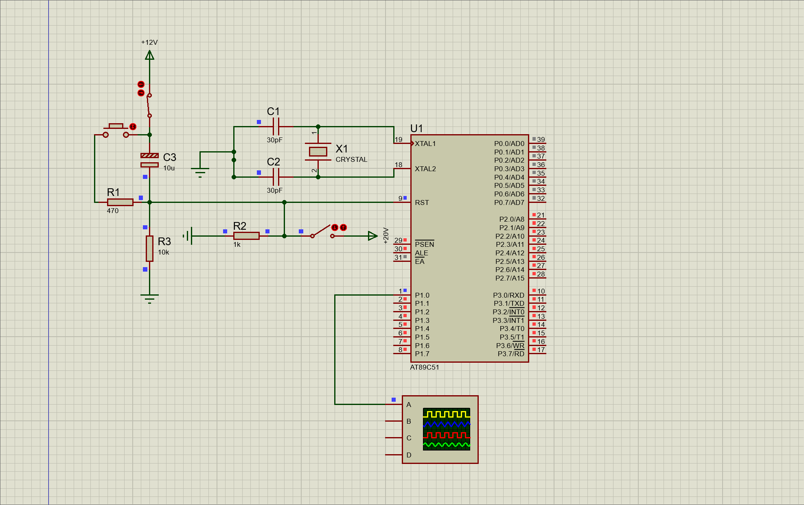</center>

实验结果如下

<center>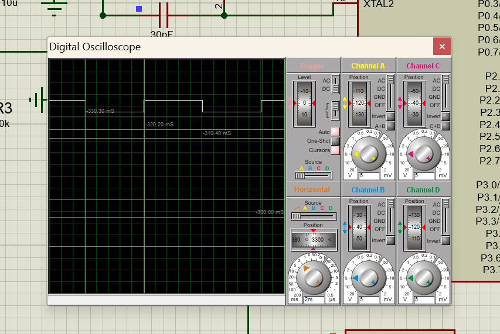</center>

方波的周期是20ms


## 3 测量方波的周期

由于1节实现了一个高精度的正脉冲测量装置，稍加改进，就能完成方波周期的测量

两个下降沿的时差就是方波的周期，那么只需要在每次中断的间隔计数即可

考虑到溢出，这种方法适合测量周期小于约60ms即频率大于20Hz的方波（上限为几个机器周期），和老师给出的方法可以作为一个互补

程序如下

```assembly
ORG 	0000H
LJMP	START

ORG		0003H
LJMP	ITR0

ORG		0040H
START:
		MOV		TMOD,	#00100001B		; 修改了T0的触发条件，现在不用中断信号
		MOV		SP,		#60H
		SETB	EA
		SETB	EX0
		SETB	IT0
		MOV		TH0,	#0H
		MOV		TL0,	#0H
		MOV		SCON,	#01010000B		
		MOV		TH1,	#0FDH			
		MOV		TL1,	#0FDH	
		SETB	TR1	
		SJMP	$
		
		
COMMUNITY:
		PUSH	ACC						; 防止一次传输过多数据，查重
		MOV		A,		R1				
		SUBB	A,		30H
		JNZ		NEXT
		MOV		A,		R2
		SUBB	A,		31H
		JZ		OUT
NEXT:	MOV		A,		R1	
		MOV		30H,	A				
		MOV		SBUF,	A				
		JNB		TI,		$
		CLR		TI
		MOV		A,		R2				
		MOV		31H,	A				
		MOV		SBUF,	A				
		JNB		TI,		$
		CLR		TI
OUT:	POP		ACC
		RET

ITR0:	
		CLR		TR0						; 停止计数
		CLR		EX0
		MOV		R1,		TH0				
		MOV		R2,		TL0
		MOV		TH0,	#0H				
		MOV		TL0,	#0H
		LCALL	COMMUNITY			
		SETB	EX0
		SETB	TR0						; 恢复计数
		RETI							; 这样一来，计数的时间就是两次中断的间隔，也就是一个周期
		
END
```

硬件连接同1节，结果如下

<center>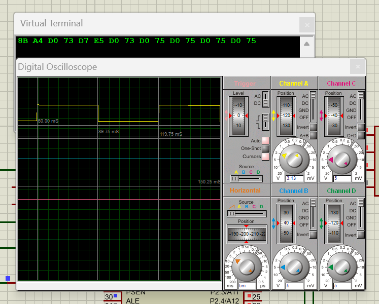</center>

在实践中发现，方波信号的周期即使在稳定后也是在小幅度变化的，上图是设置周期为60ms的结果，串口的稳定值对应的周期为58.0ms，误差也许是单片机的运行时造成的


## 4 两个51的串口通讯

程序如下，只给两机的发送数据做了定义，就只放这一段了

发送机

```assembly
INIT:	
		MOV		40H,	#12H
		MOV		41H,	#34H
```

硬件连接如下，左边是A机（发送机），右边是B机（接收机）

<center>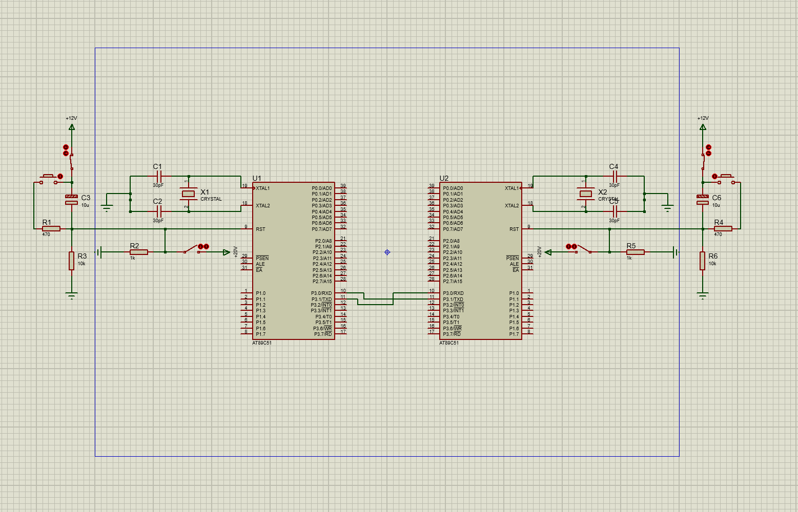</center>

由于通讯过快，这里抓不到整个变化过程，只有最终的结果，下图左边是A的MEM，右边是B的MEM，可以发现接收成功，说明握手也是成功的

<center>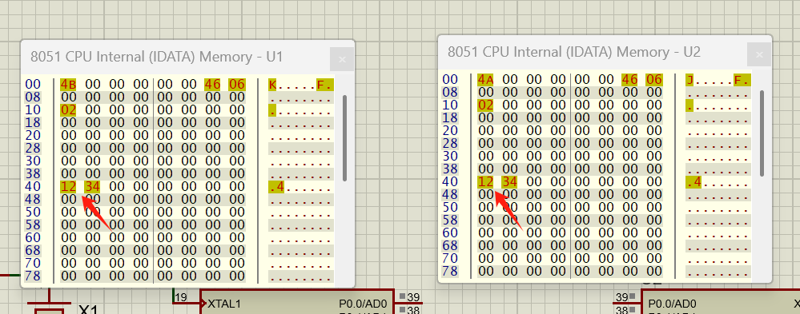</center>


## 5 两个单片机之间的通讯（改）

程序如下，A机为发送机，B机为接收机

A机程序，关键部分见注释；由于键盘输入检测是一个比较特殊的循环，程序段之间的跳转比较复杂，下面的程序的关键点是比较关键的地方

整体思路如下

1. 按下按钮控制键盘开启/关闭，使用中断
2. 键盘开启时读取输入并转化为对应数字，通过串口传送到B机
3. 此时可以随意改变传递数字
4. 断开开关，中断结束，此时不能再改变读数，相当于一个LOCK
5. 再次按下按钮，重复1-4步

```assembly
ORG 0000H
		LJMP 	INIT
		
ORG	0013H
		LCALL	GET_NUM					; 这里一定是要用LCALL，不可以用LJMP
										; 否则会产生中断无法返回的情况
		
ORG 0400H
INIT:
		MOV		00H,	#01H			; 校验用
		MOV		SP,		#60H			; 很关键，否则栈溢出就不能传递数字
		
		
ASTART:	SETB  	EA
		MOV  	TMOD,	#20H     
		MOV  	TH1,	#0F4H       
		MOV  	TL1,	#0F4H
		MOV  	PCON,	#00H       
		SETB  	TR1                  
		MOV  	SCON,	#50H  

DETECT:	SETB	EX1						; 开中断1，设置为低电平触发
										; 写在这里是因为若开关一开始就闭合
										; 可以防止初始化被跳过
		SJMP	$						; 持续检测中断信号，实际应用中这里可以干别的事情
		SJMP	DETECT					; 不需要轮询键盘数据口
		
GET_NUM:  
		CLR		EX1						; 关中断1，防止INT1的嵌套
		MOV 	P1, 	#0FFH			; 这里开始和作业2中的4节没什么变化
		CLR 	P1.3
		JNB 	P1.2, 	NUM1
		JNB 	P1.1, 	NUM2
		JNB 	P1.0, 	NUM3
		SETB 	P1.3
		CLR 	P1.4
		JNB 	P1.2, 	NUM4
		JNB 	P1.1, 	NUM5
		JNB 	P1.0, 	NUM6
		SETB 	P1.4
		CLR 	P1.5
		JNB 	P1.2, 	NUM7
		JNB 	P1.1, 	NUM8
		JNB 	P1.0, 	NUM9
		SETB 	P1.5
		CLR 	P1.6
		JNB 	P1.1, 	NUM0
		SETB 	P1.6
		JB		P3.3,	OUT				; 如果没有这句话，在按下开关后
										; 由于一直LJMP GET_NUM死循环
										; 不能再返回主程序
										; 加一个开关信息的判断来保证开关断开键盘不可用
		LJMP	GET_NUM

OUT:	RETI							; 中断的出口

NUM0:	MOV 	40H,	#00H
		LJMP 	ALOOP1					; 不需要在这里返回GET_NUM，在串口通讯结束统一返回
										; 程序更简洁
NUM1:   MOV 	40H,	#01H
		LJMP 	ALOOP1        

NUM2:   MOV 	40H,	#02H
		LJMP 	ALOOP1
	
NUM3:   MOV 	40H,	#03H
		LJMP	ALOOP1
	
NUM4:   MOV 	40H,	#04H
		LJMP 	ALOOP1
	
NUM5:   MOV 	40H,	#05H
		LJMP 	ALOOP1
		
NUM6:   MOV 	40H,	#06H
		LJMP 	ALOOP1
		
NUM7:   MOV 	40H,	#07H
		LJMP 	ALOOP1
		
NUM8:   MOV 	40H,	#08H
		LJMP 	ALOOP1
		
NUM9:   MOV 	40H,	#09H
		LJMP 	ALOOP1
		

; 与PPT中的程序类似，不需要使用传送位数的寄存器，因为就1 bit
ALOOP1:	MOV  	SBUF,	#0E1H    			; LOOP1是握手信号
		JNB  	TI,		$                  
		CLR  	TI                       
		JNB  	RI,		$                             
		CLR  	RI                      
		MOV  	A,		SBUF          
		XRL  	A,		#0E2H           
		JNZ  	ALOOP1
ALOOP2:	MOV  	R0,		#40H                ; LOOP2是数据准备
		MOV  	R6,		#00H         
ALOOP3:	MOV  	SBUF,	@R0      			; LOOP3是传送
		MOV  	A,		R6           
		ADD  	A,		@R0          
		MOV  	R6,		A            
		INC 	R0
		JNB  	TI,		$   
		CLR  	TI
		MOV  	SBUF,	R6       
		JNB  	TI,		$
		CLR  	TI
		JNB  	RI,		$            
		CLR  	RI
		MOV  	A,		SBUF        
		JNZ   	ALOOP2         
		LJMP	GET_NUM
		
END
```

B机程序，关键部分见注释

整体思路如下

1. 持续检测串口输入
2. 当产生输入中断时，跳转到接收程序
3. 利用直接定址表将保存的数字转化为SEV_SEG的输入信号
4. 将保存到数字显示到SEV_SEG
5. 中断返回

```assembly
ORG 0000H
		LJMP 	INIT
		
ORG	0023H
		LCALL	BLOOP1						; 串口收发中断

ORG 0400H
INIT:
		MOV		00H,	#01H				; 和A机保持一致
		MOV		SP,		#60H
		MOV		P0,		#00H
		
BSTART:	SETB  	EA							; 开中断
		SETB	ES							; 开UART中断
		MOV  	TMOD,	#20H
		MOV  	TH1,	#0F4H
		MOV  	TL1,	#0F4H
		MOV  	PCON,	#00H
		SETB  	TR1
		MOV  	SCON,	#50H

DETECT:	SJMP	$							; 可以干别的
		SJMP	DETECT

BLOOP1:	CLR		ES							; 防止中断嵌套
		CLR  	RI               			; 很显然，程序能进入这里说明接收到A机
											; 的握手信号，需要手动清空中断服务寄存器
		MOV  	A,		SBUF          
		XRL 	A,		#0E1H        
		JNZ		BLOOP1           
		MOV  	SBUF,	#0E2H     
		JNB 	TI,		$       
		CLR  	TI  
		MOV  	R0,		#40H       
		MOV 	R6,		#00H       
BLOOP2:	JNB  	RI,		$
		CLR  	RI  
		MOV 	A,		SBUF
		MOV  	@R0,	A         
		INC  	R0  
		ADD 	A,		R6       
		MOV 	R6,		A  
		JNB 	RI,		$        
		CLR  	RI
		MOV  	A,		SBUF
		XRL  	A,		R6           
		JZ   	END1             
		MOV  	SBUF,	#0FFH   
		JNB  	TI,		$            
		CLR  	TI
END1:	MOV  	SBUF,	#00H
		MOV		DPTR,	#SET_NUM			; 直接定址表
		MOV		A,		40H					; 40H保存了接收到的数字
		MOVC	A,		@A+DPTR
		MOV		P0,		A					; 输出
		SETB	ES							; 开中断，连续显示
		RETI
		
SET_NUM:
		DB		3FH, 06H, 5BH, 4FH, 66H
		DB		6DH, 7DH, 07H, 7FH,	6FH

END
```

硬件连线如下

<center>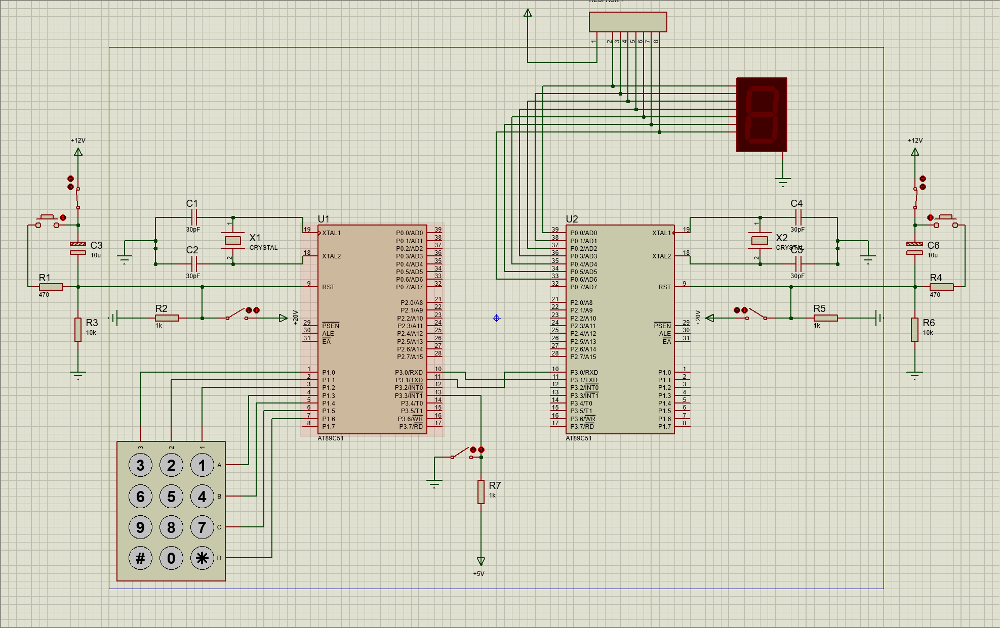</center>

当进入仿真时，开关没有按下，A机没有进入键盘读取状态，键盘口的电平全高

<center>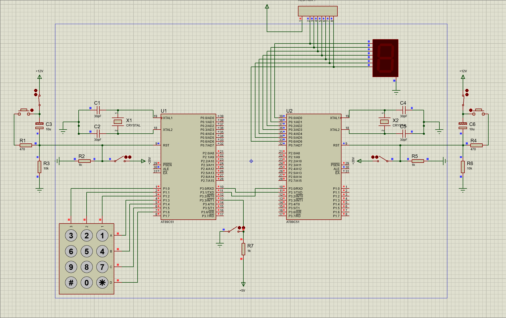</center>

当开关闭合，键盘口的灯会闪烁，表明电平变化，按下数字，数码管会显示

<center>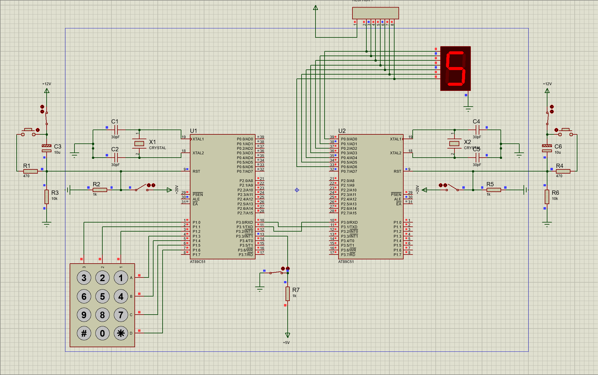</center>

不断开开关，改变一个按键，还会显示

<center>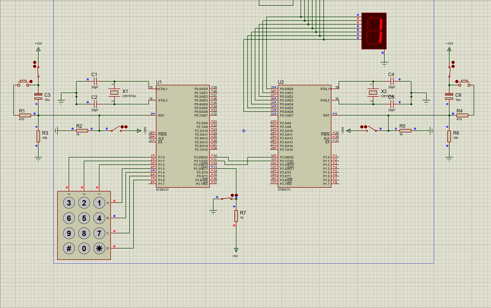</center>

断开开关，键盘电平全高，数字不会再改变（直到开关再次按下），可以锁输出

<center>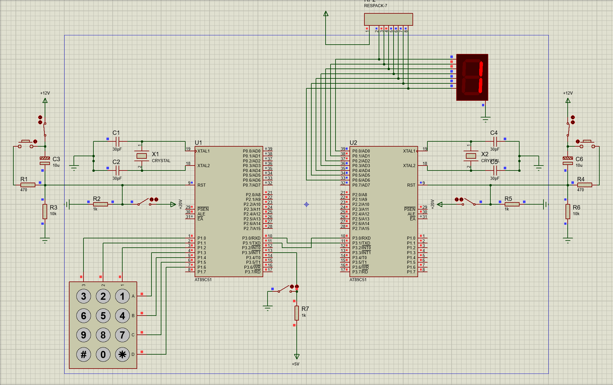</center>

程序在以下情况下也能正常运行

* 开关初始状态为闭合
* 多次开闭开关
* 快速改变输入数字

