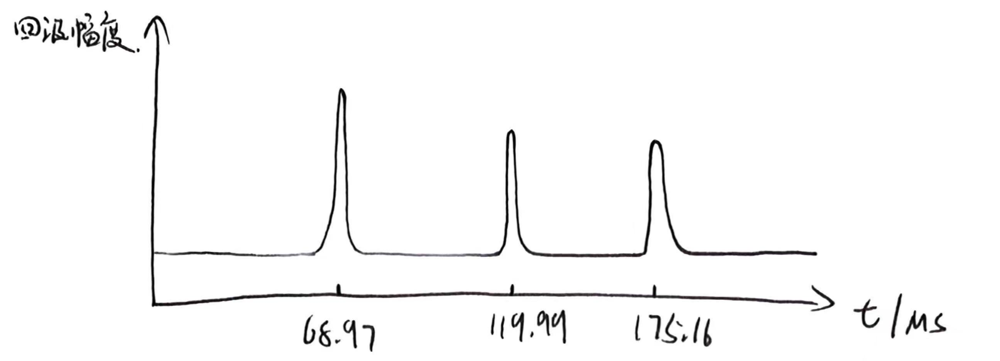
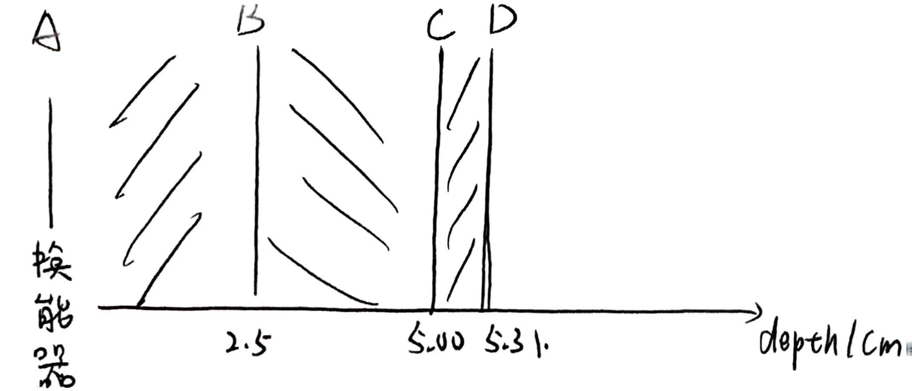
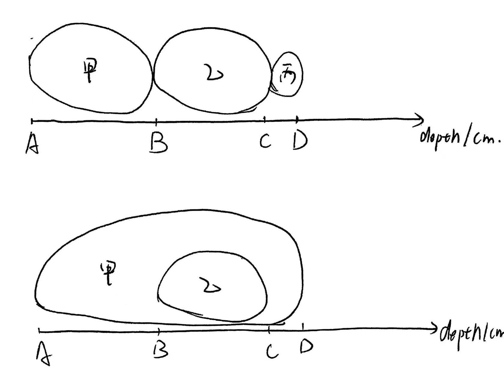

# Homework 5

## 1 给出结构画成像

由于超声成像假设声波在人体内速度不变，故成像时计算的深度就是用均一的速度乘以时间差，而时间差的测量值就是理论计算值，这个值是通过变声速求出的

### 1.1 BCD三点回波的时间

令$\overline{AB}$表示AB之间的直线距离，$c_1 = 1450\,\mathsf{m/s}\,,\,\, c_2 = 1568\,\mathsf{m/s}$

很显然存在
$$
t_B = \frac{2\overline{AB}}{c_1}\,\,,\,\,\, t_C = t_B+\frac{2\overline{BC}}{c_2}\,\,,\,\,\, t_D = t_C + \frac{2\overline{CD}}{c_1}
$$
带入数据得到
$$
t_B = 68.97 \,\mathsf{us}\,\,,\,\,\, t_C = 119.99\,\mathsf{us}\,\,,\,\,\,t_D = 175.16\,\mathsf{us}
$$

故A超成像图大致如下（考虑了TGC），幅度可能还要考虑介质之间的反射系数

### 1.2 均一声速下的时间

$$
t_B' =\frac{2\overline{AB}}{c}\,\,,\,\,\, t_C'=\frac{2\overline{AC}}{c}\,\,,\,\,\, t_D'=\frac{2\overline{AD}}{c}\,\,,\,\,\,
$$

带入数据得到
$$
t_B' = 64.94\,\mathsf{us}\,\,,\,\,\, t_C'=116.88\,\mathsf{us}\,\,,\,\,\,t_D'=168.83\,\mathsf{us}
$$
误差率分别是
$$
P_B = -5.84\%\,\,,\,\,\,P_C=-2.59\%\,\,,\,\,\,P_D=-3.61\%
$$
误差不是很大，因为人体组织的深度不深，这样的误差完全能接受

即超声成像的声速均一假设在这种语境下是能接受的

## 2 给图像画结构

深度的计算方式是
$$
d_x = \frac{t_xc}{2}
$$
其中$c=1.45\times 10^5\,\mathsf{cm/s}$，代入数据，得到
$$
d_B = 2.50\,\mathsf{cm}\,\,,\,\,\,d_C = 5.00\,\mathsf{cm}\,\,,\,\,\,d_D = 5.31\,\mathsf{cm}
$$
那么结构如下

至少有两种介质，但是AB，CD之间的介质也不一定相同，可能的解剖解构如下

