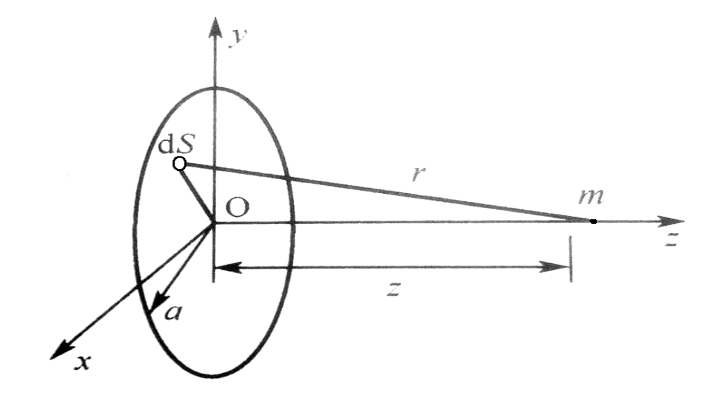

# 圆片换能器声场沿轴线分布

圆片换能器模型如下所示

对于片上一个小面元$dS$，视为一个点声源球面波，考虑波幅衰减，其声压沿轴线方向的分布为
$$
dp = \frac{kp_a}{2\pi r}\cos{\left(\omega t -kr+\frac{\pi}{2}\right)}dS \tag{1}
$$
其中$\omega,k,r$分别是声波的圆频率，波数和传播距离

已知振元的振速$u_a$，介质的声阻抗率$z_c$，根据$z_c=\rho_0c, u_a = \frac{p_a}{\rho_0 c}$，得到$p_a = z_cu_a$

假定振元距圆心距离为$R$，那么$dS=RdRd\theta$，在这个环形微元上的声压传播到m点时，沿轴线的分量完全相同

对式1进行积分，得到
$$
p_z =  \int_S dp = \int_0^{2\pi} d\theta \int_0^a \frac{kz_cu_a}{2\pi \sqrt{R^2+z^2}}\cos{\left(\omega t -k\sqrt{R^2+z^2}+\frac{\pi}{2}\right)} RdR\\= p_a \left[ \cos\left(\omega t -k\sqrt{z^2+a^2}\right) -\cos\left( \omega t-kz \right)\right]
$$
将结果写为指数的形式，得到
$$
p_z = \frac{p_a}{2}\left\{ \left[ e^{i\left(\omega t-k\sqrt{z^2+a^2}\right)}+e^{-i\left(\omega t-k\sqrt{z^2+a^2}\right)} \right]- \left[ e^{i\left(\omega t-kz\right)}+e^{-i\left(\omega t-kz\right)} \right]\right\}\\
= \frac{p_a}{2}\left\{  e^{i\omega t}e^{-i\left( \frac{k\sqrt{z^2+a^2}+kz}{2} \right)}\left[ e^{i\left( \frac{-k\sqrt{z^2+a^2}+kz}{2} \right)}-e^{-i\left( \frac{-k\sqrt{z^2+a^2}+kz}{2} \right)} \right] +e^{-i\omega t}e^{i\left( \frac{k\sqrt{z^2+a^2}+kz}{2} \right)}\left[ e^{-i\left( \frac{-k\sqrt{z^2+a^2}+kz}{2} \right)}-e^{i\left( \frac{-k\sqrt{z^2+a^2}+kz}{2} \right)} \right] \right\}
$$
利用欧拉公式写为
$$
p_z = 2u_az_c \sin{\left(\frac{kz-k\sqrt{z^2+a^2}}{2}\right)}\sin\left( \omega t-\frac{k\sqrt{z^2+a^2}+kz}{2} \right) \tag{2}
$$
式2就是沿轴线的声压随时间的变化

现在考虑声压幅值
$$
p_m = 2u_az_c \sin{\left(\frac{kz-k\sqrt{z^2+a^2}}{2}\right)} \tag{3}
$$
由于$z\gg a, z\gg \frac{3a^2}{2\lambda}$，利用等价无穷小$\lim\limits_{x\rightarrow 0}(1+\alpha x)^n-1 = \alpha nx$将正弦内部化简，得到
$$
\lim\limits_{z\gg a}\frac{kz}{2}\left( 1-\sqrt{1+\frac{a^2}{z^2}} \right) =-\frac{k}{4}\cdot\frac{a^2}{z} =- \frac{\pi a^2}{2\lambda z} \tag{4}
$$
再根据$\lim\limits_{x\rightarrow 0}\sin x = x $，将式4代入式3得到
$$
p_m = -\frac{u_az_c\pi a^2}{\lambda z} = -\frac{u_az_c S}{\lambda z} \tag{5}
$$
其中$S$是圆片的面积，令$u_az_c \triangleq -p_0$代入式5，得到最终的表达式
$$
p_m = \frac{p_0S}{\lambda z}
$$

