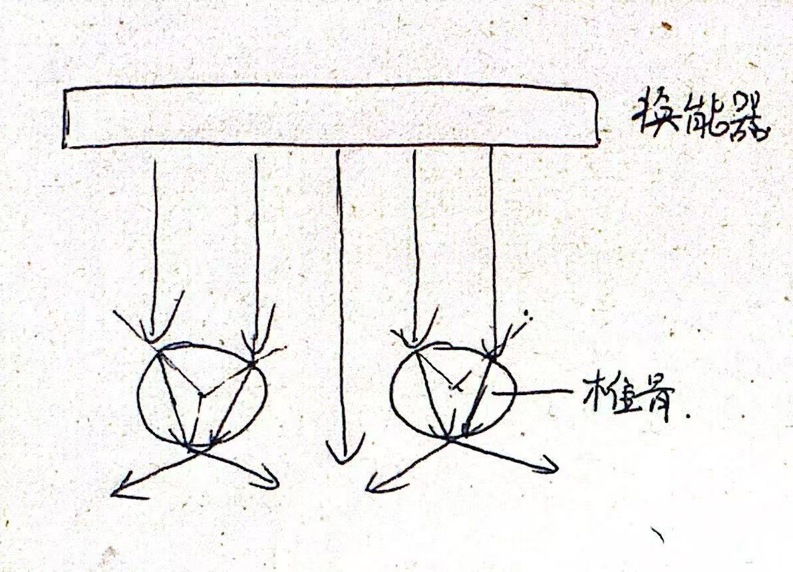
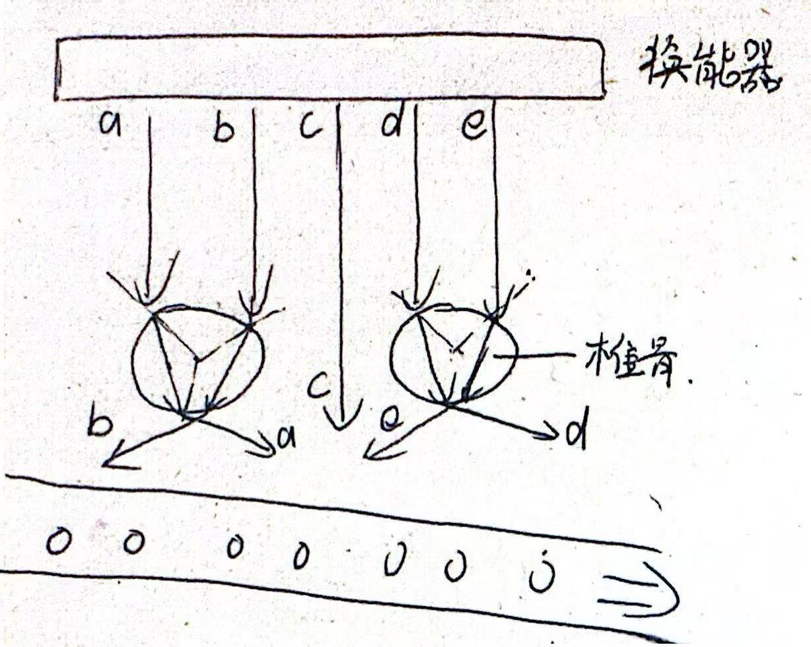
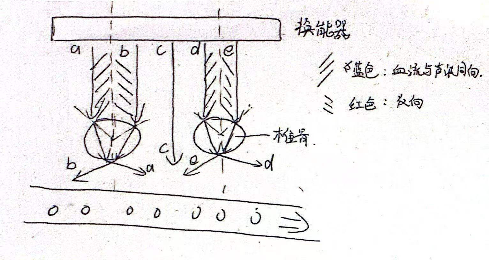
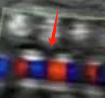

# 超声基础作业 3

### 3.1 多普勒彩超的伪影成因

胎儿的椎体的声阻抗率远远大于周围的软体组织，导致声速在其中非常大，即椎体是声密介质

在声波从软组织传播到圆形的椎体界面时，会产生如下的折射

这会导致声束产生交替变化，以图中的几个声束为例，假定胎儿血液流向朝下，即

那么声束b，e与胎儿血液方向相反；a，d与之相同；c不受干扰，但实际情况中椎骨分布较为密集，很难有这么大间隙

折射后的声波经过血液散射后的回波会经过同样的路径返回探头，由于超声成像假定声束沿直线传播，那么在显示器中就会产生如下的条纹（条纹应当标在血管中，笔误了）

以椎体中线为界，两边的颜色是不一样的，这在实际图片中亦有记载

### 3.2 推导不同近似之下的平均声压

#### 3.2.1 只考虑线性项

若只考虑线性项，那么声压的表达式为
$$
p = c_0\rho_0 v
$$
其中$c_0,\rho_0$为常数，$v=\frac{p_a}{\rho_0 c}\cos{(\omega t -kx+\phi_0)}$

那么将常数化为定值$K$，有
$$
p = K \cos{(\omega t -kx+\phi_0)}
$$
进一步计算平均声压，
$$
\bar{p} = \frac{1}{T}\int_T p\,dt = \frac{K}{T}\int_T\cos(\omega t +\varphi)\, dt = 0
$$
因为cos在一个周期上的积分（面积和）为0

#### 3.2.2 考虑2次非线性项

此时
$$
p = c_0\rho_0 v + \rho_0 v^2
$$
代入$v = \frac{p}{\rho_0 c_0}$，得到
$$
p = c_0\rho_0 v + \frac{p^2}{\rho_0c^2_0}
$$
那么
$$
\bar{p} = \frac{1}{T}\int_Tc_0\rho_0 v + \frac{p^2}{\rho_0c^2_0} \, dt
$$
前项的积分同上，为0

对于后项，引入有效值
$$
p_e = \sqrt{\frac{1}{T}\int_T p^2\, dt}
$$
那么
$$
\bar{p} = \frac{p_e^2}{\rho_0c^2_0}
$$
根据辐射压力的定义式$F =A\cdot \bar{p}$得到，确实产生了辐射压力

### 3.3 超声治疗大鼠抑郁症

#### 3.3.1 到达大脑的声波强度

对大鼠的建模：参考头皮声压衰减系数为$\alpha_1$=1.84dB/cm/MHz，颅骨声压衰减系数为$\alpha_2$=13dB/cm/MHz，头皮厚度$x_1=1$mm，颅骨厚度$x_2=2$mm

那么强度为$I_0$的超声经过大鼠的头皮和颅骨进入到大脑时，声波的强度衰减为
$$
I = I_0\cdot 10^{-\frac{1}{10}(\alpha_1x_1+\alpha_2x_2)f}
$$
带入数据得到
$$
I=68.07\,\mathsf{mW/cm^2}
$$

#### 3.3.2 脑组织的升温情况

大鼠大脑的声强衰减系数为$\alpha_3=0.9$dB/cm/MHz=0.1036Np/cm/MHz，声波在其中传播$L$路径后，变化的声强为
$$
\Delta I = I(1-e^{-2\alpha_3Lf})
$$
对于大鼠来说，$L$不会超过几厘米，故$2\alpha_3Lf\ll 1$可以成立，即
$$
\Delta I = 2\alpha_3fLI
$$
假定所有的声波能量转化为热能，对于单位长度上的大鼠脑组织，有
$$
\rho C_t \Delta T = 2\alpha_3fI\Delta t
$$
那么
$$
\frac{\Delta T}{\Delta t} = \frac{2\alpha_3fI}{\rho C_t}
$$
取小鼠脑组织的密度$\rho=1050\mathsf{kg/m^3}$，比热$C_t=3.6\mathsf{kJ/(kg\cdot  \,^\circ C)}$

得到
$$
\frac{\Delta T}{\Delta t}=2.24\times 10^{-3} \,\,\mathsf{^\circ C/s}
$$
根据这个值，经过10min的超声刺激，大鼠脑组织大约升温1.34℃；1h的超声刺激，大鼠脑组织的升温大约是8℃

一般超声刺激时长约在10min左右，这个数值是比较合理的

### 3.4 HIFU换能器参数计算

#### 3.4.1 某个换能器截面上的参数计算

$$
I_{\mathsf{SPTP}} = 5 \div \pi\div 3^2 = 176.8 \,\mathsf{mW/cm^2}
$$

$$
I_{\mathsf{SPTA}} = I_{\mathsf{SPTP}}\times1\div 2 =88.4\,\mathsf{mW/cm^2}
$$

$$
I_{\mathsf{SATP}} = I_{\mathsf{SPTP}}=176.8\,\mathsf{mW/cm^2}
$$

$$
I_{\mathsf{SATA}} = I_{\mathsf{SATP}}\times1\div2 = 88.4\,\mathsf{mW/cm^2}
$$

#### 3.4.2 在焦区的参数计算

$$
I_{\mathsf{SPTP}} = 16\times 5\div\pi\div3^2 = 2.83\,\mathsf{W/cm^2}
$$

$$
I_{\mathsf{SPTA}} = I_{\mathsf{SPTP}} \times1\div 2 = 1.42\,\mathsf{W/cm^2}
$$

$$
I_{\mathsf{SATP}} = I_{\mathsf{SPTP}} \times\left( \frac{6}{10} \right)^2 = 1.02\,\mathsf{W/cm^2}
$$

$$
I_{\mathsf{SATA}} = I_{\mathsf{SATP}} \times1\div 2 = 0.51\,\mathsf{W/cm^2}
$$

