# 超声实验一

## 1 B超成像的基本操作

### 1.1 介质造成的差异

当实验样品放置在空气中时，只有将样品紧贴换能器表面，才能得到非常微弱的图像信号，但是图忘记拍了

当样品放置在水中时，图像非常明显

<center>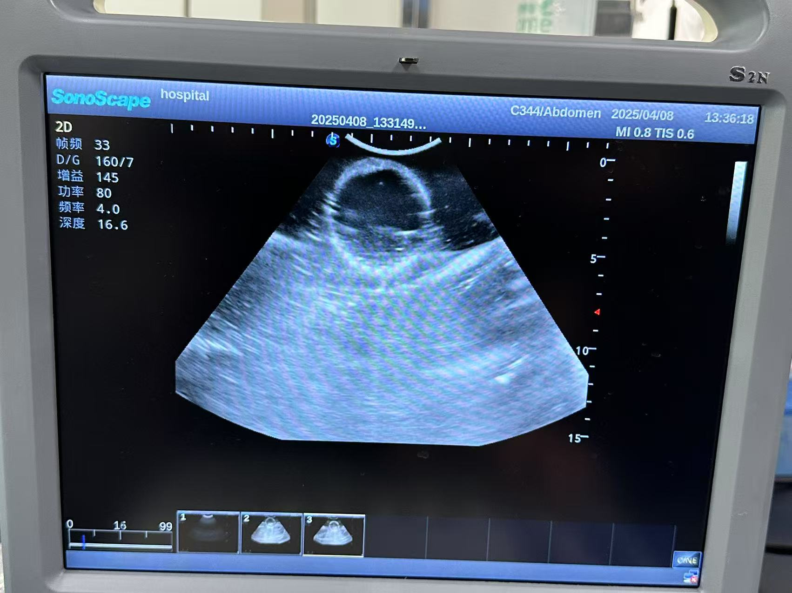</center>

这是因为超声波在空气中的衰减系数非常大，经过样品反射的信号在传递到换能器表面时非常微弱，几乎不可分辨；而在水中，超声波的衰减系数远小于空气，因此接收到的回波信号振幅更大，在图像上表现为灰度更大，更加明显


### 1.2 测量样品参数

使用直尺测量得到的样品直径为5cm，使用B超测量如下

<center>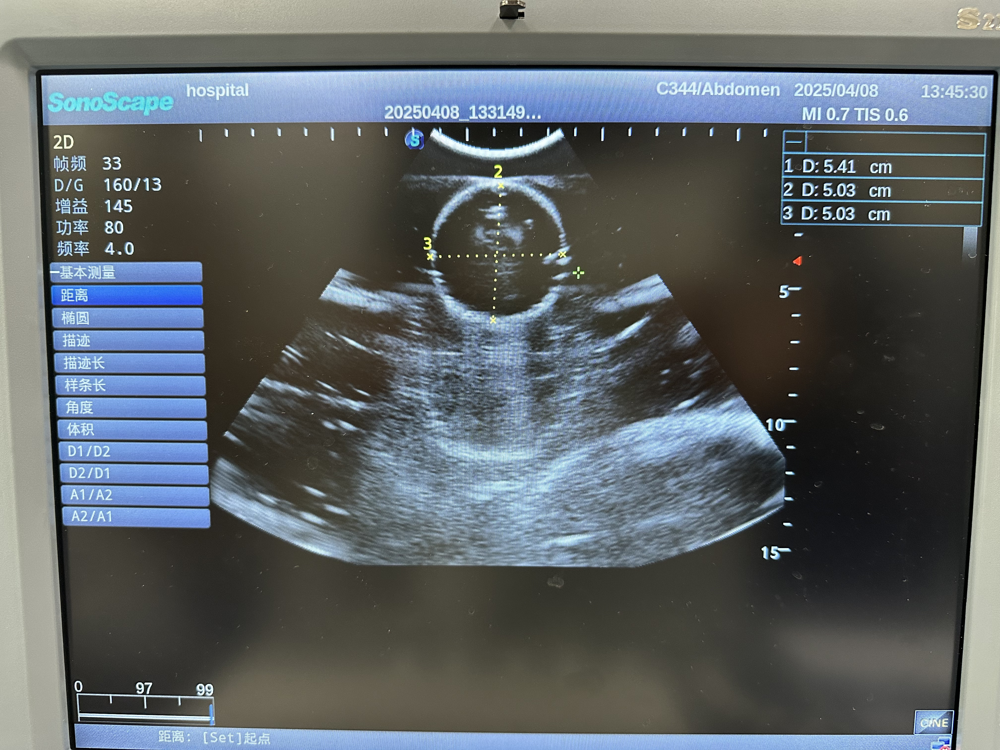</center>

图中2、3为当前测量所得直径，与真实值的差距非常小，误差仅0.6%，测量结果较准确

可能的误差来源是探头未水平放置，图中的1为第一次操作时没有水平放置探头所测得的结果，这会造成图像从圆形变为椭圆形，测量长轴使得结果偏大

还有可能是样品的图像轮廓不明显，在使用光标时标记歪了


### 1.3 焦点位置与数量对分辨率的影响

单焦点实验采集到的结果如下

<table>
    <tr>
    	<td>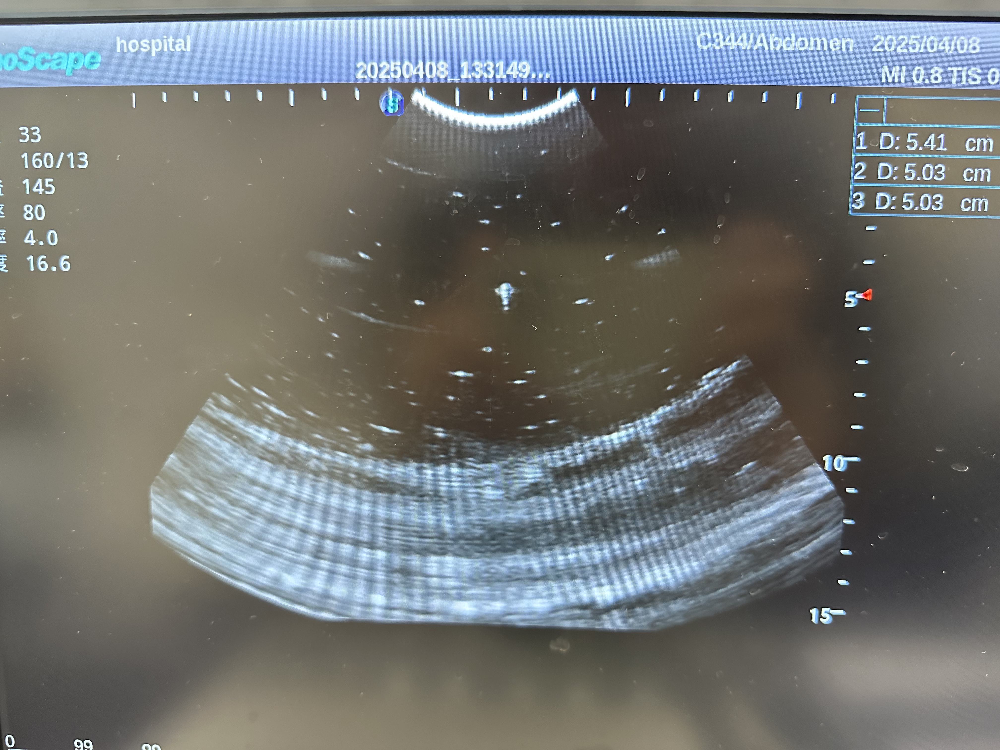</td>
        <td>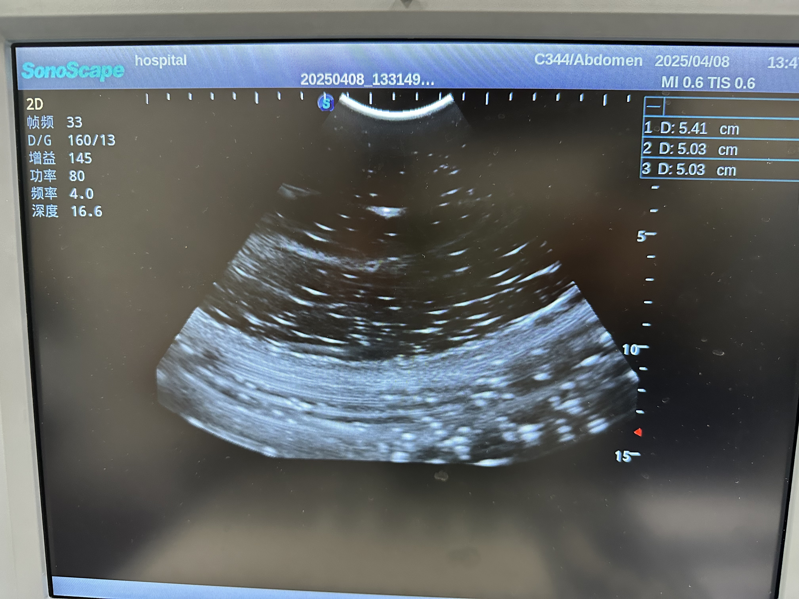</td>
    </tr>
</table>

其中左图为焦点在样品处，右图为焦点不在样品处

可以很明显的发现，当焦点在样品处时，金属丝的图像更小，即探头的横向分辨率更大

当焦点偏离样品时，金属丝的横截面明显被放大，是横向分辨率不足导致的模糊

图中的另外两个点的原因是因为旁瓣伪影造成的，只有两个是因为第一旁瓣的强度够，第二旁瓣不够


三焦点实验采集的结果如下

<table>
    <tr>
    	<td>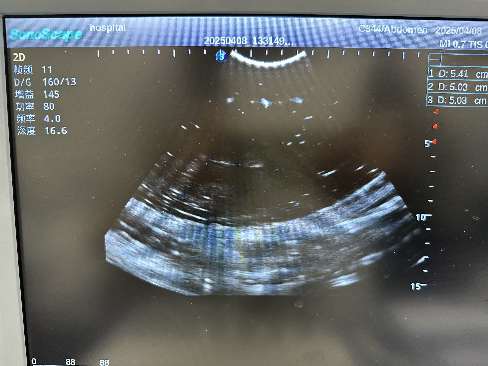</td>
        <td>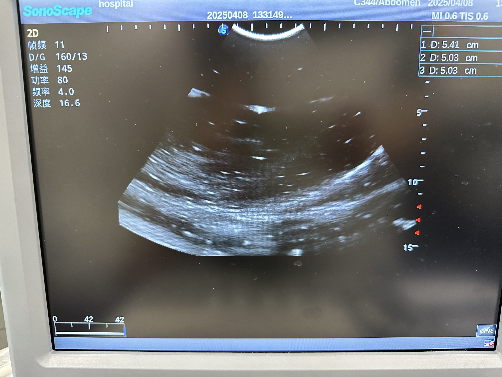</td>
    </tr>
</table>

其中左图为焦点在样品处，右图为焦点不在样品处

与单焦点的实验结果一致，左图的金属丝更加清晰，横向分辨率更大

与单焦点相比，无论是否对焦，三焦点都会产生伪影，且金属丝的像都产生了一定程度的模糊，旁瓣伪影更大的原因可能是三焦点的旁瓣更强，反射的回波强度更大，点更亮更大


聚焦使得声束在焦点处达到最细，可以更准确集中样品并返回

即超声的横向分辨率与声束的直径正相关，声束越细，能单独击中并显像的物体就越细，因此横向分辨率更大


### 1.4 工作频率对分辨率的影响

工作频率通过影响声波波长来影响分辨率

对于横向分辨率，认为超声波声束也满足高斯分布，那么声束的宽度表达式为
$$
\omega(z)=\omega_0\sqrt{1+\left(\frac{\lambda z}{\pi \omega_0^2}\right)^2}
$$
其中$\omega_0$是声束腰半径，很显然，$\lambda$越小，声束越窄；即工作频率越大，声束横向分辨率越大

对于纵向分辨率，考虑衍射极限为半波长，那么工作频率提高后衍射极限变小，能够分辨更细的物体而不发生衍射


没有实验数据支持上面的理论


## 2 B超原理验证

### 2.1 TGC

没有使用TGC时结果如下

<center>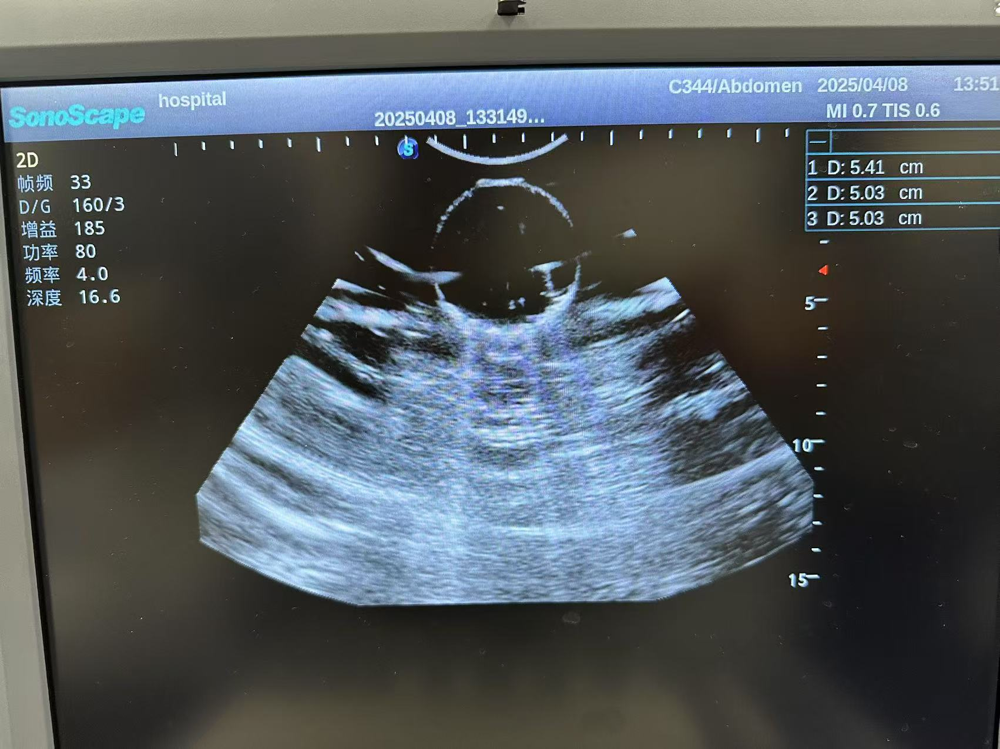</center>

此时图像远端较为均一，因为灰度相差很小，对比度不足，不能反应细节

拨动不同深度的TGC按钮，可以拟合出一条随深度变化的增益曲线

当设置TGC为下图所示时的图像如下

<center>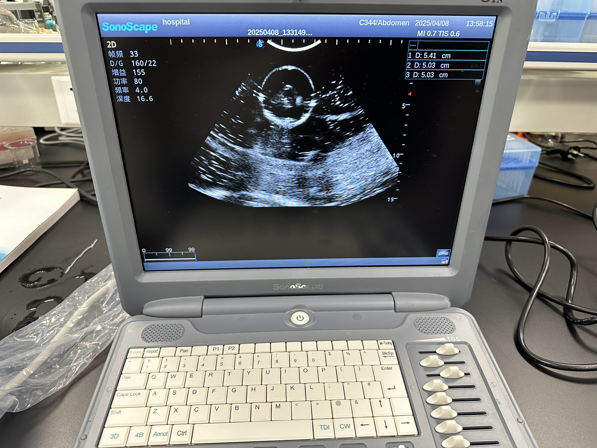</center>

这时远端的细节因为增益而显示出来

将感兴趣的区域增益拉大，可以突出显示ROI，对人眼识别图像有帮助


TGC通过对不同深度处的回波幅度进行补偿，可以突出显示ROI，也可以补偿超声波因为距离产生的衰减，调整不同深度图像区域的亮度，达到最佳的显示效果


### 2.2 总增益

总增益是对回波信号整体的提升，能放大区域之间的绝对差异，但不能改变相对差异

本机总增益范围为0~255，当设置较小时，图像如下

<center>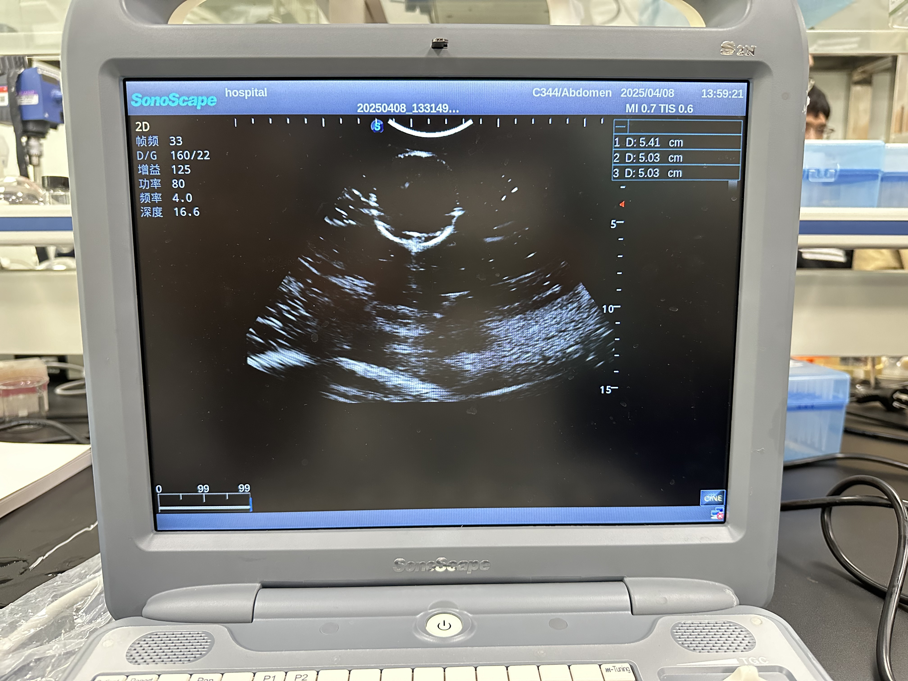</center>

此时总增益为125，图像整体偏暗；当放大总增益至4/5最大值即200左右时，如下

<center>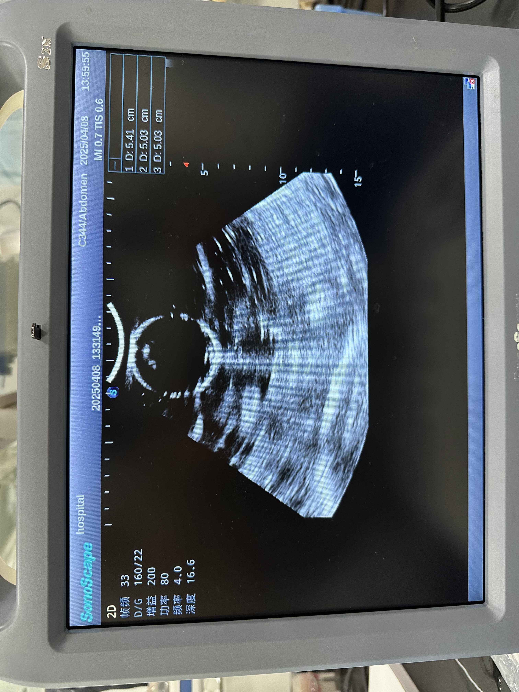</center>

图像的亮度整体上升，但是相对灰度差异不会改变，绝对灰度差变大，亮的更亮，暗的对比之下变暗


为了获取更容易识别的细节，可以将总增益从小到大依次调节，知道出现合适的图像


### 2.3 帧相关平滑

帧相关使用相邻的图像帧进行平均处理，可以一定程度上消除白噪声的干扰，但对均值非0的非白噪声无用

设置静止的物体在0/7帧相关状态下的图像如下

<table>
    <tr>
    	<td>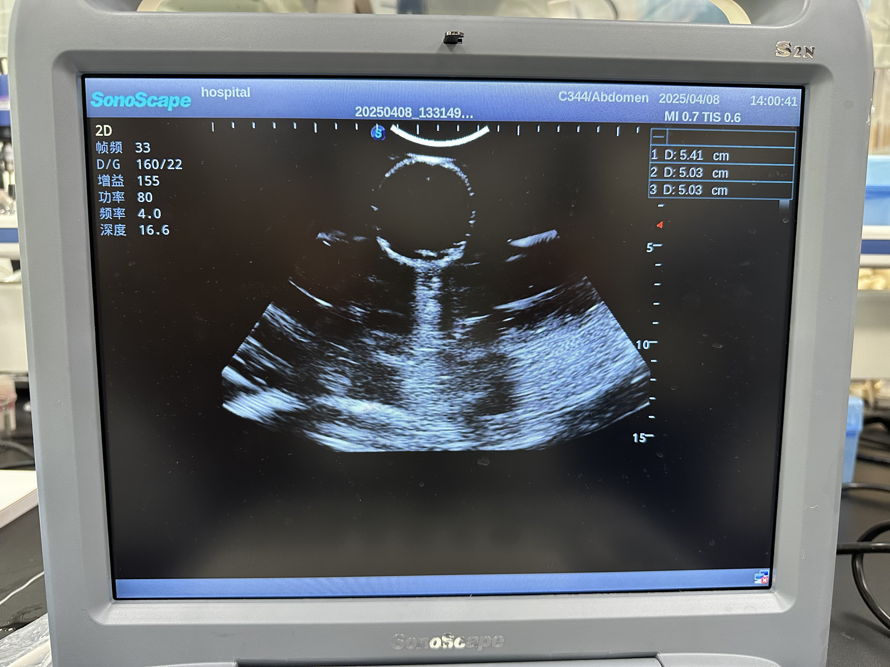</td>
        <td>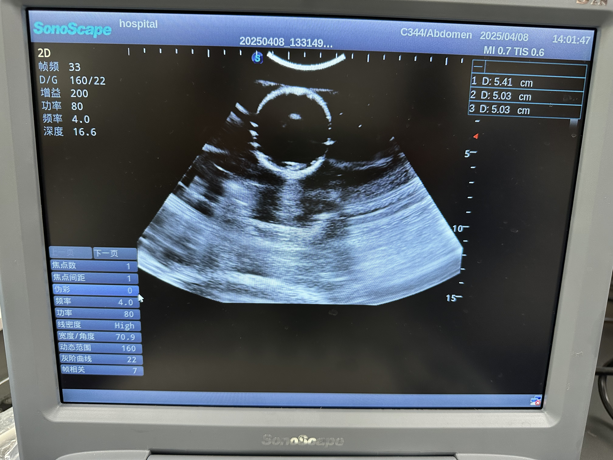</td>
    </tr>
</table>

左边是0帧相关，右边是7帧相关

可以发现，左边图像的平滑程度不如右边，这是因为帧相关的处理过程就是一个在时域上的低通FIR滤波器，在时间频域上抑制高频信号，空间中的频繁变化的噪声会被抑制，而静止的物体不会受干扰


运动物体的0/7帧相关图像如下

<table>
    <tr>
    	<td>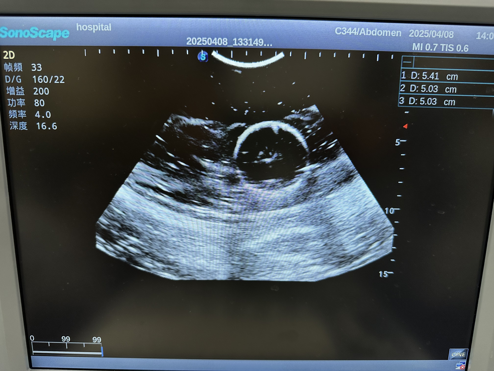</td>
        <td>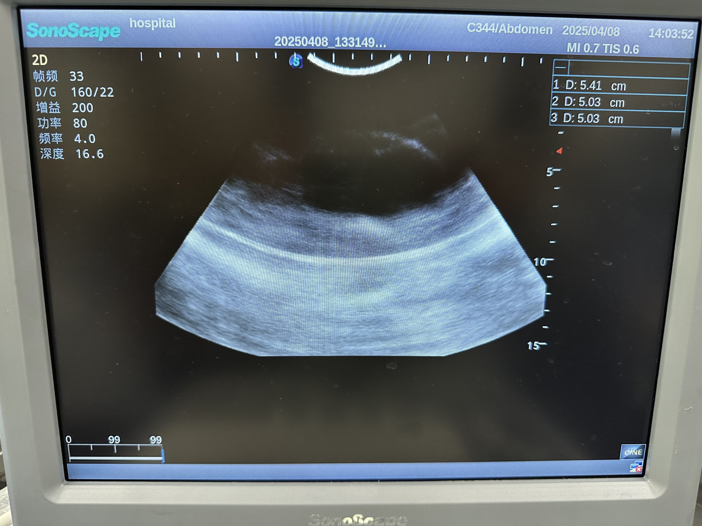</td>
    </tr>
</table>

左边是0帧，右边是7帧

很明显，左边的图像虽然噪声很大，但是至少样品的形状是有的

而右边的7帧相关将7帧的图像平均后完全无法看出物体的轮廓，虽然噪声是够平滑了，但是ROI也没了

在采集运动物体时使用帧相关需要谨慎，因为运动物体在时间频域上的信号也是高频信号，可能需要带通滤波器才行

对于动态超声视频，慎用帧相关，因为物体的运动也会被平均而不明显

实际上帧相关的算法与cv2.fastNlMeansDenoisingMulti()很像


### 2.4 帧相关算法验证

notebook文件也有，可以运行看看


```python
# 首先导入必要库
import numpy as np
import matplotlib.pyplot as plt
import cv2
```

使用拍摄得到的肾脏图片进行验证，原图如下  
<center>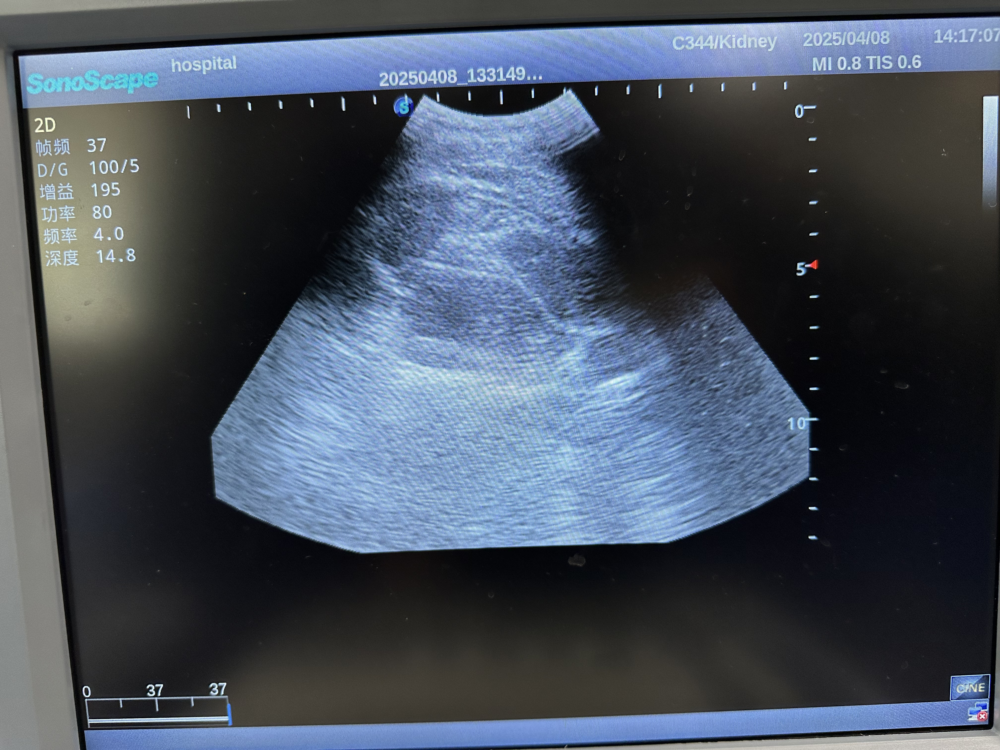</center>

下面对其添加噪声


```python
img = cv2.imread(r'IMG/16.jpg', cv2.IMREAD_COLOR)
img = cv2.cvtColor(img, cv2.COLOR_BGR2GRAY)     # 转化为灰度图，好处理，否则三通道

mean = 0    # 白噪声
sigma = 20   # 标准差

noised_img = []

for i in range(5):
    gaussian_noise = np.random.normal(mean, sigma, img.shape).astype(np.float32)
    # 将噪声添加到图像数据中
    noisy_image = img + gaussian_noise
    noised_img.append(noisy_image)

noised_img = np.array(noised_img)
```


```python
# 显示5张带白噪声的图片
fig, axes = plt.subplots(1, 2, figsize=(20, 10))
for i in range(2):
    axes[i].imshow(noised_img[i], cmap=plt.cm.gray)
    axes[i].set_title('noised_img{0}'.format(i))
    axes[i].axis('off')

fig, axes = plt.subplots(1, 2, figsize=(20, 10))
for i in range(2):
    axes[i].imshow(noised_img[i+2], cmap=plt.cm.gray)
    axes[i].set_title('noised_img{0}'.format(i+2))
    axes[i].axis('off')
```


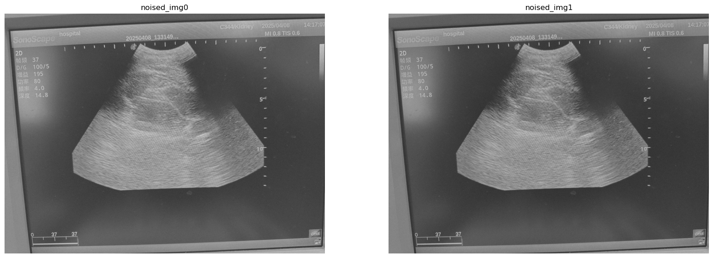
    


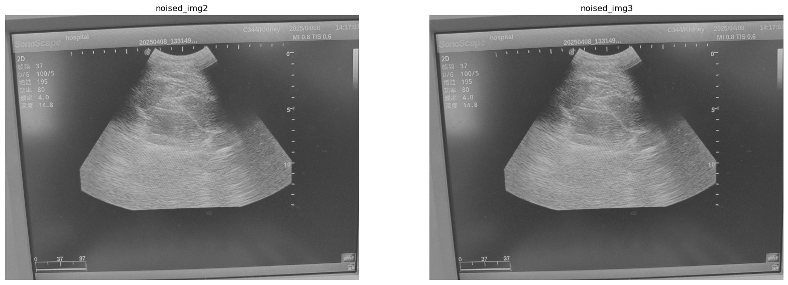
    


仅展示4张，可以发现相比于原图，加噪后图像产生了明显的噪点  
下面是5帧相关图像与原图和加噪图像对比


```python
avg_img = np.mean(noised_img[:], axis=0)
fig, axes = plt.subplots(1, 3, figsize=(20, 10))
axes[1].imshow(avg_img, cmap=plt.cm.gray)
axes[1].set_title('5 frame corelated')
axes[1].axis('off')
axes[2].imshow(img, cmap=plt.cm.gray)
axes[2].set_title('original')
axes[2].axis('off')
axes[0].imshow(noised_img[2], cmap=plt.cm.gray)
axes[0].set_title('noised_img')
axes[0].axis('off')
```


    (-0.5, 4031.5, 3023.5, -0.5)


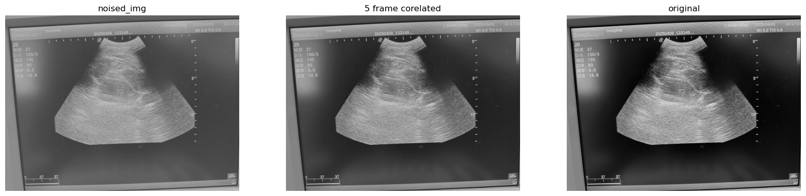
    


可以发现帧相关后确实能去除一定的噪声，但是去噪能力有限，因为没有用功率谱，用的话可以用维纳滤波进行去噪  
下面验证标准差是否为5σ=100


```python
noise = avg_img - img
sigma_noise = np.var(noise) ** 0.5
print(sigma_noise)
```

    8.943531055556257

很显然不是，当然也不可能是5倍，假设图像为$f$，噪声为$\eta_i$，那么得到的加噪图片为
$$g_i = f + \eta_i$$
其中$\eta_i$独立同分布(i.i.d)，有
$$\forall i \,,\,\eta_i \sim \mathcal{N}(0,\sigma^2)$$
那么n帧相关后的图像就是
$$\frac{\sum_{i=1}^n g_i}{n} = f + \frac{\sum_{i=1}^n\eta_i}{n}$$
其中$\sum_{i=1}^n \eta_i \sim \mathcal{N}(0, n\sigma^2)$，那么后者也就是题目中要求的帧相关后的噪声分布为
$$\frac{\sum_{i=1}^n\eta_i}{n} \sim \mathcal{N}\left(0,\frac{\sigma^2}{n}\right)$$
带入本题数据$\sigma=20, n=5$，得到8.944

存在5倍关系的应该是均方误差(MSE)，通过表达式$MSE = |f-g|^2$不难发现，MSE就是噪声的平方的期望  
由于存在关系$D(x) = E(x^2) - E^2(x)$，且本题为白噪声，$E(x)=0$  
因此，在加噪后的均方误差就是$E(\eta_i^2)=\sigma^2$，而帧相关后的均方误差就是$\frac{\sigma^2}{n}$  
下面进行理论验证


```python
MSE_1 = np.sum((img-noised_img[2])**2) / img.shape[0] / img.shape[1]
MSE_2 = np.sum((avg_img-img)**2) / img.shape[0] / img.shape[1]
print('帧相关前的MSE为{0}，帧相关后的MSE为{1}'.format(MSE_1, MSE_2))
```

    帧相关前的MSE为400.2711010330058，帧相关后的MSE为79.98674624170657


验证完成，理论正确


## 3 肾脏

采集到的肾脏图像如下

<center></center>

图中的肾皮质较为清晰