# 超声实验二

## 3 B超伪影与气泡对成像的影响

### 3.1 伪影图像的采集与解释

**回声失落现象**

当反射界面与声束的角度很小时，反射波不能返回换能器，表现为图像上没有这一块；这个现象在圆形物体的成像中十分常见，因为圆形物体的侧面切线方向与声束方向几乎一致

下图的箭头处就是回声失落

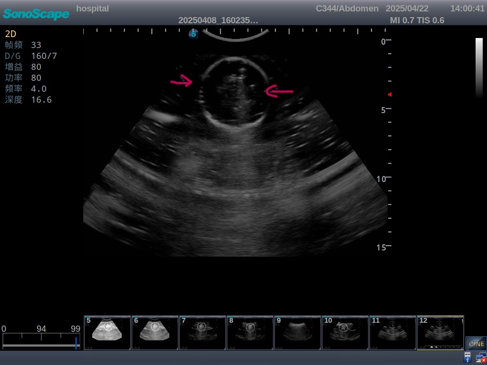

**旁瓣伪影**

B超成像默认声束从换能器的中轴返回，然而这个假设在旁瓣很强时是不成立的；旁瓣的声束经过物体反射仍然能够成像，而设备误认为这是从中轴发出并接收的声束，那么就会产生伪影；表现为左边的旁瓣产生的伪影出现在图像的右边，右边的旁瓣反之

下图的箭头处是手指的旁瓣伪影

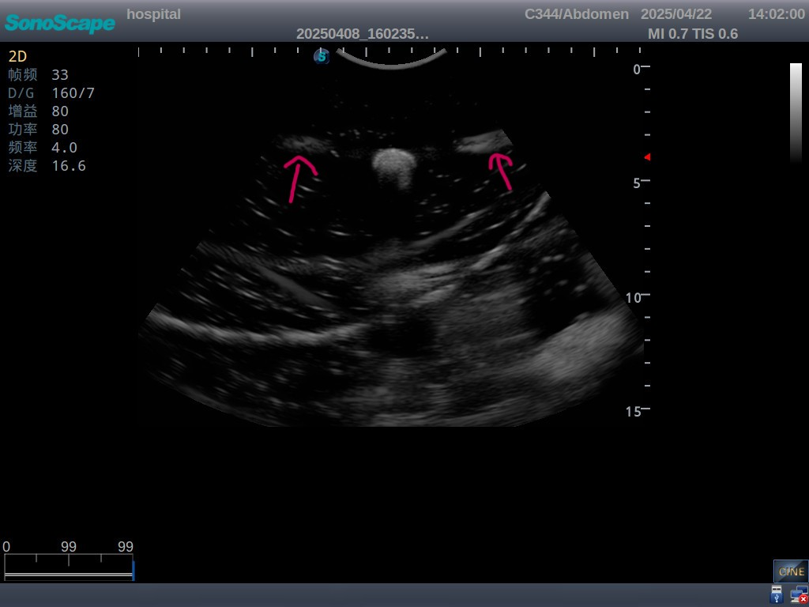

**混响伪影**

B超成像的另一个假设就是声波在界面之间只进行一次反射；当遇到强反射面时，声波会多次反射，形成多个回波，在图像上表现为一系列平行的界面，这些界面的间距往往是等大的

下图的箭头处是手指的混响伪影，两个红色的双箭头等长

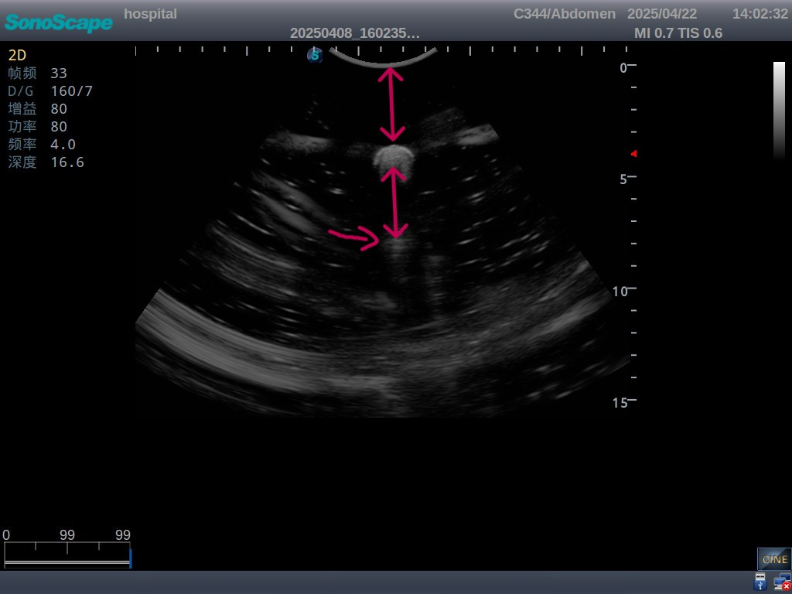

**衰减伪影**

由于强反射面大量反射声波导致其后方形成部分暗区的现象，会造成检测遗漏

在做结石实验的过程中发现了这个现象，结石后方的图像亮度明显降低

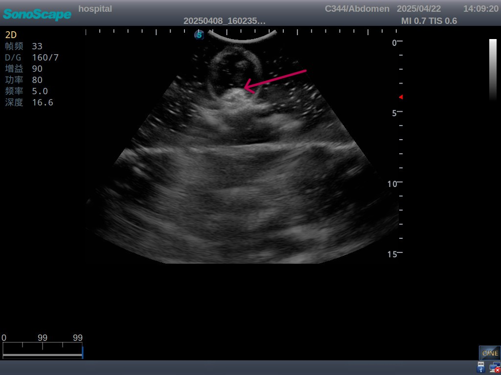

### 3.2 胆结石模型的构建

在乒乓球中放入石头模拟胆结石，在成像中需要注意让乒乓球装满水，否则空气中衰减太大，回波很弱

当换能器平放时，测量到的胆结石位于圆形的正中心，如下图箭头所指

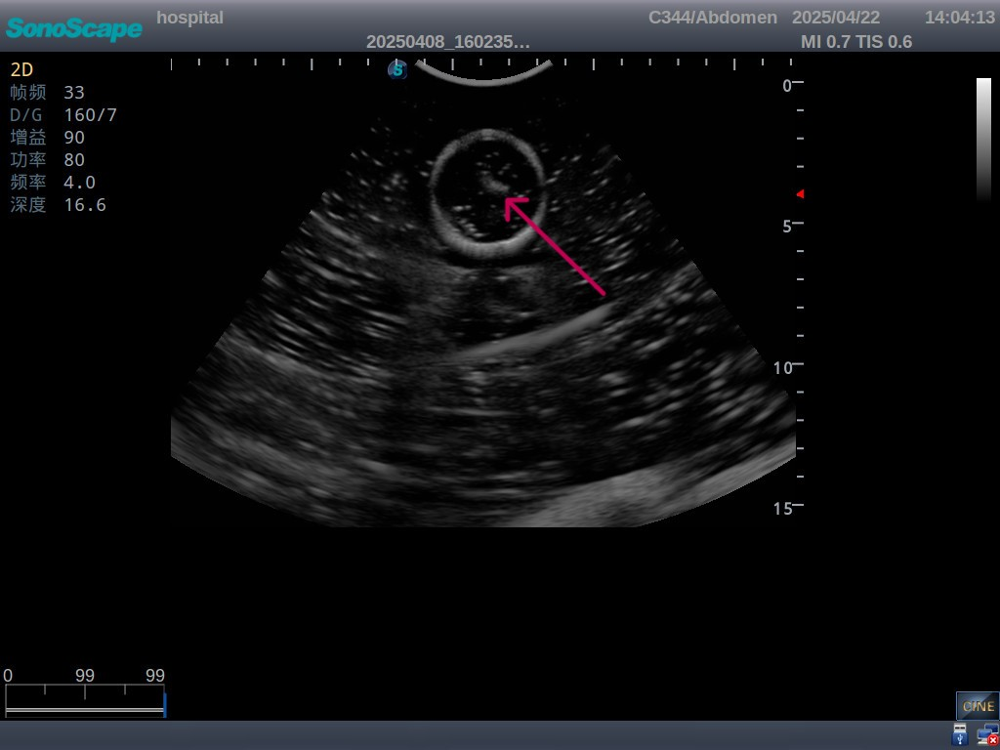

图像中的伪影：回声失落，水盆壁的反射伪影和混响伪影

当换能器竖直放置时，测量到的胆结石位于圆形的下方，如下图箭头所指

图像中的伪影：回声失落，水盆底的混响伪影，结石造成的衰减伪影

### 3.3 超声造影剂的原理

超声造影剂可以增强超声波的散射，相当于大量的反射，使得组织的回波波幅更大，在图像上表现为含有造影剂的部分更亮

下图是没有使用造影剂（面粉）的纯净水的B超图像

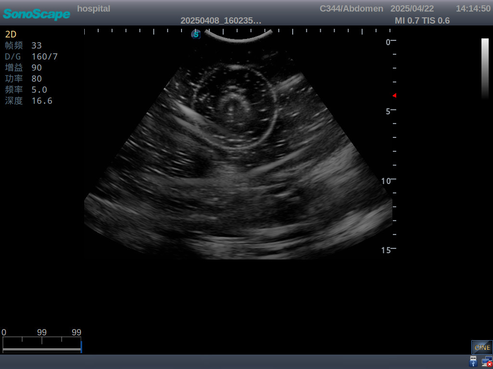

可以发现水瓶中大部分是黑的，其中的亮点是水中的气泡（相当于造影剂），中心的结中结是水瓶瓶盖的反射图像

在水中加入造影剂（面粉）后再次获取B超图像

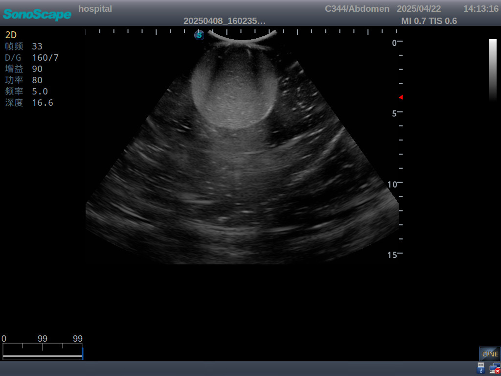

可以发现水瓶内部灰度变大，说明了回波增强，验证了造影剂的原理和作用

没用面粉时水中气泡处的亮度更大也说明了造影剂的作用和原理

## 4 B/M/D模式综合实验

### 4.1 B/M模式测量手指运动

M超原理：在一个时间段内持续记录一条线在不同深度的回波变化，用这个变化反应不同组织在这个时间内的深度变化

在此模式下，首先会进行B超成像，得到截面信息；然后选择M模式，会出现一条代表M超深度方向的绿线，仪器会在这个方向进行M超测量，得到这个方向上的深度随时间变化信息，并绘制图像

下图表示手指的周期运动的B/M超图像，其中二维图的横轴代表时间

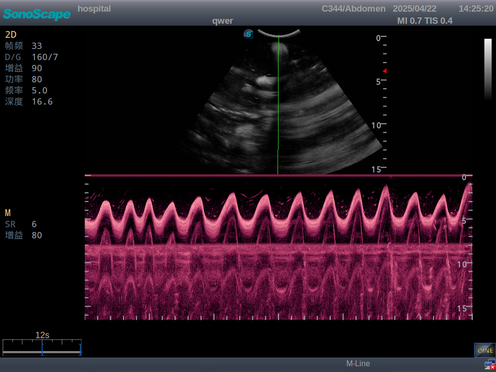

图像表示，手指头在6秒内跳动了13.5下，得到跳动频率为135bpm

在6秒内，手指头运动了约(13\*2+1)\*3.5cm的距离，得到平均速率为15.75cm/s

需要注意，手指的运动方向必须是绿线（深度）方向

### 4.2 人体器官

拍摄的肾脏图像如下

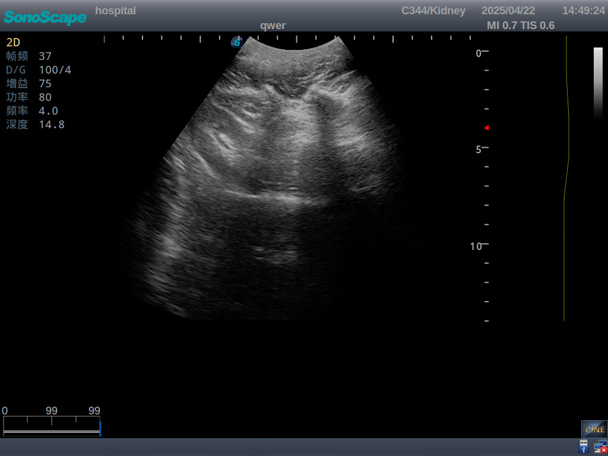

亮的地方是肾皮质，反射很强；内部的褶皱可能来源于肾髓质；内部的空洞可能是肾窦

拍摄的颈动脉图像如下

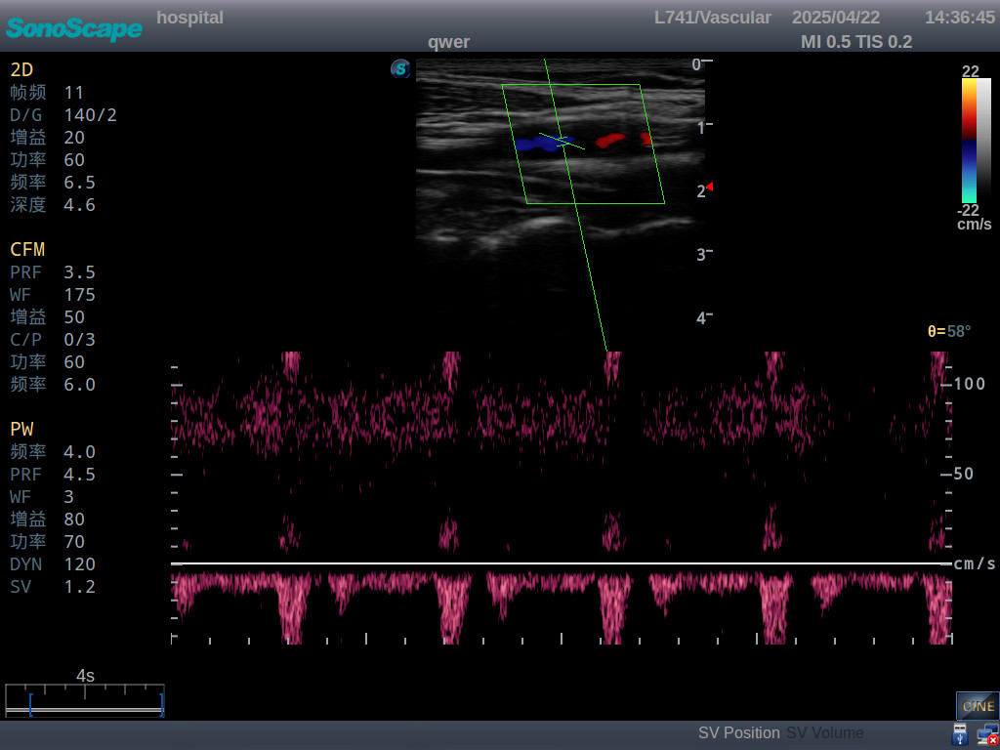

在取样容积左上放，可以清晰看到被肌肉覆盖的颈动脉壁，其上为肌肉，其下为血管内部

### 4.3 B/D测量血液流速

PRF: 脉冲重复频率，表示一秒内发射的脉冲数目，也就是采样频率

在次模式下，会先进行B超成像，在成像范围内选择取样容积，切换为PW模式进行多普勒超声测量

记录到的图像如下

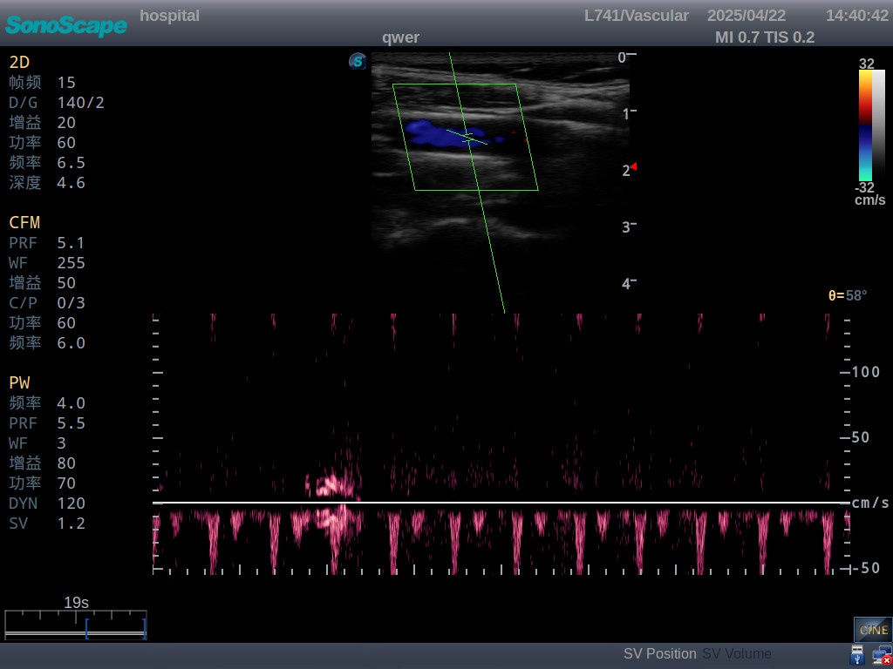

图中血流的方向为远离探头，即从左向右流动

在心脏的收缩期，流速峰值达到了50cm/s，在舒张期则为20cm/s左右，平均的血流速度大致为16cm/s

观察声谱图可以发现，由于PRF不足，负向血流的峰值被仪器误认为正向，产生了水平基线上方的伪影；这是因为脉冲波对血流的采样频率小于心跳信号频域上的最大频率的两倍，产生了混叠，进而产生伪影；解决方法是增大PRF，对于表层的颈动脉，可以用更大的PRF而不会使发射信号对回波信号造成干扰

声谱图的亮度也表明了位于这个速度的血细胞的数目，可以发现收缩期/舒张期时，位于峰值/谷值的细胞最多