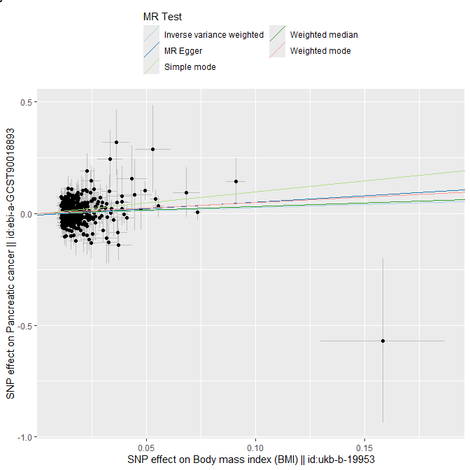
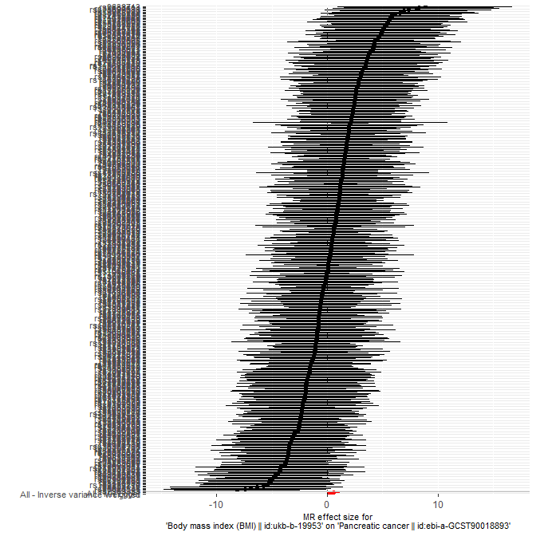
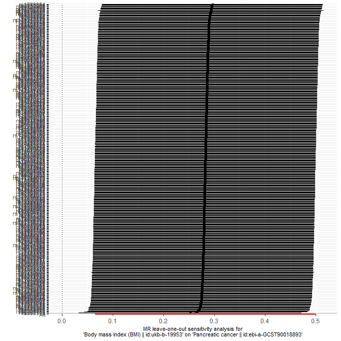
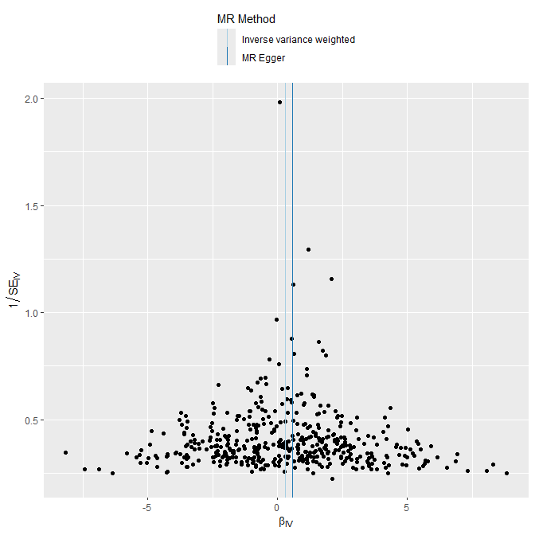

# Homework 2 MR

使用MR来探究是否BMI大小（暴露因子）和胰腺癌（结局变量）的关系

使用BMI大小的数据库为[ukb-b-19953](https://gwas.mrcieu.ac.uk/datasets/ukb-b-19953/)；使用胰腺癌的数据库为[ebi-a-GCST90018893](https://gwas.mrcieu.ac.uk/datasets/ebi-a-GCST90018893/)

环境配置略去


## 1 获取SNP数据

### 1.1 暴露因子

```R
exposure_data <- extract_instruments(outcomes = "ukb-b-19953")
# 查看数据结构
print(colnames(exposure_data))
```

输出

> [1] "samplesize.exposure"    "se.exposure"            "pos.exposure"
> [4] "pval.exposure"          "chr.exposure"           "beta.exposure"
> [7] "id.exposure"            "SNP"                    "effect_allele.exposure"
>[10] "other_allele.exposure"  "eaf.exposure"           "exposure"
>[13] "mr_keep.exposure"       "pval_origin.exposure"   "data_source.exposure"

输出就是这个暴露因子数据表的属性的属性名


### 1.2 结局变量

```R
outcome_data <- extract_outcome_data(
  snps = exposure_data$SNP,
  outcomes = "ebi-a-GCST90018893",
  proxies = 0,
  maf_threshold = 0.01,
)
print(colnames(outcome_data))
```

输出

>Extracting data for 458 SNP(s) from 1 GWAS(s) 
>[1] "SNP"                   "chr"                   "pos"
>[4] "beta.outcome"          "se.outcome"            "samplesize.outcome"
>[7] "pval.outcome"          "eaf.outcome"           "effect_allele.outcome"
>[10] "other_allele.outcome"  "outcome"               "id.outcome"
>[13] "originalname.outcome"  "outcome.deprecated"    "mr_keep.outcome"
>[16] "data_source.outcome"  

根据暴露因子的SNPs对结局变量进行的SNP进行筛选，输出是结局变量表的属性的名称

第一行输出表明BMI大小与458个SNP有很大的概率有关


### 1.3 统一效应等位与效应量

```R
data <- harmonise_data(
  exposure_dat = exposure_data,
  outcome_dat = outcome_data,
)
```

输出

> Harmonising Body mass index (BMI) || id:ukb-b-19953 (ukb-b-19953) and Pancreatic cancer || id:ebi-a-GCST90018893 (ebi-a-GCST90018893)
> Removing the following SNPs for incompatible alleles:
> rs7928320, rs9674487
> Removing the following SNPs for being palindromic with intermediate allele frequencies:
> rs10887578, rs11250094, rs11634851, rs12507026, rs1454687, rs1860750, rs2396625, rs347551, rs355777, rs396755, rs4419475, rs4737188, rs59086897, rs6597975, rs6713781, rs6774894, rs7539903, rs7568228, rs765874, rs7704382, rs9388446, rs961498

协同两个数据表的SNP方向，剔除无法判断方向的回文SNP和不兼容的SNP，是一个数据的预处理，否则GIGO


## 2 MR分析

### 2.1 MR分析

```R
rst <- mr(data)
```

输出

> Analysing 'ukb-b-19953' on 'ebi-a-GCST90018893'
>   id.exposure         	id.outcome                                    					outcome
> 1 ukb-b-19953 	ebi-a-GCST90018893 Pancreatic cancer || id:ebi-a-GCST90018893
> 2 ukb-b-19953 	ebi-a-GCST90018893 Pancreatic cancer || id:ebi-a-GCST90018893
> 3 ukb-b-19953 	ebi-a-GCST90018893 Pancreatic cancer || id:ebi-a-GCST90018893
> 4 ukb-b-19953 	ebi-a-GCST90018893 Pancreatic cancer || id:ebi-a-GCST90018893
> 5 ukb-b-19953 	ebi-a-GCST90018893 Pancreatic cancer || id:ebi-a-GCST90018893
>                           							exposure                    		method 						nsnp
> 1 Body mass index (BMI) || id:ukb-b-19953                  MR Egger  						435
> 2 Body mass index (BMI) || id:ukb-b-19953           Weighted median 				 435
> 3 Body mass index (BMI) || id:ukb-b-19953 	Inverse variance weighted 		435
> 4 Body mass index (BMI) || id:ukb-b-19953               Simple mode  					435
> 5 Body mass index (BMI) || id:ukb-b-19953             Weighted mode  				 435
>           b       			 se       			pval
> 1 0.5772912 	0.2997370 	0.05475968
> 2 0.3182377 	0.2024923 	0.11604251
> 3 0.2829090 	0.1109658 	0.01078729
> 4 0.9877247 	0.6005860 	0.10077608
> 5 0.4870654 	0.3438575 	0.15735399

Simple Mode检验说明胰腺癌概率与BMI有强烈的正相关，但p值因为检验方法的问题不是很正确

IVW检验中p值非常小，=.01，已经有足够的统计显著性说明更大的BMI会导致更高的胰腺癌风险

MR Egger检验得出的p值接近统计显著性极限，说明不同的SNP可能对BMI大小与胰腺癌之间的关系存在差异，需要进一步异质性检验

五个检验得出的效应值都是正的，且存在很大的效应值，强烈暗示了增加BMI会导致更高的胰腺癌风险

总结：多种方法显示BMI 升高可能会增加胰腺癌风险，尤其是IVW 分析结果显著且方向明确，支持存在正向因果关系


```R
rst_or <- generate_odds_ratios(rst)
```

输出

>   id.exposure        			 id.outcome                                    				outcome
>   1 ukb-b-19953	 ebi-a-GCST90018893 Pancreatic cancer || id:ebi-a-GCST90018893
>   2 ukb-b-19953 	ebi-a-GCST90018893 Pancreatic cancer || id:ebi-a-GCST90018893
>   3 ukb-b-19953 	ebi-a-GCST90018893 Pancreatic cancer || id:ebi-a-GCST90018893
>   4 ukb-b-19953 	ebi-a-GCST90018893 Pancreatic cancer || id:ebi-a-GCST90018893
>   5 ukb-b-19953 	ebi-a-GCST90018893 Pancreatic cancer || id:ebi-a-GCST90018893
>                                 					xposure                   	 		method 						 nsnp
>   1 Body mass index (BMI) || id:ukb-b-19953                  MR Egger  						435
>   2 Body mass index (BMI) || id:ukb-b-19953           Weighted median  				435
>   3 Body mass index (BMI) || id:ukb-b-19953 	Inverse variance weighted 		435
>   4 Body mass index (BMI) || id:ukb-b-19953               Simple mode  					435
>   5 Body mass index (BMI) || id:ukb-b-19953             Weighted mode  				 435
>          b        				se      			pval      			 lo_ci     			up_ci       		or  			or_lci95  
>   1 0.5772912 	0.2997370 	0.05475968 	-0.01019328 	1.1647757 	1.781207 	0.9898585	
>   2 0.3182377 	0.1914821 	0.09651859 	-0.05706721 	0.6935425 	1.374703 	0.9445306	
>   3 0.2829090 	0.1109658 	0.01078729  	0.06541602 	0.5004020 	1.326984 	1.0676031
>   4 0.9877247 	0.5804178 	0.08951881 	-0.14989413 	2.1253436 	2.685118 	0.8607991	
>   5 0.4870654 	0.3410876 	0.15401754 	-0.18146629 	1.1555970 	1.627533 	0.8340464
>   	or_uci95
>   1 3.205204
>   2 2.000791
>   3 1.649384
>   4 8.375775
>   5 3.175919

增加的Odds Ratio及其和b的置信区间表示，在患癌率方面，无论哪种检验方法，大BMI ： 小BMI始终大于1，虽然其95%CI分别包括了0和1，但其偏向性显著，尤其是IVW检验得出的p值完全在统计显著性区间内

总结：综合多种 MR 方法的结果，提示BMI 增高可能导致胰腺癌风险上升


### 2.2 敏感性分析

**异质性分析**

```R
mr_heterogeneity(data)
```

输出

>   id.exposure         	id.outcome                                    				outcome
> 1 ukb-b-19953 	ebi-a-GCST90018893 Pancreatic cancer || id:ebi-a-GCST90018893
> 2 ukb-b-19953 	ebi-a-GCST90018893 Pancreatic cancer || id:ebi-a-GCST90018893
>                                  					exposure                   			method       				 Q
> 1 Body mass index (BMI) || id:ukb-b-19953                  MR Egger					   418.8782
> 2 Body mass index (BMI) || id:ukb-b-19953 	Inverse variance weighted 	 419.9960
>     	Q_df    	Q_pval
> 1  433 	0.6781304
> 2  434 	0.6764682

MR Egger检验中Q值为418.9，Q_df为433，Q_pval为0.678。这个p值远大于统计显著性水平，表明MR Egger方法中，不存在异质性，即不同的SNP对BMI大小与胰腺癌之间的关系不太可能存在差异

IVW检验中Q值为420.0，Q_df为434，Q_pval为0.676。同样这个p值很大，说明在IVW方法中仍然不存在异质性

总结：两种检验都表明这些SNP对目标的效应是比较一致的，几乎不存在异质性


**水平多效应检验**

```R
mr_pleiotropy_test(data)
```

输出

>   ​		id.exposure         				id.outcome                                    outcome
> 1 ukb-b-19953 	ebi-a-GCST90018893 Pancreatic cancer || id:ebi-a-GCST90018893
>    ​                             					 exposure 			egger_intercept          	se     					pval
> 1 Body mass index (BMI) || id:ukb-b-19953    -0.005748911 			0.005437581 		0.2909846

水平多效应检验结果显示，在MR Egger方法中，SNPs对BMI大小影响的截距为$-5.7\times 10^{-3}$，非常接近0；p值为0.29，远远大于统计显著性水平，说明没有发现显著的混杂因素对BMI大小产生显著的影响，表明水平多效性检验中没有找到显著的水平多效性

总结：MR Egger检验证明没有其他显著的混杂因素对BMI大小产生显著影响，没有发现显著的水平多效性


## 3 可视化

### 3.1 散点图

```R
p1 <- mr_scatter_plot(rst, data)
```

<center></center>

观察散点图可以发现，二者的线性关系并不显著，其方差是非对齐的，说明不能用简单的线性关系描述二者

但是，在出去Outlier后确实有一定的正相关，一定程度上可以说明BMI增大可能导致胰腺癌患病风险提高


### 3.2 森林图

```R
rst_single <- mr_singlesnp(data)
p2 <- mr_forest_plot(rst_single)
```

<center></center>

上图表明仅存在一小部分的SNP对BMI大小与患胰腺癌风险的关系存在显著的效应，但是整体的加权平均效应（下方红色部分）的CI是不包含0的，说明SNPs对目标结论是有显著的影响效应的，即更大的BMI确实会造成更大的患胰腺癌风险


### 3.3 留一法森林图

```R
rst_loo <- mr_leaveoneout(data) 
p3 <- mr_leaveoneout_plot(rst_loo) 
```

<center></center>

留一法森林图在去除每个SNP进行的MR结果非常稳定，说明每个SNP对整体MR效应的贡献相差不大，稳定性很高，没有离群值，前文的检验可靠性更高了

且全体CI都不包括0，与森林图对比可以得出结论：多个SNP共同的作用使得BMI大小对患胰腺癌风险产生因果关系


### 3.4 漏斗图

```R
p4 <- mr_funnel_plot(rst_single) # 上面已经计算了rst_single
```

<center></center>

漏斗图左右较为对称，但点都集中在下部，上下不均匀

这表明可能存在发表偏倚，标准误大的趋向于被发现，这可能是统计值对“大BMI促进胰腺癌发病”而图表并没有显著性地支持这一结论的原因