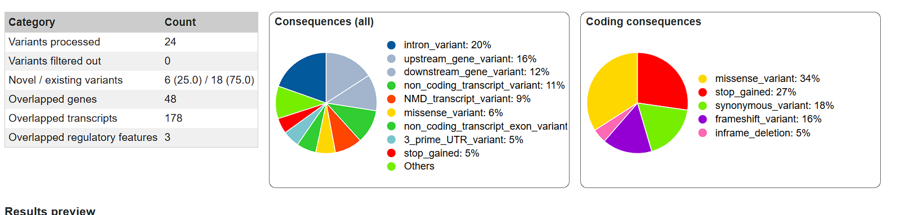

# 变异注释

> 有多少种突变类型？编码区？非编码区？

可以看出一共9种突变类型，如中间的饼图所示

编码区有5种突变类型，如右边的饼图所示；非编码区有7种，9-2=7，全部的9种有2种是编码区的

> SIFT, Polyphen2, CADD 数值各是多少？一致吗？

* SIFT: 0.123, Tolerant
* Polyphen2: 0.994, Damage
* CADD: raw: 3.83; phred: 23.3, < 0.01

SIFT的判断和其余二者不同，根据决策认为这些变异是存在危害的

>  哪些是破坏性的，哪些是良性的？

破坏性：

* 1-152215937-C-T：HRNR
* 11-62648638-A-G：INTS5
* 13-32363397-T-G：BRCA2
* 3-9434385-C-T：SETD5
* 3-102438534-C-T：ZPLD1
* 4-9268609-C-T：USP17L22
* 4-47425835-C-G：GABRB1
* 7-102572492-G-C：POLR2J3

良性：

* 1-634244-T-C：非编码
* 1-1049584-C-T：AGRN
* 1-1168091-C-T：MIR429/MIR200A/MIR200B
* 1-3265472-T-C：PRDM16
* 1-3326181-C-G：PRDM16
* 1-3403068-G-A：PRDM16
* 1-152761561-A-C：非编码
* 2-70301162-A-G：非编码
* 7-124745614-G-A：非编码
* 1-1526481-C-G：ATAD3A

> 怎么看是否和疾病有关？

主要看SIFT, Polyphen2, CADD和GWAS结果