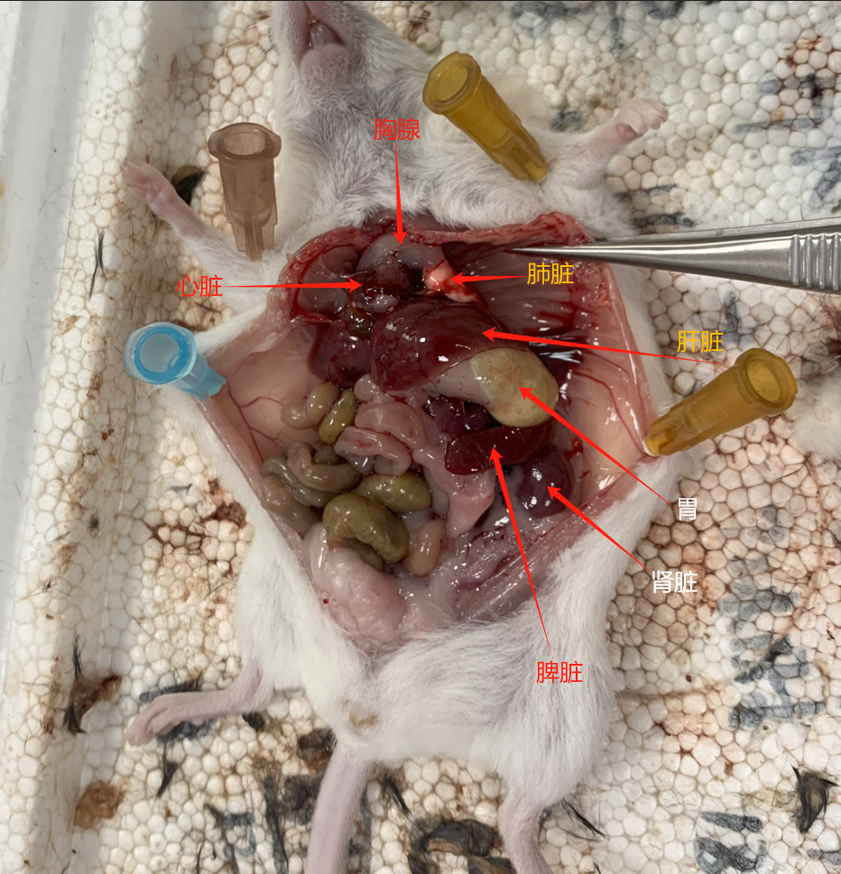
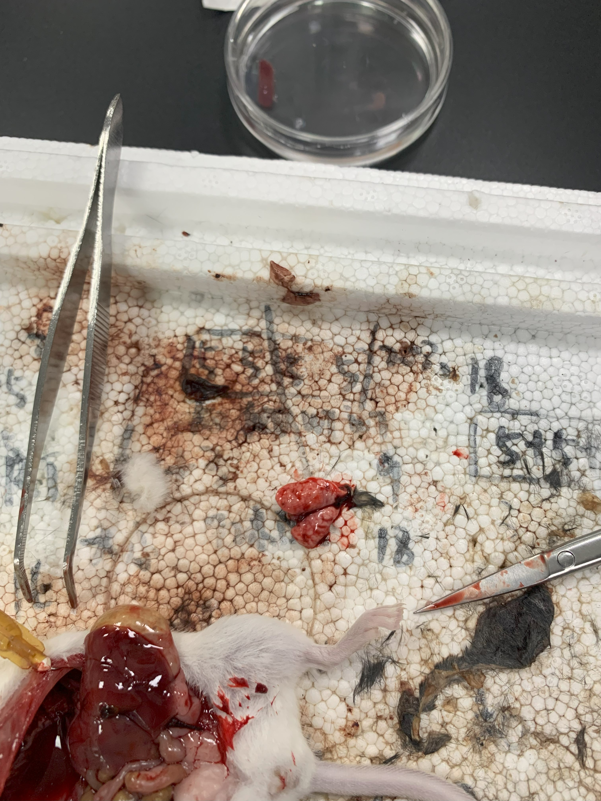
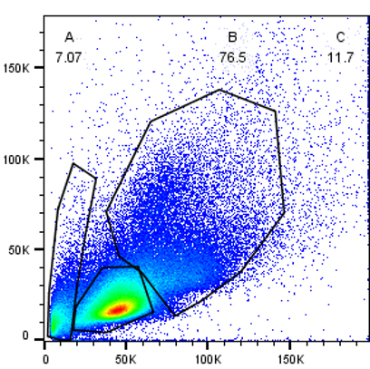
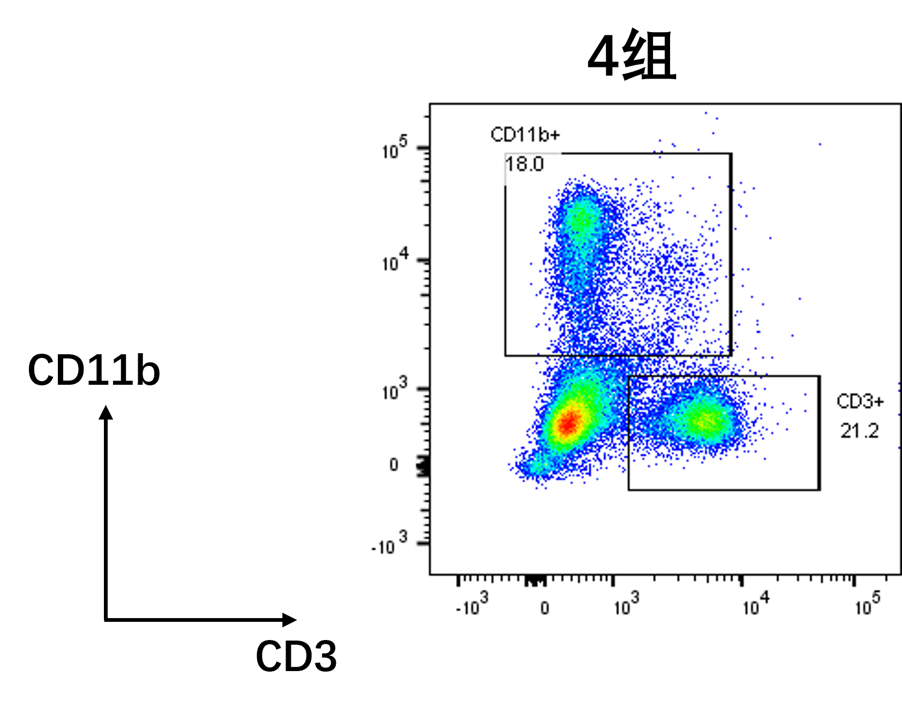
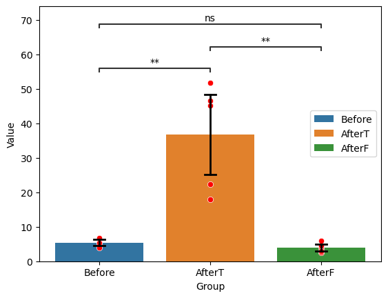
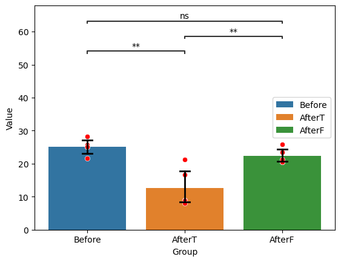

# 小鼠解剖实验

姓名：

学号：

## 1 实验目的

学习小鼠解剖技术及认识各个免疫器官

掌握脾脏单细胞悬液的制备方法

了解并操作磁珠分选阳性细胞技术

学习流式细胞术染色及分析方法

## 2 实验器材

小鼠、解剖工具（剪刀、镊子、手术刀等）、PBS缓冲液、70%乙醇、红细胞裂解液、磁珠分选试剂盒（Miltenyi CD11b MicroBeads）、流式细胞术染色抗体（CD11b，CD3，CD19）、流式细胞仪、注射器、培养板、离心管、移液枪等

## 3 实验内容

### 3.1 小鼠解剖与器官制备

#### 3.1.1 实验步骤

1. 用颈椎脱位法处死小鼠
2. 用70%乙醇擦拭小鼠腹部消毒
3. 用解剖剪刀沿腹中线切开皮肤和腹壁，暴露胸腔、腹腔器官
4. 指出胸腺、肺脏和心脏的位置
5. 剪断支气管和肺动脉，取出肺脏
6. 指出肝脏、胃、脾脏、肾脏的位置
7. 剪断脾脏的连接组织，取出脾脏
8. 将取出的脾脏置于预冷的PBS缓冲液中备用

#### 3.1.2 实验结果



<center> 各个器官在小鼠体内的位置</center>



<center>取出的肺脏</center>


<center>置于预冷的PBS缓冲液中的小鼠脾脏（两只）</center>

### 3.2 脾脏单细胞悬液的制备

#### 3.2.1 实验步骤

1. 将脾脏置于70微米滤网中，用注射器柱塞轻轻研磨
2. 用PBS缓冲液冲洗滤网，将小块组织冲入管中
3. 1500rpm离心5分钟
4. 弃上清液，得到沉淀中的组织
5. 用移液枪加入3ml红细胞裂解液，分三次，每次1ml
6. 孵育5分钟，裂解红细胞
7. 加入PBS定容至10ml，再次1500rpm离心5分钟
8. 弃上清液，加入适量PBS制备单细胞悬液
9. 用移液枪将单细胞悬液分装为90ul和100ul的小罐，后者用于对照

#### 3.2.2 实验结果

将90ul的单细胞悬液用于后续实验

### 3.3 CD11b+细胞磁珠分选

#### 3.3.1 实验原理

带有CD11b+抗体的小磁珠会和髓系细胞表面的CD11b+特异性结合，在离心过后居于沉淀之中。重悬得到的沉淀物，里面含有被磁珠标记的髓系细胞，未标记的淋巴细胞和细胞碎片。外加磁场，过柱，磁珠会被磁场吸引，其结合的髓系细胞也被留下来，未结合的其他细胞/碎片随液体进入废液缸。撤去磁场，用缓冲液冲洗得到与磁珠结合的髓系细胞；若要进一步使用，则洗脱磁珠，但是本实验不需要

#### 3.3.2 实验步骤

1. 快速工作，保持细胞低温且使用预冷溶液
3. 取上面得到的90ul悬液，加入10ul的磁珠，至于冰中孵育20min
3. 加入适量缓冲液清洗细胞，在300g转速下离心10分钟，弃上清液
4. 洗涤细胞，重悬在500 uL缓冲液中
5. 选取MS柱分离细胞
6. 将柱子放在分离器的磁场中
7. 用500ul缓冲液润洗柱子
8. 将单细胞悬液加入柱子
9. 等待液体流尽，再加入500ul缓冲液，清洗残留细胞
10. 重复步骤10三次
11. 在分离器中取出柱子，用1ml缓冲液和色谱柱自带的活塞冲出磁珠标记的CD11b+细胞馏分

#### 3.3.3 实验结果

在分离时液体很难流过，应该是有大块的组织堵塞了滤网。问题也许出现在研磨脾脏的步骤，在那一步研磨不充分，将大块组织带入了滤液；为了得到滤液，实验老师振动了分离管；而且我们组提交试管的时间比较迟，在冰上孵育的时长可能不足，导致实验结果中CD11b+细胞占比较少

### 3.4 流式细胞术染色

#### 3.4.1 实验原理

用流式细胞仪检测

>前向散射光小角度偏转，强度大，使用光电二极管检测，**检测细胞大小**
>侧向散射光位于90°偏转，强度小，使用**光电倍增管**检测，**检测细胞复杂度**
>荧光在经过偏光镜和滤光片后检测，强度小，使用**光电倍增管**检测，**检测特定物质**
>产生荧光的前提是**事先在混合物中加入了不同的荧光探针，区分不同生物颗粒**

#### 3.4.2 实验步骤

1. 将分选的细胞以1500rpm离心5分钟后，用100ul PBS重悬，同时用100ul未分选的脾细胞悬液作为对照组
2. 分别吸取1ul CD11b-Percp/Cy5.5 和CD3-Pacific Blue 抗体加入细胞悬液中，并轻轻吹打混匀，冰上孵育20分钟
3. 加入1ml PBS轻轻吹打混匀后以1500rpm离心5分钟，洗去未标记的抗体
4. 用500ul PBS重悬细胞后上机检测

#### 3.4.3 实验结果

**未分选细胞**



<font color=red>问题1：请根据FSC和SSC，判断三个区域A、B、C分别代表何种细胞组分（髓系细胞，细胞碎片，淋巴细胞）？</font>

而前向散射光强度正比于细胞大小，很显然，细胞碎片是最小的，淋巴细胞直径在6-10um；髓系细胞直径在10-20um；

侧向散射光正比于细胞复杂度，显然细胞碎片的复杂度是最低的，而髓系细胞和淋巴细胞的复杂度不好判断；

故**ABC分别是细胞碎片，淋巴细胞和髓系细胞**

现在我知道髓系细胞的复杂度更高

**分选后的阳性细胞**



<font color=red>计算经磁珠分选后CD11b阳性细胞的富集倍数</font>

分选前的有三个样本观测值，如果认为每组样本i.i.d.，则得到总体的95%CI，有
$$
 \mathsf{CI}_{1-\alpha}=(\overline{x}-t_{\frac{\alpha}{2}}\frac{s}{\sqrt{n}},\overline{x}+t_{\frac{\alpha}{2}}\frac{s}{\sqrt{n}})
$$
带入数据计算得到95%CI=(1.8, 9.1)，因为样本的方差太大了所以置信区间也很大

分选后的数据为18.0（第四组）

得到富集倍数的95%CI=(2.0, 10.0)，均值是3.3；这个数字并不大，原因在3.3.3有说明

**数据分析**

<font color=red>利用全班数据，分别统计分选前、分选后阳性细胞、分选后阴性细胞三组中，CD11b和CD3细胞比例，并计算有无统计学差异</font>

下表列出了各组的95%CI，其中阳性组用了前5组的数据，尽管第4组也很烂就是了

对于不足5个观测值的样本，用均值补齐

|  组别  |    分选前    |  分选后阳性  |  分选后阴性  |
| :----: | :----------: | :----------: | :----------: |
| CD11b+ |  (1.8, 9.1)  | (17.6, 55.9) |  (2.3, 5.6)  |
|  CD3+  | (16.8, 33.6) | (5.4, 20.1)  | (19.5, 25.2) |

对CD11b+和CD3+分别做1-Way ANOVA检验

* <font color=red>**CD11b**</font>

得到报告

```html
Source     SS      DF      MS          F        p-unc       np2
Group  3427.76908   2  1713.884540  21.388134  0.000111  0.780927
Within  961.58996  12    80.132497        NaN       NaN       NaN
```

三组之间的差别是很显著的，p非常小，进一步进行Post Hoc多重检验，得到

```html
  A       B      mean(A)  mean(B)    diff      se        T    p-tukey
AfterF  AfterT    3.972   36.740 -32.768  5.661537 -5.787828  0.000236
AfterF  Before    3.972    5.422  -1.450  5.661537 -0.256114  0.964592
AfterT  Before   36.740    5.422  31.318  5.661537  5.531714  0.000352
```

最终报告如下：

分选前，分选后阳性，分选后阴性的比例分别是5.4(n=5,SD=1.03), 36.7(n=5,SD=15.4), 4.0(n=5,SD=1.3)，显示三组比例有显著不同(F(2,12)=21.4 , p=1E-4, eta2=0.78)；进一步组间多重比较Tukey HSD 检验发现，**分选后阴性**与**分选后阳性**差异达到统计显著性（p=2E-4），**分选后阳性**与**分选前**差异也达到了统计显著性（p=4E-4）



由于画显著性标记的函数没有事后检验，只用了独立样本t检验，其显著性是偏低的（p值偏高），实际上是4个“*”

95%CI标注于图上

* <font color=red>**CD3**</font>

得到报告

```html
Source     SS      DF     MS          F       p-unc       np2
Group  428.20432   2  214.10216  13.920536  0.000747  0.698803
Within 184.56372  12  15.38031        NaN       NaN       NaN
```

三组之间的差距很显著，进一步PH检验，得到

```html
    A       B  mean(A)  mean(B)    diff        se         T   p-tukey
AfterF  AfterT   22.360   12.716   9.644  2.480348  3.888165  0.005649
AfterF  Before   22.360   25.200  -2.840  2.480348 -1.145001  0.506287
AfterT  Before   12.716   25.200 -12.484  2.480348 -5.033166  0.000790
```

最终报告如下：

分选前，分选后阳性，分选后阴性的比例分别是25.2(n=5,SD=2.4), 12.7(n=5,SD=6.0), 22.4(n=5,SD=2.3)，显示三组比例有显著不同(F(2,12)=13.9 , p=7E-4, eta2=0.70)；进一步组间多重比较Tukey HSD 检验发现，**分选后阴性**与**分选后阳性**差异达到统计显著性（p=.006），**分选后阳性**与**分选前**差异也达到了统计显著性（p=.0008）



同理显著性偏低

<font color=red>讨论：根据实验结果分析实验过程中出现的问题及可能的原因</font>

全班总体实验结果符合理论假设

但是第四组的分选后阳性细胞中的髓系细胞细胞占比和富集倍数都很低，推测是第四组在分选时丢失了大量的髓系细胞

原因在于分选过滤时滤网堵住，将整个柱子通了一次后才能正常工作，在通的时候很多髓系细胞也随之流入废液缸；

滤网堵住的原因在于第四组在对脾脏进行研磨时不够仔细，研磨后仍然有大颗粒；

加入磁珠时，在冰上孵育的时间不够也可能是丢失髓系细胞的一个原因

也有可能是切除脾脏时有部分脂肪残留在上面，但是在离心的过程中脂肪也许会在上清液中被弃置？